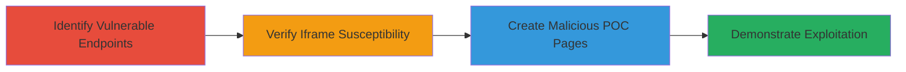

---
tags:
  - clickjacking
  - web
  - ui-manipulation
  - yelp
type: attack_chain
tools: []
tactics:
  - '[[Initial Access]]'
commands: []
platforms:
  - Web
complexity: medium
procedures:
  - '[[procedures/Identify-Vulnerable-Clickjacking-Endpoints-on-Yelp]]'
  - '[[procedures/Verify-Clickjacking-Susceptibility-on-Yelp]]'
  - '[[procedures/Create-Proof-of-Concept-Malicious-Pages-for-Yelp-Clickjacking]]'
  - '[[procedures/Demonstrate-Yelp-Clickjacking-Exploitation-with-Video-POC]]'
step_count: 4
techniques:
  - '[[Drive-by Compromise]]'
description: >-
  Multi-stage clickjacking attack exploiting missing frame protections on
  Yelp.com to trick users into flagging profiles, following users, or sending
  malicious compliments via hidden iframes.
skill_level: intermediate
impact_level: high
id: be3a5b2f-afda-49d7-acca-e2aeb5585474
created_at: '2025-12-14T17:28:05.227Z'
updated_at: '2025-12-14T17:28:05.227Z'
verified: false
validated: true
submitted: true
mitre_tactics:
  - '[[Initial Access]]'
mitre_techniques:
  - '[[Drive-by Compromise]]'
---
# Clickjacking on Yelp Endpoints to Coerce Unintended User Actions

Multi-stage attack chain demonstrating a complete clickjacking workflow on Yelp.com, where vulnerable endpoints lack X-Frame-Options or CSP frame-ancestors protections, allowing embedding in iframes to trick authenticated users into performing actions like flagging profiles with abusive messages, following unwanted users, or sending compliments with malicious content. This harms user experience, platform trust, and Yelp's reputation by enabling coerced interactions without user awareness.

## Chain Metrics Dashboard

| Metric | Value |
|--------|-------|
| Chain Status | Unverified |
| Total Steps | 4 |
| Execution Time | ~15 minutes |
| Skill Level | Intermediate |
| Complexity | Medium |
| Impact Level | High |

## Attack Flow Visualization

## Prerequisites & Requirements

### Required Tools

- Web browser (e.g., Chrome, Firefox) for testing iframes
- Text editor for creating HTML files
- Screen recording software for POC video

### Target Environment

- Web platform: Yelp.com
- Required services/ports: HTTPS on port 443
- Network access requirements: Internet access to Yelp.com

### Initial Access Requirements

- No credentials needed for identification and verification
- Authenticated user session on Yelp for demonstration (victim simulation)
- Prior access needed: Public access to endpoints

## Detailed Attack Procedures

### Step 1: Identify Vulnerable Endpoints
procedure: [[procedures/Identify-Vulnerable-Clickjacking-Endpoints-on-Yelp]]

**Objective**: Locate Yelp endpoints that perform sensitive user actions without frame protections.

**Instructions**: Manually examine Yelp's site structure to find endpoints like /flag_content for reporting, /following_user/add for following, and /thanx for compliments. Note parameters such as flag_id, message, dst_user_id, user_id, and previous_url, confirming no X-Frame-Options or CSP restrictions.

**Expected Output**: List of vulnerable URLs with parameters.

**Success Indicators**:
- Endpoints identified that accept action parameters
- No frame-busting headers observed

### Step 2: Verify Susceptibility
procedure: [[procedures/Verify-Clickjacking-Susceptibility-on-Yelp]]

**Objective**: Confirm endpoints can be embedded in external iframes.

**Instructions**: Load the identified endpoints in a local HTML file using an <iframe> tag pointing to the Yelp URL. Check if the page renders without blocking.

**Expected Output**: Yelp page visible inside the iframe.

**Success Indicators**:
- No browser errors or frame denials
- Endpoint content loads in iframe

### Step 3: Create Proof-of-Concept Pages
procedure: [[procedures/Create-Proof-of-Concept-Malicious-Pages-for-Yelp-Clickjacking]]

**Objective**: Build malicious HTML pages that overlay elements to capture clicks and trigger actions in hidden iframes.

**Instructions**: Develop HTML files like Report_a_USER.html with a hidden iframe embedding /flag_content?message=This%20person%20is%20abusive&flag_id=..., an overlay button mimicking a benign action, and JavaScript to submit the form on click. Repeat for Follow_User.html and Send_a_Compliment.html with messages like 'go to hell'.

**Expected Output**: Functional HTML files that perform actions when clicked while logged into Yelp.

**Success Indicators**:
- Click triggers unintended Yelp action
- Action completes without user noticing iframe

### Step 4: Demonstrate Exploitation
procedure: [[procedures/Demonstrate-Yelp-Clickjacking-Exploitation-with-Video-POC]]

**Objective**: Record a video showing the attack in action to prove impact.

**Instructions**: Open the POC HTML in a browser while authenticated on Yelp, simulate a victim clicking the overlay, and record the screen to capture the coerced action (e.g., profile flagged) without direct interaction with Yelp.

**Expected Output**: Video file (e.g., Dangerous_ClickJacking_Yelp.flv) illustrating the trick.

**Success Indicators**:
- Video shows action performed invisibly
- No alerts or blocks during execution

## Attack Chain Summary

### Key Achievements

1. Identified multiple Yelp endpoints vulnerable to clickjacking due to missing protections.
2. Created POCs that coerce users into abusive actions like flagging with insults or sending malicious compliments.
3. Demonstrated real-world impact on user interactions and platform integrity.

## Technique & Tactic Coverage

### MITRE ATT&CK Techniques

- [[Drive-by Compromise]]

### MITRE ATT&CK Tactics

- [[Initial Access]]

---
*Last updated: 2023-10-01T00:00:00Z*
