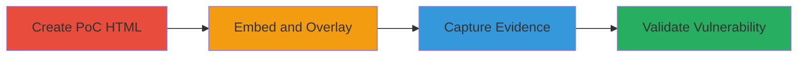

---
tags:
  - clickjacking
  - ui-redressing
  - iframe
  - web-vulnerability
type: attack_chain
tools: []
tactics:
  - '[[Initial Access]]'
verified: false
platforms:
  - Web
submitted: true
complexity: low
created_at: '2023-10-01T00:00:00Z'
procedures:
  - '[[procedures/Create-Clickjacking-HTML-PoC]]'
  - '[[procedures/Capture-Clickjacking-Demonstration-Screenshot]]'
step_count: 2
techniques:
  - '[[Drive-by Compromise]]'
updated_at: '2025-12-14T17:28:04.351Z'
description: >-
  Demonstrates a clickjacking vulnerability on Yelp's main domain by embedding
  the homepage in an iframe without X-Frame-Options protection, allowing UI
  overlay for tricking users into unintended clicks.
skill_level: beginner
impact_level: low
id: bf2eaa17-95c6-4cca-a666-846517b0bb9b
validated: true
mitre_tactics:
  - '[[Initial Access]]'
mitre_techniques:
  - '[[Drive-by Compromise]]'
---
# Clickjacking on Yelp Homepage via Iframe Embedding

Multi-stage attack chain demonstrating a complete attack workflow for exploiting clickjacking on Yelp's www.yelp.com homepage.

## Chain Metrics Dashboard

| Metric | Value |
|--------|-------|
| Chain Status | Unverified |
| Total Steps | 2 |
| Execution Time | ~5 minutes |
| Skill Level | Beginner |
| Complexity | Low |
| Impact Level | Low |

## Attack Flow Visualization



## Prerequisites & Requirements

### Required Tools

- Web browser (e.g., Chrome, Firefox)
- Text editor (e.g., VS Code, Notepad)
- Screenshot tool (built-in OS tools)

### Target Environment

- Target: Web platform
- Required services/ports: HTTP/HTTPS on port 80/443
- Network access requirements: Internet access to www.yelp.com

### Initial Access Requirements

- No credentials required
- Public network access
- No prior access needed

## Detailed Attack Procedures

### Step 1: Create Clickjacking PoC HTML
procedure: [[procedures/Create-Clickjacking-HTML-PoC]]

**Objective**: Construct an HTML file that embeds the Yelp homepage in an invisible iframe and overlays a fake button to hijack user clicks.

**Instructions**: Open a text editor and create a file named `clickjack.html`. Add the following HTML code to load www.yelp.com in an iframe with zero opacity and position a transparent overlay button:

```html
<!DOCTYPE html>
<html>
<head>
    <title>Clickjacking PoC</title>
</head>
<body>
    <iframe src="https://www.yelp.com" width="100%" height="100%" style="opacity: 0.5; position: absolute; top: 0; left: 0; border: none;"></iframe>
    <button style="position: absolute; top: 100px; left: 100px; z-index: 1;">Click Me (Fake Button)</button>
</body>
</html>
```

Save the file and open it in a web browser to test the embedding.

**Expected Output**: The Yelp homepage loads within the iframe, partially visible, with the fake button overlaid on top.

**Success Indicators**:
- Yelp homepage embeds successfully without frame-busting errors
- Fake button appears over the iframed content

### Step 2: Capture Clickjacking Demonstration Screenshot
procedure: [[procedures/Capture-Clickjacking-Demonstration-Screenshot]]

**Objective**: Visually document the vulnerability by capturing a screenshot of the iframed Yelp page with overlaid malicious elements.

**Instructions**: With the `clickjack.html` file open in the browser, adjust the iframe opacity to make it nearly invisible (e.g., set to 0.1 in the style) and position the fake button over a sensitive area like a profile delete button simulation. Use your OS screenshot tool (e.g., Snipping Tool on Windows or Command+Shift+4 on macOS) to capture the screen showing the overlay.

Save the image as `yelp_clickjacking.png`.

**Expected Output**: A PNG image displaying the embedded Yelp homepage with the malicious overlay button in place.

**Success Indicators**:
- Screenshot clearly shows the iframe embedding and UI overlay
- No X-Frame-Options denial observed in browser console

## Attack Chain Summary

### Key Achievements

1. Successfully embedded Yelp's unprotected homepage in an external iframe
2. Demonstrated potential for click hijacking with UI overlay
3. Provided visual evidence confirming the vulnerability's exploitability

## Technique & Tactic Coverage

### MITRE ATT&CK Techniques

- [[Drive-by Compromise]]

### MITRE ATT&CK Tactics

- [[Initial Access]]

---
*Last updated: 2023-10-01T00:00:00Z*
