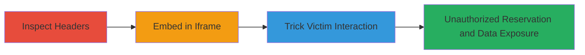

---
tags:
  - clickjacking
  - x-frame-options
  - web-vulnerability
  - data-exposure
  - yelp
type: attack_chain
tools: []
tactics:
  - '[[Initial Access]]'
  - '[[Reconnaissance]]'
verified: false
platforms:
  - Web
submitted: true
complexity: medium
created_at: '2023-10-01T00:00:00Z'
procedures:
  - '[[procedures/Inspect-Response-Headers-for-Missing-Security-Headers]]'
  - '[[procedures/Embed-Target-Page-in-Invisible-Iframe]]'
  - '[[procedures/Induce-Victim-Interaction-for-Form-Submission]]'
step_count: 3
techniques:
  - '[[Drive-by Compromise]]'
  - '[[Gather Victim Host Information]]'
updated_at: '2025-12-14T17:28:12.810Z'
description: >-
  A multi-stage clickjacking attack exploiting the missing X-Frame-Options
  header on Yelp's /reservations page to embed the page in an iframe, trick
  users into making unauthorized reservations, and expose private data like
  email and phone numbers.
skill_level: intermediate
impact_level: high
id: 767c53c6-ecd7-4faa-9948-ba86169fd180
validated: true
mitre_tactics:
  - '[[Initial Access]]'
  - '[[Reconnaissance]]'
mitre_techniques:
  - '[[Drive-by Compromise]]'
  - '[[Gather Victim Host Information]]'
---
# Clickjacking on Yelp Reservations to Enable Unauthorized Bookings and Private Data Exposure

Multi-stage attack chain demonstrating a complete clickjacking workflow on Yelp's /reservations page, leading to unauthorized reservations and exposure of victim contact information.

## Chain Metrics Dashboard

| Metric | Value |
|--------|-------|
| Chain Status | Unverified |
| Total Steps | 3 |
| Execution Time | ~5 minutes |
| Skill Level | Intermediate |
| Complexity | Medium |
| Impact Level | High |

## Attack Flow Visualization

## Prerequisites & Requirements

### Required Tools

- Web browser developer tools (e.g., Chrome DevTools)
- Local web server for hosting malicious page (e.g., Python's http.server)

### Target Environment

- Web platform
- Yelp Reservations service accessible via HTTPS
- No specific ports required beyond standard HTTP/HTTPS (80/443)

### Initial Access Requirements

- Public access to Yelp's /reservations page
- Ability to host a malicious website
- Victim interaction via social engineering or drive-by visit

## Detailed Attack Procedures

### Step 1: Inspect Response Headers
procedure: [[procedures/Inspect-Response-Headers-for-Missing-Security-Headers]]

**Objective**: Verify the absence of X-Frame-Options header to confirm clickjacking vulnerability.

**Instructions**: Open the Yelp /reservations page in a browser and use developer tools to inspect the HTTP response headers. Look for the lack of X-Frame-Options: DENY or SAMEORIGIN.

**Expected Output**: Response headers without X-Frame-Options, confirming the page can be framed.

**Success Indicators**:
- No X-Frame-Options header present
- Page loads successfully in a test iframe

### Step 2: Embed Target Page in Invisible Iframe
procedure: [[procedures/Embed-Target-Page-in-Invisible-Iframe]]

**Objective**: Create a malicious page that invisibly embeds the vulnerable /reservations page to overlay interactive elements.

**Instructions**: Host a malicious HTML page on your server. Use an iframe to load https://www.yelp.com/reservations with zero opacity and absolute positioning to hide it behind a clickable button or image on your site.

**Expected Output**: The Yelp page loads within the iframe without framing restrictions.

**Success Indicators**:
- Iframe successfully embeds the /reservations page
- No browser errors related to framing

### Step 3: Induce Victim Interaction for Form Submission
procedure: [[procedures/Induce-Victim-Interaction-for-Form-Submission]]

**Objective**: Trick the victim into clicking an element that interacts with the hidden iframe, triggering browser autofill and form submission.

**Instructions**: Lure the victim to your malicious site via phishing or drive-by. Design the page so a visible click (e.g., "Click for Free Gift") aligns with a form submit button in the iframe. Upon interaction, the browser autofills and submits reservation details.

**Expected Output**: Unauthorized reservation created on Yelp, with victim's email/phone exposed to the business.

**Success Indicators**:
- Form submission occurs without victim awareness
- Confirmation of booking or data exposure via Yelp account or business logs

## Attack Chain Summary

### Key Achievements

1. Confirmed clickjacking vulnerability through header inspection
2. Successfully embedded and hid the vulnerable page in an iframe
3. Enabled unauthorized actions leading to data exposure and potential financial impact

## Technique & Tactic Coverage

### MITRE ATT&CK Techniques

- [[Drive-by Compromise]]
- [[Gather Victim Host Information]]

### MITRE ATT&CK Tactics

- [[Initial Access]]
- [[Reconnaissance]]

---
*Last updated: 2023-10-01T00:00:00Z*
