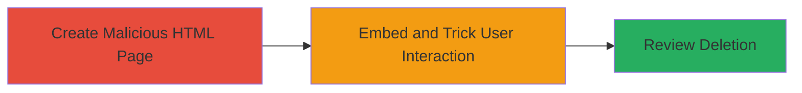

---
tags:
  - clickjacking
  - ui-redressing
  - yelp
  - review-deletion
  - web-exploit
type: attack_chain
tools: []
tactics:
  - '[[Initial Access]]'
  - '[[Execution]]'
commands: []
platforms:
  - Web
complexity: medium
procedures:
  - '[[procedures/Create-Malicious-HTML-for-Clickjacking]]'
  - '[[procedures/Exploit-Clickjacking-to-Delete-Reviews]]'
step_count: 2
techniques:
  - '[[Drive-by Compromise]]'
description: >-
  A multi-stage attack exploiting clickjacking on Yelp's review removal feature
  to overlay an invisible iframe, tricking authenticated users into deleting
  their own reviews without awareness.
skill_level: intermediate
impact_level: medium
id: e4e64dd1-bdd3-4556-85f4-52694baa624f
created_at: '2025-12-14T17:28:05.322Z'
updated_at: '2025-12-14T17:28:05.322Z'
verified: false
validated: true
submitted: true
mitre_tactics:
  - '[[Initial Access]]'
  - '[[Execution]]'
mitre_techniques:
  - '[[Drive-by Compromise]]'
---
# Clickjacking on Yelp Review Deletion to Trick Users into Removing Reviews

## Overview

This attack chain demonstrates a clickjacking (UI redressing) vulnerability on Yelp's review removal functionality. An attacker creates a malicious webpage that embeds the target's review page in an invisible iframe, overlaying deceptive elements to trick authenticated users into clicking the delete button. This results in unauthorized deletion of the user's own reviews. The vulnerability stems from the lack of frame-busting headers or CSP rules preventing iframe embedding. While it does not enable full account takeover, it causes data loss for users. The attack was reported on HackerOne (Report #965141) but did not qualify for a bounty due to limited impact.

## Chain Metrics Dashboard

| Metric | Value |
|--------|-------|
| Chain Status | Unverified |
| Total Steps | 2 |
| Execution Time | ~5 minutes |
| Skill Level | Intermediate |
| Complexity | Medium |
| Impact Level | Medium |

## Attack Flow Visualization

## Prerequisites & Requirements

### Required Tools

- None (uses basic HTML and browser)

### Target Environment

- Web platform
- Yelp review removal page accessible via browser
- No specific services/ports required beyond standard HTTP/HTTPS

### Initial Access Requirements

- Attacker must host a malicious webpage (e.g., on a personal server or GitHub Pages)
- Victim must be an authenticated Yelp user with reviews to delete
- No prior credentials or network position needed for the attacker; relies on social engineering to lure the victim to the malicious page

## Detailed Attack Procedures

### Step 1: Create Malicious HTML Page
procedure: [[procedures/Create-Malicious-HTML-for-Clickjacking]]

**Objective**: Build an HTML page that embeds the Yelp review removal page in an invisible iframe, positioning the delete button over a deceptive visible element to trick user clicks.

**Instructions**: Create a simple HTML file using a text editor. Define an iframe sourcing the victim's specific review deletion URL (obtained via social engineering or phishing). Set iframe styles to make it transparent and position the delete button overlay. Save as index.html and host it on a web server.

**Expected Output**: A hosted webpage that loads invisibly the Yelp review page, ready for user interaction.

**Success Indicators**:
- Iframe loads the Yelp review deletion page without errors
- Delete button is overlaid and clickable via the visible deceptive element

### Step 2: Exploit Clickjacking to Delete Reviews
procedure: [[procedures/Exploit-Clickjacking-to-Delete-Reviews]]

**Objective**: Lure the victim to the malicious page and induce them to interact with the overlaid delete button, executing the review removal on their behalf.

**Instructions**: Distribute the malicious URL via phishing email, social media, or other means targeting Yelp users. When the victim visits and clicks the deceptive element (e.g., a fake "Confirm Update" button), it triggers the iframe's delete action. Monitor for successful deletion by checking the victim's Yelp profile or receiving confirmation from the interaction.

**Expected Output**: The victim's review is deleted from Yelp without their awareness of the true action.

**Success Indicators**:
- Victim interacts with the page
- Review disappears from the victim's Yelp account
- No alerts or confirmations disrupt the process

## Attack Chain Summary

### Key Achievements

1. Successful embedding of Yelp's review deletion page in an iframe without detection
2. Tricking authenticated users into unauthorized review deletions
3. Demonstration of clickjacking impact on user-generated content integrity

## Technique & Tactic Coverage

### MITRE ATT&CK Techniques

- [[Drive-by Compromise]]

### MITRE ATT&CK Tactics

- [[Initial Access]]
- [[Execution]]

---
*Last updated: 2023-10-01T00:00:00Z*
