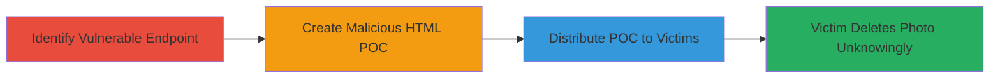

---
tags:
  - clickjacking
  - ui-redressing
  - web-vulnerability
  - yelp
type: attack_chain
tools: []
tactics:
  - '[[Initial Access]]'
commands: []
platforms:
  - Web
complexity: medium
procedures:
  - '[[procedures/Identify-Clickjacking-Vulnerability-in-Yelp-Photo-Deletion]]'
  - '[[procedures/Create-Clickjacking-Proof-of-Concept-HTML]]'
  - '[[procedures/Demonstrate-Clickjacking-Exploitation-via-POC-Distribution]]'
step_count: 3
techniques:
  - '[[Exploit Public-Facing Application]]'
  - '[[Drive-by Compromise]]'
description: >-
  A multi-stage clickjacking attack exploiting the lack of X-Frame-Options
  header on Yelp's user photo deletion page, allowing attackers to overlay
  deceptive UI elements and trick authenticated users into deleting their
  profile photos without awareness.
skill_level: intermediate
impact_level: high
id: a56b70fa-9cc8-4b63-8ba8-419b2b439709
created_at: '2025-12-14T17:28:04.820Z'
updated_at: '2025-12-14T17:28:04.820Z'
verified: false
validated: true
submitted: true
mitre_tactics:
  - '[[Initial Access]]'
mitre_techniques:
  - '[[Exploit Public-Facing Application]]'
  - '[[Drive-by Compromise]]'
---
# Clickjacking on Yelp User Photo Deletion to Trick Victims into Removing Profile Pictures

## Overview

This attack chain demonstrates a clickjacking vulnerability in Yelp's user photo deletion endpoint at https://www.yelp.com/user_photos/{photo_id}/remove. The absence of the X-Frame-Options header allows the page to be embedded in an iframe on a malicious site. An attacker crafts a proof-of-concept HTML page that frames the deletion page, scales and positions it invisibly, and overlays a fake button to trick the victim into clicking what they believe is a harmless action, resulting in unauthorized photo deletion. This requires the victim to be authenticated on Yelp and tricked into visiting the malicious page, leading to loss of user data without authentication prompts.

## Attack Flow Visualization

## Prerequisites & Requirements

### Required Tools

- Web browser for testing (e.g., Chrome Developer Tools)
- Text editor for HTML/JS creation

### Target Environment

- Web platform
- Yelp authenticated session
- No specific ports or services beyond standard HTTPS (443)

### Initial Access Requirements

- Victim must be logged into Yelp
- Attacker needs a valid photo_id (e.g., from public profiles)
- Network access to host the malicious HTML page

## Detailed Attack Procedures

### Step 1: Identify Vulnerable Endpoint
procedure: [[procedures/Identify-Clickjacking-Vulnerability-in-Yelp-Photo-Deletion]]

**Objective**: Confirm the photo deletion page can be framed due to missing frame-busting headers.

**Instructions**: Access the endpoint https://www.yelp.com/user_photos/{photo_id}/remove in a browser, replacing {photo_id} with a real ID like bvPb9EsYxQo_T_WCF363HJQ. Use developer tools to inspect network headers and verify the absence of X-Frame-Options. Test embedding by creating a simple HTML file with an <iframe src="https://www.yelp.com/user_photos/{photo_id}/remove"></iframe> and opening it locally; the page should load without restrictions.

**Expected Output**: The iframe successfully embeds the deletion page, showing the confirmation UI without errors.

**Success Indicators**:
- No X-Frame-Options header in response
- Iframe loads the full deletion page

### Step 2: Create Malicious HTML POC
procedure: [[procedures/Create-Clickjacking-Proof-of-Concept-HTML]]

**Objective**: Build an HTML page that invisibly frames the deletion endpoint and overlays a deceptive button to capture the user's click on the hidden confirmation.

**Instructions**: Create an HTML file with an iframe sourcing the delete URL. Use CSS to scale (transform: scale(1); transform-origin: 200px 200px) and position the iframe (left: 0; top: 0; opacity: 0.5 for testing). Overlay a red 'Click' button at coordinates (left: 200px; top: 200px) to align with the delete button. Add JavaScript for postMessage handling and event listeners (mouseover, blur) to adjust positioning dynamically. Host the file on a server or share via email.

**Expected Output**: When opened, the page shows the overlay button; clicking it submits the framed form, deleting the photo.

**Success Indicators**:
- Iframe aligns correctly with overlay
- Click on fake button triggers deletion (verify via Yelp account)

### Step 3: Distribute and Execute POC
procedure: [[procedures/Demonstrate-Clickjacking-Exploitation-via-POC-Distribution]]

**Objective**: Trick the victim into interacting with the POC, causing unintended photo deletion.

**Instructions**: Send the POC HTML link to the victim via email, social engineering it as a 'fun click' or urgent action. Ensure the victim is authenticated on Yelp (e.g., open in a tab where they're logged in). Monitor for deletion by checking the victim's profile or using a test account.

**Expected Output**: Victim's profile photo is removed without direct confirmation.

**Success Indicators**:
- Photo deletion confirmed on Yelp
- No additional auth prompts triggered

## Attack Chain Summary

### Key Achievements

1. Identified frameable endpoint without X-Frame-Options
2. Crafted deceptive UI overlay for click hijacking
3. Enabled unauthorized data deletion via social engineering

## Technique & Tactic Coverage

### MITRE ATT&CK Techniques

- [[Exploit Public-Facing Application]] Exploit Public-Facing Application
- [[Drive-by Compromise]] Drive-by Compromise

### MITRE ATT&CK Tactics

- [[Initial Access]] Initial Access

---
*Last updated: 2023-10-01*
