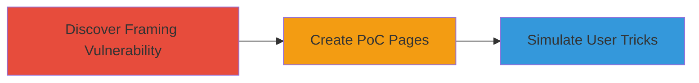

---
tags:
  - clickjacking
  - ui-redressing
  - web-vulnerability
  - yelp
type: attack_chain
tools: []
tactics:
  - '[[Execution]]'
  - '[[Initial Access]]'
verified: false
platforms:
  - Web
submitted: true
complexity: medium
created_at: '2023-10-01T00:00:00Z'
procedures:
  - '[[procedures/Discover-Clickjacking-Vulnerability-by-Testing-Iframe-Loading]]'
  - '[[procedures/Create-Proof-of-Concept-for-Clickjacking-Attacks]]'
  - '[[procedures/Demonstrate-Clickjacking-Exploits-via-Video-Simulations]]'
step_count: 3
techniques:
  - '[[User Execution]]'
  - '[[Drive-by Compromise]]'
updated_at: '2025-12-14T17:28:12.694Z'
description: >-
  Multi-stage attack chain exploiting inconsistent X-Frame-Options on Yelp.com
  to perform clickjacking, tricking authenticated users into bookmarking
  businesses, adding events, and editing reviews.
skill_level: intermediate
impact_level: high
id: 4e8d254b-15f0-40c8-8253-93ef5d0c87bc
validated: true
mitre_tactics:
  - '[[Execution]]'
  - '[[Initial Access]]'
mitre_techniques:
  - '[[User Execution]]'
  - '[[Drive-by Compromise]]'
---
# Clickjacking on Yelp.com to Trick Users into Unintended Actions

Multi-stage attack chain demonstrating a complete attack workflow exploiting clickjacking on Yelp.com to manipulate user interactions.

## Chain Metrics Dashboard

| Metric | Value |
|--------|-------|
| Chain Status | Unverified |
| Total Steps | 3 |
| Execution Time | ~30 minutes |
| Skill Level | Intermediate |
| Complexity | Medium |
| Impact Level | High |

## Attack Flow Visualization



## Prerequisites & Requirements

### Required Tools

- Web browser with developer tools
- Text editor for HTML/JS

### Target Environment

- Web platform
- Authenticated Yelp.com session
- No specific ports or services beyond standard HTTPS

### Initial Access Requirements

- Ability to host or locally serve HTML pages
- Access to a logged-in Yelp user session for testing
- No prior network access beyond public internet

## Detailed Attack Procedures

### Step 1: Discover Framing Vulnerability
procedure: [[procedures/Discover-Clickjacking-Vulnerability-by-Testing-Iframe-Loading]]

**Objective**: Identify pages on Yelp.com that can be loaded into iframes despite X-Frame-Options protections.

**Instructions**: Create a simple HTML test page to embed Yelp URLs in an iframe and observe loading behavior. Use browser developer tools to inspect headers.

Open a local HTML file with an iframe targeting a Yelp page, such as a business profile:

```html
<!DOCTYPE html>
<html>
<body>
<iframe src="https://www.yelp.com/biz/some-business" width="800" height="600"></iframe>
</body>
</html>
```

Load the file in a browser and check if the iframe renders the Yelp content.

**Expected Output**: Some Yelp pages load successfully in the iframe, indicating inconsistent header enforcement.

**Success Indicators**:
- Iframe content from Yelp loads without blocking
- Network tab shows X-Frame-Options: SAMEORIGIN but no enforcement for same-origin tests

### Step 2: Create PoC for Clickjacking
procedure: [[procedures/Create-Proof-of-Concept-for-Clickjacking-Attacks]]

**Objective**: Build malicious HTML pages that overlay elements to hijack clicks on embedded Yelp UI.

**Instructions**: Develop HTML files using iframes to load vulnerable Yelp endpoints, then position transparent divs or images over interactive elements.

For bookmarking example, create hack.html:

```html
<!DOCTYPE html>
<html>
<body>
<iframe id="yelpframe" src="https://www.yelp.com/biz/bookmark-endpoint" style="opacity:0.1;"></iframe>
<div style="position:absolute; top:100px; left:100px; z-index:1;">
  <button onclick="document.getElementById('yelpframe').contentWindow.clickBookmark()">Click to Win!</button>
</div>
</body>
</html>
```

Adjust positions to align overlays with Yelp buttons.

**Expected Output**: Clicking the overlay triggers the hidden Yelp action, like bookmarking.

**Success Indicators**:
- User click on overlay performs unintended Yelp action
- No visible Yelp UI distraction during test

### Step 3: Demonstrate Exploits
procedure: [[procedures/Demonstrate-Clickjacking-Exploits-via-Video-Simulations]]

**Objective**: Record simulations showing real-world impacts like account defacement.

**Instructions**: Use screen recording software to capture browser interactions with PoC pages while simulating user behavior.

Load the PoC in a browser with a logged-in Yelp session, interact with overlays, and record the sequence: bookmark a business, add an event, edit a review rating.

For transparent iframe demo:

```html
<iframe src="https://www.yelp.com/review-edit" style="position:absolute; opacity:0; width:100%; height:100%;"></iframe>
<div style="position:relative; z-index:2;">Fake content here</div>
```

Record the click triggering the edit.

**Expected Output**: Video files (MP4) showing tricked actions, e.g., mismatched review stars.

**Success Indicators**:
- Videos confirm actions like unwanted bookmarks or rating changes
- Demonstrates potential for misinformation or privacy issues

## Attack Chain Summary

### Key Achievements

1. Identified exploitable pages despite general protections
2. Created functional PoCs for multiple attack vectors
3. Proven impacts on user accounts via simulations

## Technique & Tactic Coverage

### MITRE ATT&CK Techniques

- [[User Execution]]
- [[Drive-by Compromise]]

### MITRE ATT&CK Tactics

- [[Execution]]
- [[Initial Access]]

---
*Last updated: 2023-10-01T00:00:00Z*
