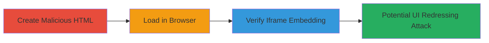

---
tags:
  - clickjacking
  - ui-redressing
  - x-frame-options
  - web-vulnerability
type: attack_chain
tools: []
tactics:
  - '[[Initial Access]]'
verified: false
platforms:
  - Web
submitted: true
complexity: low
created_at: '2023-10-01T12:00:00Z'
procedures:
  - '[[procedures/Demonstrate-Clickjacking-with-Iframe-Embedding]]'
step_count: 3
techniques:
  - '[[Drive-by Compromise]]'
updated_at: '2025-12-14T17:28:05.146Z'
description: >-
  Demonstrates clickjacking vulnerability on the Zomato book login page by
  embedding it in an iframe due to absent X-Frame-Options header, enabling UI
  redressing attacks.
skill_level: beginner
impact_level: low
id: 7bd0389a-d0f4-473d-ba45-2ac67644bed1
validated: true
mitre_tactics:
  - '[[Initial Access]]'
mitre_techniques:
  - '[[Drive-by Compromise]]'
---
# Clickjacking on Zomato Book Login Page via Missing X-Frame-Options Header

Multi-stage attack chain demonstrating a complete attack workflow for exploiting clickjacking on the login page of book.zomato.com.

## Chain Metrics Dashboard

| Metric | Value |
|--------|-------|
| Chain Status | Unverified |
| Total Steps | 3 |
| Execution Time | ~2 minutes |
| Skill Level | Beginner |
| Complexity | Low |
| Impact Level | Low |

## Attack Flow Visualization



## Prerequisites & Requirements

### Required Tools

- Web browser (e.g., Chrome, Firefox)
- Text editor (e.g., Notepad, VS Code)

### Target Environment

- Web platform
- Target URL: http://book.zomato.com/account/login.aspx
- No specific services or ports required beyond standard HTTP/80

### Initial Access Requirements

- Internet access to load the target page
- No credentials or prior access needed

## Detailed Attack Procedures

### Step 1: Create Malicious HTML File
procedure: [[procedures/Demonstrate-Clickjacking-with-Iframe-Embedding]]

**Objective**: Construct a simple HTML file that embeds the vulnerable login page in an iframe to bypass framing protections.

**Instructions**: Use a text editor to create an HTML file with the following content:

```html
<html><body><iframe src="http://book.zomato.com/account/login.aspx" width="500" height="500"></body></html>
```

Save the file with a .html extension, such as demo.html.

**Expected Output**: A valid HTML file ready for browser execution.

**Success Indicators**:
- HTML file created without syntax errors
- File saved locally

### Step 2: Load HTML File in Browser
procedure: [[procedures/Demonstrate-Clickjacking-with-Iframe-Embedding]]

**Objective**: Render the HTML file to embed and display the target login page within the iframe.

**Instructions**: Open the saved HTML file in any modern web browser by double-clicking it or using the browser's file open dialog.

**Expected Output**: The browser loads the page, and the Zomato login form appears inside the iframe without any blocking errors.

**Success Indicators**:
- Iframe renders successfully
- No browser warnings about framing restrictions

### Step 3: Verify and Observe Iframe Loading
procedure: [[procedures/Demonstrate-Clickjacking-with-Iframe-Embedding]]

**Objective**: Confirm that the login page loads unrestricted in the iframe, proving the clickjacking vulnerability.

**Instructions**: Inspect the loaded page in the browser's developer tools (F12) to verify the iframe source and check network requests. Interact with the form to ensure it functions as expected.

**Expected Output**: The login page is fully interactive within the iframe, allowing potential overlay attacks on a malicious site.

**Success Indicators**:
- Login page elements (e.g., username/password fields) are visible and clickable
- No X-Frame-Options enforcement observed in response headers

## Attack Chain Summary

### Key Achievements

1. Successfully embedded the Zomato login page in an external iframe
2. Demonstrated absence of framing protections, enabling UI redressing
3. Highlighted potential for tricking users into credential submission or unintended actions

## Technique & Tactic Coverage

### MITRE ATT&CK Techniques

- [[Drive-by Compromise]]

### MITRE ATT&CK Tactics

- [[Initial Access]]

---
*Last updated: 2023-10-01T12:00:00Z*
