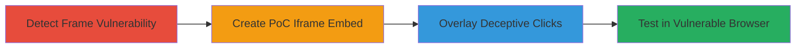

# Clickjacking on Zomato to Trick Users into Account Deletion, Privacy Changes, and Ratings

Multi-stage attack chain demonstrating a complete clickjacking workflow on the Zomato web application, leveraging the lack of X-Frame-Options header to embed sensitive pages in iframes and deceive users into performing destructive or privacy-compromising actions.

## Chain Metrics Dashboard

| Metric | Value |
|--------|-------|
| Chain Status | Unverified |
| Total Steps | 4 |
| Execution Time | ~10 minutes |
| Skill Level | Intermediate |
| Complexity | Medium |
| Impact Level | High |

## Attack Flow Visualization

## Prerequisites & Requirements

### Required Tools

- A web browser (Internet Explorer for exploitation; modern browsers for detection)
- Text editor for HTML PoC creation
- Web server to host PoC (e.g., local Apache or Python SimpleHTTPServer)

### Target Environment

- Target Platform: Web application (Zomato)
- Required services/ports: HTTPS on port 443
- Network access requirements: Internet access to Zomato endpoints

### Initial Access Requirements

- No credentials required; relies on user interaction with malicious page
- Network position: Attacker hosts malicious page; victim visits it while logged into Zomato
- Prior access needed: None, but victim must be authenticated on Zomato

## Detailed Attack Procedures

### Step 1: Detect Frame Vulnerability
procedure: [[procedures/Detect-Clickjacking-Vulnerability]]

**Objective**: Identify the absence of frame protection headers on target pages to confirm iframe embeddability.

**Instructions**: Inspect HTTP responses for sensitive Zomato pages using browser developer tools or a proxy like Burp Suite. Check for the missing X-Frame-Options header on endpoints like user profile edits (e.g., https://www.zomato.com/users/[id]/edit) and business pages (e.g., https://www.zomato.com/szczecin/bajgle-kr%C3%B3la-jana-%C5%9Br%C3%B3dmie%C5%9Bcie).

**Expected Output**: HTTP response headers without X-Frame-Options: DENY or SAMEORIGIN, confirming framming is possible.

**Success Indicators**:
- No X-Frame-Options header present
- Page loads successfully in an iframe during initial tests

### Step 2: Create Clickjacking Proof-of-Concept
procedure: [[procedures/Create-Clickjacking-Proof-of-Concept]]

**Objective**: Build an HTML page that embeds vulnerable Zomato endpoints in an iframe to overlay deceptive UI.

**Instructions**: Create an HTML file with an iframe sourcing a sensitive URL, such as https://www.zomato.com/users/simone-eisenberg-53373042/edit for account actions. Set iframe opacity to 0.2 for PoC visibility (0 for stealth). Host the HTML on a real domain to ensure cookies are transmitted.

**Expected Output**: Iframe displays the Zomato page content, allowing interaction.

**Success Indicators**:
- Iframe loads Zomato page without blocking
- User actions (e.g., form submissions) are possible within the iframe

### Step 3: Overlay Deceptive Elements for Click-Tricking
procedure: [[procedures/Overlay-Deceptive-Elements-for-Click-Tricking]]

**Objective**: Position invisible or semi-transparent overlays to guide victim clicks onto sensitive iframe elements, simulating legitimate interactions.

**Instructions**: Add absolute-positioned div elements over the iframe with pointer-events: none for guidance. For account deletion, position clicks at specific coordinates (e.g., Click 1: left:70px top:860px; Clicks 2&3: left:330px top:600px). Actions require 1-3 clicks depending on the target (e.g., delete account, change privacy, rate business).

**Expected Output**: Victim clicks trigger unintended actions on the embedded Zomato page, such as form submissions.

**Success Indicators**:
- Clicks at specified positions execute Zomato actions
- No visual disruption to the attacker's page

### Step 4: Test Clickjacking in Internet Explorer
procedure: [[procedures/Test-Clickjacking-in-Internet-Explorer]]

**Objective**: Validate the full attack in a browser vulnerable to the exploit (IE), confirming impacts like account deletion or settings changes.

**Instructions**: Load the hosted PoC HTML in Internet Explorer while authenticated to Zomato. Simulate victim interaction by clicking overlaid elements. Note that modern browsers (Chrome/Firefox) block via CSP frame-ancestors.

**Expected Output**: Successful execution of Zomato actions (e.g., account deletion request initiated).

**Success Indicators**:
- Actions complete without errors in IE
- Impacts observed: account deleted, privacy changed, rating submitted, or follow/unfollow executed

## Attack Chain Summary

### Key Achievements

1. Confirmed clickjacking vulnerability due to missing X-Frame-Options, exploitable in legacy browsers.
2. Demonstrated PoC for multiple impacts: DoS via account deletion, integrity violations via ratings/follows, and confidentiality breaches via privacy changes.
3. Highlighted browser-specific limitations, emphasizing IE as the primary vector.

## Technique & Tactic Coverage

### MITRE ATT&CK Techniques

- [[Drive-by Compromise]]

### MITRE ATT&CK Tactics

- [[Initial Access]]

---
*Last updated: 2023-10-01T00:00:00Z*
