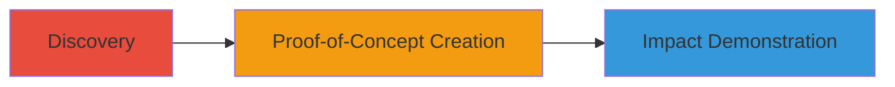

# Clickjacking on docs.weblate.org via Missing X-Frame-Options Header

Multi-stage attack chain demonstrating a complete attack workflow.

## Chain Metrics Dashboard

| Metric | Value |
|--------|-------|
| Chain Status | Unverified |
| Total Steps | 1 |
| Execution Time | ~2 minutes |
| Skill Level | Beginner |
| Complexity | Low |
| Impact Level | Medium |

## Attack Flow Visualization



## Prerequisites & Requirements

### Required Tools

- Web browser (e.g., Chrome, Firefox)
- Text editor (e.g., Notepad, VS Code)

### Target Environment

- Target: docs.weblate.org
- Required services/ports: HTTP/HTTPS on port 80/443
- Network access requirements: Internet access to load the target site

### Initial Access Requirements

- No credentials required
- Public network access
- No prior access needed

## Detailed Attack Procedures

### Step 1: Demonstrate Clickjacking Vulnerability
procedure: [[procedures/Create-Clickjacking-Proof-of-Concept]]

**Objective**: Verify the site's susceptibility to clickjacking by embedding it in an iframe and confirming no framing restrictions.

**Instructions**: Inspect the site's HTTP headers to confirm the absence of X-Frame-Options, then create a simple HTML file with an iframe pointing to docs.weblate.org. Load the file in a browser to embed the site and overlay potential malicious elements.

First, use browser developer tools or a tool like curl to check headers:

```bash
curl -I https://docs.weblate.org
```

Look for the absence of `X-Frame-Options` in the response headers.

Then, create the PoC HTML file as described in the procedure.

**Expected Output**: The target site loads fully within the iframe without any blocking errors, allowing overlay of transparent elements.

**Success Indicators**:
- No X-Frame-Options header present in response
- Site embeds successfully in iframe from a different domain
- Ability to overlay invisible divs for click trickery

## Attack Chain Summary

### Key Achievements

1. Confirmed missing X-Frame-Options header on docs.weblate.org
2. Created and executed a PoC demonstrating iframe embedding
3. Highlighted potential for user deception leading to unauthorized actions

## Technique & Tactic Coverage

### MITRE ATT&CK Techniques

- [[Drive-by Compromise]]

### MITRE ATT&CK Tactics

- [[Initial Access]]

---
*Last updated: 2023-10-01T00:00:00Z*
