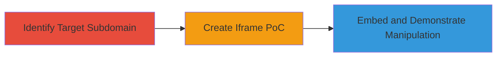

# Clickjacking via Iframe on Non-Production Email Subdomain

Multi-stage attack chain demonstrating the discovery and exploitation of a clickjacking vulnerability on the non-production subdomain http://mailboxes.legalrobot-uat.com/, which lacks X-Frame-Options headers. This allows an attacker to embed the site in an iframe and overlay elements to trick users into unintended actions, such as clicking hidden buttons for unauthorized email operations or phishing.

## Chain Metrics Dashboard

| Metric | Value |
|--------|-------|
| Chain Status | Unverified |
| Total Steps | 3 |
| Execution Time | ~5 minutes |
| Skill Level | Beginner |
| Complexity | Low |
| Impact Level | Medium |

## Attack Flow Visualization



## Prerequisites & Requirements

### Required Tools

- Web browser for testing
- Text editor for HTML

### Target Environment

- Web platform
- Non-production subdomain (e.g., UAT environment)
- Email server service without frame protections

### Initial Access Requirements

- Public access to the target URL
- No credentials needed for demonstration
- Ability to host or locally serve HTML PoC

## Detailed Attack Procedures

### Step 1: Identify Vulnerable Subdomain
procedure: [[procedures/Identify-Vulnerable-Subdomain-for-Clickjacking]]

**Objective**: Locate a target subdomain lacking clickjacking protections to assess for UI redressing risks.

**Instructions**: Manually inspect or enumerate subdomains associated with the target domain, focusing on non-production environments like UAT. Verify the absence of X-Frame-Options by attempting to load the site in an iframe or using browser dev tools to check headers.

**Expected Output**: Confirmation of the target URL (e.g., http://mailboxes.legalrobot-uat.com/) without frame-busting headers.

**Success Indicators**:
- Subdomain identified
- No X-Frame-Options header present

### Step 2: Create Clickjacking Proof-of-Concept
procedure: [[procedures/Create-Clickjacking-Proof-of-Concept]]

**Objective**: Build an HTML page that embeds the target site in an iframe to demonstrate potential UI overlay for tricking users.

**Instructions**: Create a simple HTML file with an iframe set to full width and height, overlaying a transparent or misleading element (e.g., a button) to simulate click hijacking. Save as PoC.html and open in a browser to test embedding.

Example HTML structure:

```html
<!DOCTYPE html>
<html>
<head>
    <title>Clickjacking PoC</title>
    <style>
        iframe { position: absolute; top: 0; left: 0; width: 100%; height: 100%; }
        .overlay { position: absolute; top: 100px; left: 100px; z-index: 1; }
    </style>
</head>
<body>
    <h1>Warning: This is a demo</h1>
    <div class="overlay">
        <button>Click Here (Hidden Action)</button>
    </div>
    <iframe src="http://mailboxes.legalrobot-uat.com/"></iframe>
</body>
</html>
```

**Expected Output**: The target site loads inside the iframe, allowing overlay elements to capture clicks.

**Success Indicators**:
- Iframe embeds without errors
- Overlay interacts with hidden site elements

### Step 3: Demonstrate and Report Vulnerability
procedure: [[procedures/Demonstrate-and-Report-Clickjacking-Vulnerability]]

**Objective**: Capture evidence of the vulnerability and submit for validation, highlighting potential impacts like phishing on email services.

**Instructions**: Take screenshots of the PoC in action, showing the iframe and overlay. Attach the HTML file and images to a vulnerability report, detailing the root cause (missing headers) and impact (UI manipulation for unauthorized actions).

**Expected Output**: Report submission with PoC attachment, potentially leading to acknowledgment or fix.

**Success Indicators**:
- Screenshot confirms embedding
- Report details impact on email server context

## Attack Chain Summary

### Key Achievements

1. Identified unprotected non-production subdomain
2. Created functional clickjacking PoC
3. Demonstrated potential for phishing or unauthorized email actions

## Technique & Tactic Coverage

### MITRE ATT&CK Techniques

- [[Drive-by Compromise]]
- [[Exploit Public-Facing Application]]

### MITRE ATT&CK Tactics

- [[Initial Access]]

---
*Last updated: 2023-10-01T12:00:00Z*
