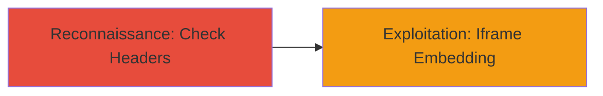

---
tags:
  - clickjacking
  - x-frame-options
  - web-vulnerability
  - ui-redressing
type: attack_chain
tools: []
tactics:
  - '[[Initial Access]]'
commands:
  - '[[commands/curl-check-headers]]'
platforms:
  - Web
complexity: low
procedures:
  - '[[procedures/Detect-and-Exploit-Clickjacking-Vulnerability]]'
step_count: 1
techniques:
  - '[[Exploit Public-Facing Application]]'
description: >-
  Attack chain exploiting clickjacking vulnerability on open.rocket.chat due to
  absent X-FRAME-OPTIONS header, allowing iframe embedding and UI redressing.
skill_level: beginner
impact_level: medium
id: 63ed6466-c970-4942-adad-81b46e07991f
created_at: '2025-12-14T17:28:12.799Z'
updated_at: '2025-12-14T17:28:12.799Z'
verified: false
validated: true
submitted: true
mitre_tactics:
  - '[[Initial Access]]'
mitre_techniques:
  - '[[Exploit Public-Facing Application]]'
---
# Clickjacking via Missing X-FRAME-OPTIONS Header on Rocket.Chat

## Overview

This attack chain demonstrates the discovery and exploitation of a clickjacking vulnerability on the open.rocket.chat instance. The site lacks the X-FRAME-OPTIONS header, allowing it to be embedded in iframes without restrictions. An attacker can overlay invisible malicious elements over the legitimate interface, tricking users into performing actions such as clicking buttons or submitting forms, potentially leading to unauthorized interactions or data exposure. The chain focuses on reconnaissance to identify the misconfiguration and basic exploitation setup.

## Chain Metrics Dashboard

| Metric | Value |
|--------|-------|
| Chain Status | Unverified |
| Total Steps | 1 |
| Execution Time | ~1 minute |
| Skill Level | Beginner |
| Complexity | Low |
| Impact Level | Medium |

## Attack Flow Visualization



## Prerequisites & Requirements

### Required Tools

- Browser developer tools or [[commands/curl-check-headers]]

### Target Environment

- Web platform
- Publicly accessible HTTP/HTTPS site
- No specific ports required beyond standard 80/443

### Initial Access Requirements

- Internet access to the target URL
- No credentials needed
- Positioned as external attacker

## Detailed Attack Procedures

### Step 1: Discover Missing X-FRAME-OPTIONS Header
procedure: [[procedures/Detect-and-Exploit-Clickjacking-Vulnerability]]

**Objective**: Identify the absence of frame-busting headers to confirm clickjacking susceptibility.

**Instructions**: Use [[commands/curl-check-headers]] to inspect the HTTP response headers of the target site:

```bash
curl -I https://open.rocket.chat/
```

Review the output for the absence of X-Frame-Options. If missing, the site can be embedded in an iframe. To demonstrate exploitation, create a simple HTML page with an iframe embedding the target and overlay a transparent div with a malicious button.

**Expected Output**: HTTP headers without X-Frame-Options: DENY or SAMEORIGIN, confirming vulnerability.

**Success Indicators**:
- No X-Frame-Options header present
- Site loads successfully in an iframe without errors

## Attack Chain Summary

### Key Achievements

1. Confirmed missing security header enabling clickjacking
2. Demonstrated potential for UI redressing attacks
3. Highlighted impact on user interactions without additional exploitation

## Technique & Tactic Coverage

### MITRE ATT&CK Techniques

- [[Exploit Public-Facing Application]]

### MITRE ATT&CK Tactics

- [[Initial Access]]

---
*Last updated: 2023-10-01*
