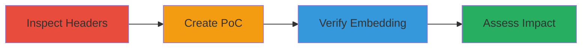

# Clickjacking via Missing X-Frame-Options Header on Django Site

Multi-stage attack chain demonstrating the discovery and proof-of-concept exploitation of a clickjacking vulnerability on a Django-based website due to the lack of X-Frame-Options HTTP response header. This allows malicious sites to embed the target in iframes, potentially tricking users into unintended actions via UI redressing.

## Chain Metrics Dashboard

| Metric | Value |
|--------|-------|
| Chain Status | Unverified |
| Total Steps | 3 |
| Execution Time | ~5 minutes |
| Skill Level | Beginner |
| Complexity | Low |
| Impact Level | Medium |

## Attack Flow Visualization



## Prerequisites & Requirements

### Required Tools

- [[tools/curl]]
- [[tools/Web-Browser]]
- Text editor for HTML

### Target Environment

- Web platform
- Django-based application
- Publicly accessible HTTP/HTTPS site

### Initial Access Requirements

- Internet access to the target domain
- No authentication required for header inspection
- Local file system access for PoC creation

## Detailed Attack Procedures

### Step 1: Inspect HTTP Headers
procedure: [[procedures/Inspect-HTTP-Headers-for-Security-Misconfigurations]]

**Objective**: Identify the absence of security headers like X-Frame-Options that protect against clickjacking.

**Instructions**: Use [[commands/curl-check-headers]] to fetch and examine the response headers of the target URL:

```bash
curl -I http://django.aspen.io/en/latest/
```

Look for the X-Frame-Options header in the output. If missing, the site is vulnerable to iframe embedding.

**Expected Output**: HTTP response headers without X-Frame-Options, e.g., "HTTP/1.1 200 OK\nServer: nginx\n..." (no X-Frame-Options line).

**Success Indicators**:
- No X-Frame-Options header present
- Confirmation of vulnerability to clickjacking

### Step 2: Create Proof-of-Concept
procedure: [[procedures/Create-Clickjacking-Proof-of-Concept]]

**Objective**: Build a simple HTML page that embeds the target site in an iframe to demonstrate unrestricted loading.

**Instructions**: Create an HTML file using a text editor with the following content, sourcing the target URL in an iframe:

```html
<!DOCTYPE html>
<html>
<head>
    <title>Clickjack test page</title>
</head>
<body>
    <p>Website is vulnerable to clickjacking!</p>
    <iframe src="http://django.aspen.io/en/latest/" height="500"></iframe>
</body>
</html>
```

Save it as `cj.html`.

**Expected Output**: A valid HTML file that, when opened, attempts to load the target in an iframe.

**Success Indicators**:
- HTML file created without errors
- Iframe source set to target URL

### Step 3: Verify Vulnerability
procedure: [[procedures/Verify-Clickjacking-Vulnerability-in-Browser]]

**Objective**: Confirm the iframe embedding works without browser restrictions, proving the clickjacking risk.

**Instructions**: Open the `cj.html` file in a web browser (e.g., Chrome, Firefox). Observe if the target site loads fully within the iframe without any framing protection errors.

**Expected Output**: The target page (http://django.aspen.io/en/latest/) renders inside the iframe, with no console errors about framing being blocked.

**Success Indicators**:
- Target site embeds successfully
- No browser warnings or blocks on iframe loading
- Potential for overlaying invisible elements to simulate clicks

## Attack Chain Summary

### Key Achievements

1. Identified missing X-Frame-Options header via header inspection
2. Developed a PoC HTML demonstrating iframe vulnerability
3. Verified embedding in browser, confirming clickjacking feasibility

## Technique & Tactic Coverage

### MITRE ATT&CK Techniques

- [[Exploit Public-Facing Application]]

### MITRE ATT&CK Tactics

- [[Initial Access]]

---
*Last updated: 2023-10-01T00:00:00Z*
