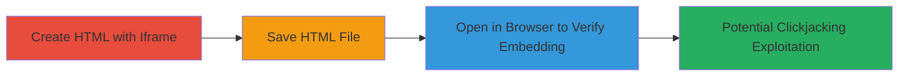

---
tags:
  - clickjacking
  - x-frame-options
  - aws-s3
  - cloudflare
  - web-vulnerability
type: attack_chain
tools: []
tactics:
  - '[[Initial Access]]'
verified: false
platforms:
  - Web
  - AWS
submitted: true
complexity: low
created_at: '2023-10-01T00:00:00Z'
procedures:
  - '[[procedures/Create-Clickjacking-HTML-File]]'
  - '[[procedures/Save-HTML-File-for-Embedding]]'
  - '[[procedures/Test-Iframe-Embedding-in-Browser]]'
step_count: 3
techniques:
  - '[[Exploit Public-Facing Application]]'
updated_at: '2025-12-14T17:28:05.167Z'
description: >-
  Demonstrates a clickjacking attack by embedding Legal Robot's static AWS S3
  page in an iframe due to the absence of X-Frame-Options header, enabling
  potential UI redressing for tricking users into unauthorized actions.
skill_level: beginner
impact_level: medium
id: 0dd87c29-e6af-4c03-9e7c-73529cbc25ec
validated: true
mitre_tactics:
  - '[[Initial Access]]'
mitre_techniques:
  - '[[Exploit Public-Facing Application]]'
---
# Clickjacking via Missing X-Frame-Options on AWS S3 Static Pages

Multi-stage attack chain demonstrating a complete clickjacking workflow by exploiting the lack of X-Frame-Options header on static pages hosted on AWS S3.

## Chain Metrics Dashboard

| Metric | Value |
|--------|-------|
| Chain Status | Unverified |
| Total Steps | 3 |
| Execution Time | ~1 minute |
| Skill Level | Beginner |
| Complexity | Low |
| Impact Level | Medium |

## Attack Flow Visualization

## Prerequisites & Requirements

### Required Tools

- Text editor (e.g., Notepad)
- Web browser (e.g., Chrome, Firefox)

### Target Environment

- Web platform with static pages hosted on AWS S3
- No X-Frame-Options header in HTTP responses
- Accessible URL, e.g., https://www.legalrobot.com/swag/

### Initial Access Requirements

- Public access to the target URL
- Local machine with browser and text editor
- No credentials needed

## Detailed Attack Procedures

### Step 1: Create HTML File with Iframe
procedure: [[procedures/Create-Clickjacking-HTML-File]]

**Objective**: Generate a basic HTML page that embeds the target site in an iframe to test for frame embedding restrictions.

**Instructions**: Open a text editor and input the HTML code for an iframe pointing to the target URL.

**Expected Output**: An editable HTML document containing the iframe tag.

**Success Indicators**:
- HTML code is correctly formed with iframe src set to target
- No syntax errors in the code

### Step 2: Save HTML File for Embedding
procedure: [[procedures/Save-HTML-File-for-Embedding]]

**Objective**: Persist the HTML code as a file that can be loaded in a browser.

**Instructions**: Save the content from the text editor with a .html extension.

**Expected Output**: A saved .html file on the local filesystem.

**Success Indicators**:
- File is saved without errors
- Extension is .html for browser recognition

### Step 3: Test Iframe Embedding in Browser
procedure: [[procedures/Test-Iframe-Embedding-in-Browser]]

**Objective**: Load the HTML file to verify if the target site embeds successfully without frame-busting protections.

**Instructions**: Open the saved HTML file in a web browser to observe the iframe rendering.

**Expected Output**: The target site loads inside the iframe without restrictions or errors.

**Success Indicators**:
- Target page displays fully within the iframe
- No console errors related to X-Frame-Options

## Attack Chain Summary

### Key Achievements

1. Successfully created an iframe-based HTML page targeting the vulnerable static URL.
2. Verified the absence of X-Frame-Options by observing unrestricted embedding.
3. Demonstrated potential for clickjacking attacks, such as overlaying malicious elements to trick user interactions.

## Technique & Tactic Coverage

### MITRE ATT&CK Techniques

- [[Exploit Public-Facing Application]]

### MITRE ATT&CK Tactics

- [[Initial Access]]

---
*Last updated: 2023-10-01T00:00:00Z*
