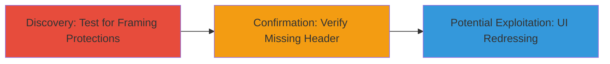

---
id: ac-clickjacking-goodhire-api
name: Clickjacking via Missing X-Frame-Options on GoodHire API
type: attack_chain
description: "Demonstrates discovery and confirmation of clickjacking vulnerability on the GoodHire API endpoint due to absent X-Frame-Options header, enabling potential UI redressing attacks."
verified: false
submitted: false
step_count: 2
created_at: 2023-10-01T00:00:00Z
updated_at: 2023-10-01T00:00:00Z
procedures: [[procedures/Test-API-for-Clickjacking-Protections]], [[procedures/Confirm-Missing-X-Frame-Options-Header]]
techniques: [[Exploit Public-Facing Application]]
tactics: [[Initial Access]]
tags: clickjacking, x-frame-options, ui-redressing, web-vulnerability
platforms: Web
tools: []
---

# Clickjacking via Missing X-Frame-Options on GoodHire API

Multi-stage attack chain demonstrating a complete attack workflow for identifying clickjacking vulnerabilities on web APIs.

## Chain Metrics Dashboard

| Metric | Value |
|--------|-------|
| Chain Status | Unverified |
| Total Steps | 2 |
| Execution Time | ~2 minutes |
| Skill Level | Beginner |
| Complexity | Low |
| Impact Level | Low |

## Attack Flow Visualization



## Prerequisites & Requirements

### Required Tools

- None (uses standard HTTP client like curl)

### Target Environment

- Web platform
- Publicly accessible API endpoint (e.g., HTTPS)
- No authentication required for header inspection

### Initial Access Requirements

- Internet access to the target URL
- No credentials needed
- Browser or command-line tool for testing framing

## Detailed Attack Procedures

### Step 1: Test API for Clickjacking Protections
procedure: [[procedures/Test-API-for-Clickjacking-Protections]]

**Objective**: Inspect the HTTP response headers of the target API to check for clickjacking protections like X-Frame-Options.

**Instructions**: Use [[commands/check-http-headers-for-x-frame-options]] to fetch and examine the headers of the API endpoint:

```bash
curl -I https://www.goodhire.com/api
```

Look for the presence of X-Frame-Options in the output. If absent, proceed to confirmation.

**Expected Output**: HTTP headers listing, such as "HTTP/2 200" followed by various headers without X-Frame-Options.

**Success Indicators**:
- Headers retrieved successfully
- No X-Frame-Options header observed

### Step 2: Confirm Missing X-Frame-Options Header
procedure: [[procedures/Confirm-Missing-X-Frame-Options-Header]]

**Objective**: Verify that the endpoint can be embedded in an iframe, confirming the clickjacking vulnerability.

**Instructions**: Create a simple HTML page to attempt framing the API endpoint and load it in a browser. For example, save the following as test.html and open in a browser:

```html
<!DOCTYPE html>
<html>
<body>
<iframe src="https://www.goodhire.com/api" width="500" height="500"></iframe>
</body>
</html>
```

If the iframe loads without restrictions, the header is missing.

**Expected Output**: The API content (or error) loads inside the iframe without browser blocking.

**Success Indicators**:
- Iframe embeds successfully
- No console errors related to framing restrictions

## Attack Chain Summary

### Key Achievements

1. Identified lack of clickjacking protections on the GoodHire API.
2. Confirmed vulnerability through header inspection and iframe testing.
3. Highlighted potential for low-severity UI redressing attacks where malicious sites could trick users into interactions.

## Technique & Tactic Coverage

### MITRE ATT&CK Techniques

- [[Exploit Public-Facing Application]]

### MITRE ATT&CK Tactics

- [[Initial Access]]

---
*Last updated: 2023-10-01T00:00:00Z*
