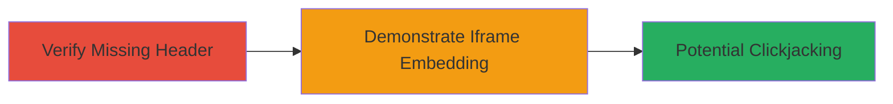

# Clickjacking via Missing X-Frame-Options on Kubernetes Website

Multi-stage attack chain demonstrating a complete attack workflow for identifying and exploiting a clickjacking vulnerability on the Kubernetes website.

## Chain Metrics Dashboard

| Metric | Value |
|--------|-------|
| Chain Status | Unverified |
| Total Steps | 2 |
| Execution Time | ~5 minutes |
| Skill Level | Beginner |
| Complexity | Low |
| Impact Level | Low |

## Attack Flow Visualization

## Prerequisites & Requirements

### Required Tools

- Web browser (e.g., Chrome Developer Tools)
- Text editor for HTML

### Target Environment

- Target: Public-facing website (https://kubernetes.io/)
- Required services/ports: HTTP/HTTPS on port 80/443
- Network access requirements: Internet access to the target site

### Initial Access Requirements

- No credentials required
- No prior access needed; performed from any external position

## Detailed Attack Procedures

### Step 1: Verify Missing X-Frame-Options Header
procedure: [[procedures/Verify-Missing-X-Frame-Options-Header]]

**Objective**: Inspect the HTTP response headers of the target website to confirm the absence of the X-Frame-Options header, which prevents iframe embedding.

**Instructions**: Open the target website in a web browser and use developer tools to examine the response headers. Look specifically for the X-Frame-Options header; its absence indicates vulnerability to clickjacking.

**Expected Output**: HTTP response headers without X-Frame-Options, confirming the site can be embedded in iframes.

**Success Indicators**:
- No X-Frame-Options header present in the response
- Site loads normally without framing restrictions

### Step 2: Demonstrate Clickjacking with Iframe Embedding
procedure: [[procedures/Demonstrate-Clickjacking-with-Iframe-Embedding]]

**Objective**: Create a malicious HTML page that embeds the target site in an invisible or disguised iframe to simulate tricking users into clicking unintended elements, demonstrating the clickjacking potential.

**Instructions**: Create an HTML file with an iframe sourcing the Kubernetes site, set to specific dimensions (e.g., 700px width, 550px height), and overlay transparent elements to disguise interactions. Host or open the file locally to test embedding.

**Expected Output**: The Kubernetes website renders inside the iframe without restrictions, allowing overlay of clickable elements for clickjacking simulation.

**Success Indicators**:
- Target site embeds successfully in the iframe
- No framing errors or blocks occur
- Simulated clicks can be overlaid on site elements

## Attack Chain Summary

### Key Achievements

1. Confirmed absence of protective X-Frame-Options header on a public website.
2. Demonstrated practical clickjacking by embedding the site in an iframe.
3. Highlighted low-impact risk due to lack of sensitive interactions on the site.

## Technique & Tactic Coverage

### MITRE ATT&CK Techniques

- [[Drive-by Compromise]]

### MITRE ATT&CK Tactics

- [[Initial Access]]

---
*Last updated: 2023-10-01T00:00:00Z*
