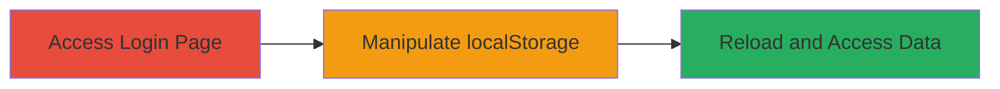

---
tags:
  - auth-bypass
  - client-side
  - localstorage
  - web-auth
type: attack_chain
tools:
  - '[[tools/Browser-Developer-Tools]]'
tactics:
  - '[[Initial Access]]'
commands: []
platforms:
  - Web
complexity: low
procedures:
  - '[[procedures/Access-Target-Login-Endpoint]]'
  - '[[procedures/Manipulate-localStorage-for-Auth-Bypass]]'
  - '[[procedures/Reload-Page-to-Trigger-Bypass]]'
step_count: 3
techniques:
  - '[[Valid Accounts]]'
description: >-
  A multi-step attack exploiting client-side authentication that uses
  localStorage to track login state, allowing unauthorized access to sensitive
  user data without a valid password.
skill_level: beginner
impact_level: high
id: b9c6aac4-aca4-4f96-9711-d9078bd573da
created_at: '2025-12-14T17:31:30.775Z'
updated_at: '2025-12-14T17:31:30.775Z'
verified: false
validated: true
submitted: true
mitre_tactics:
  - '[[Initial Access]]'
mitre_techniques:
  - '[[Valid Accounts]]'
---
# Client-Side Authentication Bypass via localStorage Manipulation

Multi-stage attack chain demonstrating a complete attack workflow exploiting weak client-side authentication in a web application.

## Chain Metrics Dashboard

| Metric | Value |
|--------|-------|
| Chain Status | Unverified |
| Total Steps | 3 |
| Execution Time | ~1 minute |
| Skill Level | Beginner |
| Complexity | Low |
| Impact Level | High |

## Attack Flow Visualization

## Prerequisites & Requirements

### Required Tools

- [[tools/Browser-Developer-Tools]]

### Target Environment

- Web application with client-side authentication
- JavaScript-based frontend
- No specific ports or services required beyond standard HTTPS

### Initial Access Requirements

- Direct network access to the target URL
- No credentials needed
- Browser with developer tools enabled

## Detailed Attack Procedures

### Step 1: Access Target Login Endpoint
procedure: [[procedures/Access-Target-Login-Endpoint]]

**Objective**: Navigate to the login page to inspect the authentication mechanism.

**Instructions**: Open a web browser and visit the target login endpoint. Use the browser's address bar to load the page, which should prompt for authentication.

**Expected Output**: The login interface loads, potentially showing an error or input field for credentials.

**Success Indicators**:
- Page loads successfully
- Authentication prompt appears

### Step 2: Manipulate localStorage for Auth Bypass
procedure: [[procedures/Manipulate-localStorage-for-Auth-Bypass]]

**Objective**: Identify and set the authentication flag in localStorage to simulate a successful login.

**Instructions**: Open browser developer tools (F12 or right-click > Inspect), navigate to the Console or Application tab, and execute the localStorage set command for the specific key observed in the JavaScript (e.g., set 'isAuthenticated' to 'true').

**Expected Output**: localStorage item is updated without errors.

**Success Indicators**:
- localStorage key-value pair is set to 'true'
- No console errors from manipulation

### Step 3: Reload Page to Trigger Bypass
procedure: [[procedures/Reload-Page-to-Trigger-Bypass]]

**Objective**: Refresh the page to apply the manipulated state and gain unauthorized access.

**Instructions**: After setting localStorage, reload the page using Ctrl+R or the browser refresh button. The application should now treat the user as authenticated.

**Expected Output**: Access to protected sections, revealing sensitive data like phone numbers and emails.

**Success Indicators**:
- Bypassed login screen
- Visible sensitive user information

## Attack Chain Summary

### Key Achievements

1. Bypassed client-side authentication without valid credentials
2. Gained unauthorized access to sensitive personal data
3. Demonstrated the risks of localStorage-based auth state management

## Technique & Tactic Coverage

### MITRE ATT&CK Techniques

- [[Valid Accounts]]

### MITRE ATT&CK Tactics

- [[Initial Access]]

---
*Last updated: 2023-10-01*
