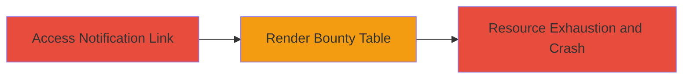

# Client-Side DoS via Corrupted Bounty Table Rendering in HackerOne

Multi-stage attack chain demonstrating a client-side DoS vulnerability in HackerOne's bounty table update feature, where viewing a malformed or high-activity bounty table causes browser memory exhaustion and tab crashes. This affects any user accessing the page, preventing interactions and potentially destabilizing low-spec systems.

## Chain Metrics Dashboard

| Metric | Value |
|--------|-------|
| Chain Status | Unverified |
| Total Steps | 3 |
| Execution Time | ~1 minute |
| Skill Level | Novice |
| Complexity | Low |
| Impact Level | Medium |

## Attack Flow Visualization

## Prerequisites & Requirements

### Required Tools

- Modern web browser (e.g., Chrome, Firefox)

### Target Environment

- HackerOne platform
- Web browser environment
- No specific services/ports required beyond standard HTTPS (443)

### Initial Access Requirements

- Valid HackerOne user account
- Access to a notification email or direct URL for a bounty table update in a high-activity program (e.g., Clario)
- No prior privileged access needed; affects any authenticated or public viewer of the page

## Detailed Attack Procedures

### Step 1: Access the Bounty Table Update Page
procedure: [[procedures/Trigger-HackerOne-Bounty-Table-DoS]]

**Objective**: Navigate to the vulnerable bounty table versions page to initiate rendering of the corrupted data.

**Instructions**: Open a web browser and visit the specific URL from the notification, such as the bounty table for a high-activity program. For reproduction, use a URL like https://hackerone.com/clario/bounty_table_versions?nid=115515717&utm_campaign=user_652675&utm_content=team_url&utm_medium=email&utm_source=bounty_table_update. Ensure you are logged in to HackerOne if required for access.

**Expected Output**: The page begins loading the bounty table, but rendering starts consuming excessive resources.

**Success Indicators**:
- Page loads partially with visible table elements
- Immediate spike in CPU and RAM usage observable in browser task manager

### Step 2: Observe Page Unresponsiveness
procedure: [[procedures/Trigger-HackerOne-Bounty-Table-DoS]]

**Objective**: Monitor the impact of resource exhaustion on page interactions during table rendering.

**Instructions**: Attempt to interact with page elements like the profile or inbox buttons while the bounty table renders. The JavaScript-heavy rendering of the overly complex or corrupted table data will cause the browser to hang.

**Expected Output**: Buttons and UI elements become unresponsive; browser developer tools may show stalled JavaScript execution.

**Success Indicators**:
- Inability to click or hover over interactive elements
- High CPU/RAM usage (e.g., 100% CPU, several GB RAM) in browser processes

### Step 3: Trigger Browser Tab Crash
procedure: [[procedures/Trigger-HackerOne-Bounty-Table-DoS]]

**Objective**: Force the browser tab to crash due to out-of-memory error from uncontrolled resource consumption.

**Instructions**: Allow the page to fully attempt rendering the bounty table. No additional actions needed beyond keeping the tab open; the vulnerability triggers automatically on load.

**Expected Output**: 'Out of Memory' error message appears, followed by tab crash. Reproducible in Chrome and Firefox.

**Success Indicators**:
- Error dialog: 'Out of Memory' or similar
- Tab closes unexpectedly; browser may prompt to restore
- System-wide resource spikes on low-spec devices leading to instability

## Attack Chain Summary

### Key Achievements

1. Successful triggering of client-side DoS affecting browser usability
2. Demonstration of memory exhaustion without server-side intervention
3. Reproduction across multiple browsers, impacting any HackerOne user

## Technique & Tactic Coverage

### MITRE ATT&CK Techniques

- [[Endpoint Denial of Service]]

### MITRE ATT&CK Tactics

- [[Impact]]

---
*Last updated: 2023-10-01T00:00:00Z*
