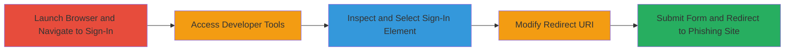

---
tags:
  - open-redirect
  - dom-manipulation
  - phishing
  - client-side
  - self-xss
type: attack_chain
tools:
  - '[[tools/Mozilla-Firefox]]'
  - '[[tools/Mozilla-Firefox-Developer-Tools]]'
tactics:
  - '[[Initial Access]]'
verified: false
platforms:
  - Web
submitted: true
complexity: medium
created_at: '2023-10-01T00:00:00Z'
procedures:
  - '[[procedures/Manipulate-DOM-for-Open-Redirect-on-Sign-In]]'
step_count: 9
techniques:
  - '[[Phishing]]'
  - '[[Exploit Public-Facing Application]]'
updated_at: '2025-12-14T17:24:23.452Z'
description: >-
  Demonstrates a client-side open redirect vulnerability on the Coinbase sign-in
  page by manipulating the DOM with browser developer tools to redirect users to
  a phishing site after login.
skill_level: intermediate
impact_level: medium
id: 82f223c7-a429-4e35-918d-f2d55bff4c07
validated: true
mitre_tactics:
  - '[[Initial Access]]'
mitre_techniques:
  - '[[Phishing]]'
  - '[[Exploit Public-Facing Application]]'
---
# Client-Side Open Redirect via DOM Manipulation on Coinbase Sign-In

Multi-stage attack chain demonstrating a client-side open redirect vulnerability on the Coinbase sign-in page. An attacker with physical access to the victim's machine or via social engineering can use browser developer tools to alter the DOM, changing the redirect URI after credential submission to point to a phishing site. This requires user-side tampering and is similar to Self-XSS, as noted by Coinbase.

## Chain Metrics Dashboard

| Metric | Value |
|--------|-------|
| Chain Status | Unverified |
| Total Steps | 9 |
| Execution Time | ~5 minutes |
| Skill Level | Intermediate |
| Complexity | Medium |
| Impact Level | Medium |

## Attack Flow Visualization

## Prerequisites & Requirements

### Required Tools

- [[tools/Mozilla-Firefox]]
- [[tools/Mozilla-Firefox-Developer-Tools]]

### Target Environment

- Web platform
- Access to Coinbase sign-in page (https://www.coinbase.com/signin?locale=en)
- Victim's unlocked device with browser access

### Initial Access Requirements

- Physical access to victim's machine or social engineering to gain browser control
- No network privileges beyond standard internet access
- Victim must enter credentials on the manipulated page

## Detailed Attack Procedures

### Step 1: Launch Browser
procedure: [[procedures/Manipulate-DOM-for-Open-Redirect-on-Sign-In]]

**Objective**: Open the browser to prepare for accessing the target site.

**Instructions**: Launch Mozilla Firefox to begin the session.

**Expected Output**: Firefox browser window opens.

**Success Indicators**:
- Browser is running and ready for navigation

### Step 2: Navigate to Sign-In Page
procedure: [[procedures/Manipulate-DOM-for-Open-Redirect-on-Sign-In]]

**Objective**: Load the Coinbase sign-in page to inspect its elements.

**Instructions**: Enter the URL https://www.coinbase.com/signin?locale=en in the address bar and press Enter.

**Expected Output**: The sign-in page loads, displaying the login form.

**Success Indicators**:
- Page title shows "Sign in to Coinbase"
- Login form elements are visible

### Step 3: Open Context Menu
procedure: [[procedures/Manipulate-DOM-for-Open-Redirect-on-Sign-In]]

**Objective**: Initiate access to developer tools for DOM inspection.

**Instructions**: Right-click anywhere on the sign-in page to open the browser's context menu.

**Expected Output**: Context menu appears with options like "Inspect Element".

**Success Indicators**:
- Context menu is visible

### Step 4: Select Inspect Element
procedure: [[procedures/Manipulate-DOM-for-Open-Redirect-on-Sign-In]]

**Objective**: Open the developer tools to view and edit the DOM.

**Instructions**: From the context menu, select "Inspect Element".

**Expected Output**: Developer tools panel opens, showing the HTML source.

**Success Indicators**:
- Inspector panel is active with DOM tree visible

### Step 5: Select Sign-In Button Element
procedure: [[procedures/Manipulate-DOM-for-Open-Redirect-on-Sign-In]]

**Objective**: Locate the HTML element for the sign-in button in the DOM.

**Instructions**: In the developer tools, navigate to and highlight the button or form element associated with sign-in (e.g., <button> or <form action> tag).

**Expected Output**: The element is selected in the inspector, highlighting its position on the page.

**Success Indicators**:
- Button element is highlighted on the page

### Step 6: Reveal Element Attributes
procedure: [[procedures/Manipulate-DOM-for-Open-Redirect-on-Sign-In]]

**Objective**: Display the properties of the sign-in button to identify the redirect URI.

**Instructions**: Hover over or click the selected element in the inspector to view its attributes, such as action, href, or any redirect-related URL.

**Expected Output**: Attributes panel shows properties, including the legitimate redirect URI.

**Success Indicators**:
- URL attribute (e.g., action="https://www.coinbase.com/redirect") is visible

### Step 7: Click to Enable Editing
procedure: [[procedures/Manipulate-DOM-for-Open-Redirect-on-Sign-In]]

**Objective**: Prepare the element for modification by selecting it for editing.

**Instructions**: Double-click or right-click the URL attribute in the inspector and select "Edit as HTML" or directly edit the value.

**Expected Output**: The attribute field becomes editable.

**Success Indicators**:
- Attribute value is in edit mode

### Step 8: Modify the URL Attribute
procedure: [[procedures/Manipulate-DOM-for-Open-Redirect-on-Sign-In]]

**Objective**: Alter the redirect URI to point to an attacker-controlled phishing site.

**Instructions**: Change the value of the action, href, or redirect attribute to an attacker-controlled URL, e.g., action="https://attacker-phishing-site.com/callback".

**Expected Output**: The DOM is updated with the new URI; the change persists in the current session.

**Success Indicators**:
- Modified URL is saved in the inspector
- Page preview shows no errors

### Step 9: Close Developer Tools and Test
procedure: [[procedures/Manipulate-DOM-for-Open-Redirect-on-Sign-In]]

**Objective**: Exit tools and verify the redirect by submitting the form.

**Instructions**: Close the developer tools panel. Enter credentials and click the sign-in button to submit.

**Expected Output**: After submission, the browser redirects to the attacker-controlled phishing site instead of Coinbase.

**Success Indicators**:
- Redirect occurs to phishing URL
- Credentials are potentially captured on the attacker's site

## Attack Chain Summary

### Key Achievements

1. Successful DOM manipulation to alter post-login redirect
2. Demonstration of client-side open redirect leading to phishing
3. Highlighted lack of server-side validation for redirects

## Technique & Tactic Coverage

### MITRE ATT&CK Techniques

- [[Phishing]] Phishing
- [[Exploit Public-Facing Application]] Exploit Public-Facing Application

### MITRE ATT&CK Tactics

- [[Initial Access]] Initial Access

---

*Last updated: 2023-10-01T00:00:00Z*
