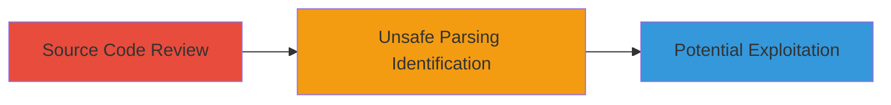

---
tags:
  - deserialization
  - rce
  - snakeyaml
  - hyperledger
  - java
type: attack_chain
tools: []
tactics:
  - '[[Execution]]'
verified: false
platforms:
  - Java
submitted: true
complexity: medium
created_at: '2023-10-01T00:00:00Z'
procedures:
  - >-
    [[procedures/Review-Hyperledger-Fabric-SDK-Source-Code-for-Deserialization-Issues]]
  - '[[procedures/Identify-Unsafe-SnakeYAML-Parsing-Configuration]]'
step_count: 2
techniques:
  - '[[Exploitation for Client Execution]]'
updated_at: '2025-12-14T17:23:31.228Z'
description: >-
  A vulnerability in the Hyperledger Fabric SDK for Java allowing arbitrary Java
  object instantiation through unsafe SnakeYAML parsing, leading to potential
  client-side remote code execution when processing untrusted YAML
  configurations.
skill_level: intermediate
impact_level: low
id: 78e3f2d5-d863-475d-a9b9-8dc2c8b1afd9
validated: true
mitre_tactics:
  - '[[Execution]]'
mitre_techniques:
  - '[[Exploitation for Client Execution]]'
---
# Client-Side RCE via Unsafe YAML Deserialization in Hyperledger Fabric Java SDK

Multi-stage attack chain demonstrating the discovery and exploitation potential of unsafe YAML deserialization in the Hyperledger Fabric SDK for Java (versions 2.0.0 and earlier).

## Chain Metrics Dashboard

| Metric | Value |
|--------|-------|
| Chain Status | Unverified |
| Total Steps | 2 |
| Execution Time | ~30 minutes |
| Skill Level | Intermediate |
| Complexity | Medium |
| Impact Level | Low |

## Attack Flow Visualization

## Prerequisites & Requirements

### Required Tools

- Source code access (e.g., Git repository clone)
- Java development environment (IDE like IntelliJ or Eclipse)

### Target Environment

- Java platform
- Hyperledger Fabric SDK for Java (version 2.0.0 or earlier)
- Access to SDK source code

### Initial Access Requirements

- Read access to the Hyperledger Fabric SDK repository
- No network access required; client-side analysis

## Detailed Attack Procedures

### Step 1: Source Code Review
procedure: [[procedures/Review-Hyperledger-Fabric-SDK-Source-Code-for-Deserialization-Issues]]

**Objective**: Examine the SDK source code to identify locations where YAML files are parsed, focusing on potential deserialization risks.

**Instructions**: Clone the Hyperledger Fabric SDK repository and navigate to key files in the src/main/java/org/hyperledger/fabric/sdk directory. Open ChaincodeCollectionConfiguration.java, NetworkConfig.java, ChaincodeEndorsementPolicy.java, and LifecycleChaincodeEndorsementPolicy.java in an IDE. Search for SnakeYAML instantiation and parsing calls around the specified lines.

**Expected Output**: Identification of YAML parsing code without SafeConstructor usage.

**Success Indicators**:
- Located parsing in ChaincodeCollectionConfiguration.java at line 121
- Found similar issues in other files at lines 301, 241, 262, and 228

### Step 2: Identify Unsafe Configuration
procedure: [[procedures/Identify-Unsafe-SnakeYAML-Parsing-Configuration]]

**Objective**: Confirm that SnakeYAML is not configured with a SafeConstructor, enabling arbitrary Java type instantiation from untrusted YAML input.

**Instructions**: In the identified files, inspect the SnakeYAML constructor calls. Verify absence of SafeConstructor or similar restrictions. Test by creating a minimal Java project with the SDK dependency and attempting to parse a sample YAML with a malicious object reference (e.g., using a gadget like Runtime.getRuntime().exec()).

**Expected Output**: Confirmation of unrestricted object deserialization, potentially leading to RCE on client-side YAML processing.

**Success Indicators**:
- SnakeYAML instantiated without SafeConstructor
- Successful deserialization of arbitrary types in a test environment

## Attack Chain Summary

### Key Achievements

1. Discovered multiple unsafe YAML parsing locations in the SDK.
2. Identified root cause as lack of SafeConstructor in SnakeYAML.
3. Assessed impact as client-side RCE with low severity due to no remote vector.

## Technique & Tactic Coverage

### MITRE ATT&CK Techniques

- [[Exploitation for Client Execution]]

### MITRE ATT&CK Tactics

- [[Execution]]

---
*Last updated: 2023-10-01T00:00:00Z*
