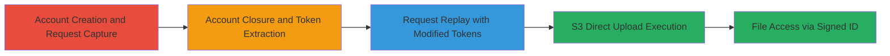

# Closed Account Authentication Bypass for Arbitrary File Upload to AWS S3

Multi-stage attack chain demonstrating exploitation of improper authentication checks in the Hey.com (Basecamp) file upload process using Ruby on Rails Active Storage, enabling closed account users to upload arbitrary files to an AWS S3 bucket.

## Chain Metrics Dashboard

| Metric | Value |
|--------|-------|
| Chain Status | Unverified |
| Total Steps | 9 |
| Execution Time | ~15 minutes |
| Skill Level | Intermediate |
| Complexity | Medium |
| Impact Level | High |

## Attack Flow Visualization

## Prerequisites & Requirements

### Required Tools

- [[tools/Burp-Suite]]

### Target Environment

- Web application using Ruby on Rails with Active Storage
- AWS S3 for file storage
- Services: HTTP/HTTPS on port 443
- Tech stack: Ruby on Rails, Active Storage

### Initial Access Requirements

- Valid target URL (e.g., https://app.hey.com/)
- Ability to create and close accounts
- Network access to the web app and S3 endpoints
- Burp Suite configured as proxy for traffic interception

## Detailed Attack Procedures

### Step 1: Account Creation and Initial Upload Capture
procedure: [[procedures/Capture-Initial-Upload-Request]]

**Objective**: Establish a baseline by creating an account and capturing the file upload request details for later replay.

**Instructions**: Configure Burp Suite to intercept traffic, navigate to https://app.hey.com/, create a new account, and perform a test file upload to capture the POST request to /rails/active_storage/direct_uploads.

**Expected Output**: Captured POST request with blob metadata (filename, content_type, byte_size, checksum) and associated PUT request to S3 in Burp history.

**Success Indicators**:
- Account created successfully
- Upload request intercepted and sent to Repeater

### Step 2: Account Closure and Login Attempt
procedure: [[procedures/Close-Account-and-Extract-Tokens]]

**Objective**: Close the account to simulate unauthenticated state while extracting session cookies and CSRF tokens for request modification.

**Instructions**: Use account settings to close the account, then attempt login with the closed credentials to reach an access denied page, intercepting the login response for CSRF token and session cookie.

**Expected Output**: Access denied page with valid session cookie and CSRF token extracted.

**Success Indicators**:
- Account closed
- Login attempt yields tokens despite denial

### Step 3: Modify and Replay Upload Initiation Request
procedure: [[procedures/Replay-Modified-POST-for-Upload-Initiation]]

**Objective**: Replay the captured POST request with updated tokens from the closed account to obtain new S3 upload credentials.

**Instructions**: In Burp Repeater, update the original POST request by adding the new X-CSRF-Token header and replacing the Cookie with the closed account session, then send to initiate a new direct upload.

**Expected Output**: JSON response containing new signed_id, upload URL, and S3 headers (X-Amz-Algorithm, etc.).

**Success Indicators**:
- Server accepts the request and returns S3 credentials
- No authentication error

### Step 4: Update and Execute S3 PUT Request
procedure: [[procedures/Update-and-Execute-S3-PUT-Upload]]

**Objective**: Modify the captured S3 PUT request with new credentials and arbitrary file content to complete the upload.

**Instructions**: Locate the original PUT request in Burp history, replace AWS parameters (X-Amz-Credential, X-Amz-Signature, etc.) with values from the POST response, set the body to arbitrary file content, and send to the S3 URL.

**Expected Output**: HTTP 200 OK from S3 confirming upload success.

**Success Indicators**:
- File uploaded to S3 bucket
- No signature validation errors

### Step 5: Access the Uploaded File
procedure: [[procedures/Access-Uploaded-File-via-Signed-ID]]

**Objective**: Verify the upload by constructing and accessing the file URL using the signed ID, demonstrating persistent access despite account closure.

**Instructions**: Build the URL https://app.hey.com/rails/active_storage/blobs/redirect/<signed_id>/<filename> from the POST response and access it directly in a browser or via curl.

**Expected Output**: The uploaded file is served without authentication prompts.

**Success Indicators**:
- File accessible via signed URL
- Confirms storage abuse potential

## Attack Chain Summary

### Key Achievements

1. Bypassed account closure checks in Active Storage upload process
2. Replayed requests to generate valid S3 presigned URLs for closed accounts
3. Achieved arbitrary file upload to production S3 bucket, enabling abuse or malicious content storage

## Technique & Tactic Coverage

### MITRE ATT&CK Techniques

- [[Valid Accounts]] Valid Accounts
- [[Exploit Public-Facing Application]] Exploit Public-Facing Application
- [[Remote File Copy]] Ingress Tool Transfer

### MITRE ATT&CK Tactics

- [[Initial Access]] Initial Access
- [[Execution]] Execution

---

*Last updated: 2023-10-01T00:00:00Z*
