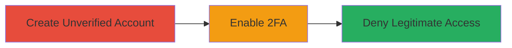

# Cloudflare Account Takeover via Unverified 2FA Enablement

Multi-stage attack chain demonstrating a complete attack workflow exploiting Cloudflare's lack of verification during account creation and 2FA enablement.

## Chain Metrics Dashboard

| Metric | Value |
|--------|-------|
| Chain Status | Unverified |
| Total Steps | 3 |
| Execution Time | ~5 minutes |
| Skill Level | Beginner |
| Complexity | Low |
| Impact Level | High |

## Attack Flow Visualization

## Prerequisites & Requirements

### Required Tools

- Web browser (e.g., Chrome, Firefox)

### Target Environment

- Cloudflare web platform
- Access to the internet
- Target's email address

### Initial Access Requirements

- No prior credentials needed
- Public internet access
- Knowledge of target's email

## Detailed Attack Procedures

### Step 1: Create Unverified Account
procedure: [[procedures/Create-Unverified-Cloudflare-Account-with-Target-Email]]

**Objective**: Establish control over a new account using the target's email without verification.

**Instructions**: Open a web browser and navigate to the Cloudflare signup page. Enter the target's email address and complete the basic signup form without proceeding to email verification. This creates an unverified account tied to the target's email.

**Expected Output**: Successful account creation with access to the dashboard using the provided email and a temporary password.

**Success Indicators**:
- Account dashboard accessible without email verification
- No prompts blocking access post-signup

### Step 2: Enable 2FA
procedure: [[procedures/Enable-2FA-on-Unverified-Cloudflare-Account]]

**Objective**: Lock the account with 2FA, requiring the attacker's authenticator for future logins.

**Instructions**: From the unverified account dashboard, navigate to the account settings and locate the 2FA configuration. Scan a QR code or enter a setup key into an authenticator app (e.g., Google Authenticator) to enable 2FA. Confirm the setup without any additional verification.

**Expected Output**: 2FA enabled status in account settings, with the attacker now controlling the 2FA codes.

**Success Indicators**:
- 2FA toggle shows as active
- Test login prompt requires 2FA code

### Step 3: Deny Access to Legitimate Owner
procedure: [[procedures/Exploit-2FA-for-Legitimate-Account-Denial]]

**Objective**: Prevent the legitimate user from accessing or recovering the account.

**Instructions**: The legitimate user will attempt to log in or reset the password using their email. Due to the enabled 2FA on the unverified account, they will be unable to proceed without the attacker's 2FA codes, resulting in denial of service. Optionally, the attacker can log in with the 2FA to fully takeover the account.

**Expected Output**: Legitimate user receives errors like "Invalid 2FA code" or blocked reset attempts.

**Success Indicators**:
- Legitimate login attempts fail
- Attacker can access the account with 2FA

## Attack Chain Summary

### Key Achievements

1. Created an unverified account using a target's email without checks.
2. Enabled 2FA on the unverified account, securing attacker control.
3. Caused denial of service or full takeover for the legitimate owner.

## Technique & Tactic Coverage

### MITRE ATT&CK Techniques

- [[Valid Accounts]]
- [[Account Manipulation]]
- [[Endpoint Denial of Service]]

### MITRE ATT&CK Tactics

- [[Initial Access]]
- [[Persistence]]
- [[Impact]]

---
*Last updated: 2023-10-01T12:00:00Z*
