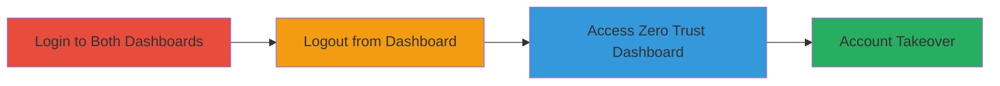

# Cloudflare Dashboard Session Mismatch Leading to Zero Trust Account Takeover

Multi-stage attack chain demonstrating a session management vulnerability in Cloudflare's shared login system, allowing persistent access to the Zero Trust Dashboard after logout from the main Dashboard.

## Chain Metrics Dashboard

| Metric | Value |
|--------|-------|
| Chain Status | Unverified |
| Total Steps | 3 |
| Execution Time | ~2 minutes |
| Skill Level | Intermediate |
| Complexity | Low |
| Impact Level | High |

## Attack Flow Visualization

## Prerequisites & Requirements

### Required Tools

- Web browser (e.g., Chrome, Firefox)

### Target Environment

- Cloudflare account with access to both Dashboard and Zero Trust Dashboard
- Web platform
- No specific ports or services beyond standard HTTPS (443)

### Initial Access Requirements

- Valid Cloudflare credentials
- Local access to the victim's device or session (physical proximity required for effective exploitation)
- Network access to dashboard.cloudflare.com and zero trust dashboard

## Detailed Attack Procedures

### Step 1: Login to Both Dashboards
procedure: [[procedures/Login-to-Cloudflare-Dashboards]]

**Objective**: Establish active sessions in both the Cloudflare Dashboard and Zero Trust Dashboard using the shared authentication mechanism.

**Instructions**: Open a web browser and navigate to the Cloudflare Dashboard login page. Enter valid credentials to authenticate. Once logged in, navigate to the Zero Trust Dashboard via the shared login portal to create parallel sessions.

**Expected Output**: Successful login confirmation in both interfaces, with access to dashboard features.

**Success Indicators**:
- Dashboard homepage loads with user-specific data
- Zero Trust interface is accessible without re-authentication

### Step 2: Logout from Cloudflare Dashboard
procedure: [[procedures/Logout-from-Cloudflare-Dashboard]]

**Objective**: Invalidate the session in the Cloudflare Dashboard while leaving the Zero Trust Dashboard session intact due to the session management flaw.

**Instructions**: From the Cloudflare Dashboard, locate and click the logout button (typically in the user profile menu). Confirm the logout action. Verify that the Dashboard session is terminated by attempting to access a protected page, which should redirect to login.

**Expected Output**: Dashboard redirects to login page, indicating session invalidation.

**Success Indicators**:
- Inability to access Dashboard features post-logout
- No error messages indicating broader session propagation

### Step 3: Access Zero Trust Dashboard Post-Logout
procedure: [[procedures/Access-Zero-Trust-Dashboard-Post-Logout]]

**Objective**: Demonstrate persistent access to the Zero Trust Dashboard, exploiting the independent session handling for potential unauthorized actions or account takeover.

**Instructions**: Without closing the browser or clearing cookies, navigate back to the Zero Trust Dashboard URL. Attempt to perform actions such as viewing configurations or managing access policies.

**Expected Output**: Full access to Zero Trust features without requiring re-authentication.

**Success Indicators**:
- Zero Trust Dashboard loads user data and allows interactions
- No logout prompt or session expiration

## Attack Chain Summary

### Key Achievements

1. Established dual sessions via shared login
2. Invalidated one session without affecting the other
3. Achieved persistent access to sensitive Zero Trust controls, enabling potential account takeover with local device access

## Technique & Tactic Coverage

### MITRE ATT&CK Techniques

- [[Valid Accounts]] Valid Accounts
- [[Pass the Hash]] Pass the Ticket (adapted for web sessions)

### MITRE ATT&CK Tactics

- [[Persistence]] Persistence
- [[Initial Access]] Initial Access

---

*Last updated: 2023-10-01T00:00:00Z*
