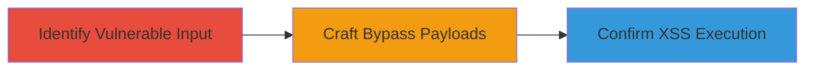

# Cloudflare WAF Bypass Leading to XSS Execution

Multi-stage attack chain demonstrating a complete workflow to identify, bypass, and execute XSS in a Cloudflare-protected web application. The attack leverages crafted payloads using mixed encoding and HTML attributes to evade WAF detection, resulting in arbitrary JavaScript execution in victims' browsers.

## Chain Metrics Dashboard

| Metric | Value |
|--------|-------|
| Chain Status | Unverified |
| Total Steps | 3 |
| Execution Time | ~5 minutes |
| Skill Level | Intermediate |
| Complexity | Medium |
| Impact Level | Low |

## Attack Flow Visualization

## Prerequisites & Requirements

### Required Tools

- Browser developer tools for payload testing
- Proxy tool like Burp Suite for request manipulation (optional)

### Target Environment

- Web application protected by Cloudflare WAF
- Accessible input fields or endpoints that reflect user input
- No specific ports required; operates over HTTPS

### Initial Access Requirements

- Public access to the target web application
- No credentials needed for unauthenticated XSS testing
- Network position: External attacker with internet access

## Detailed Attack Procedures

### Step 1: Identify Vulnerable Input
procedure: [[procedures/Identify-XSS-Vulnerability-in-WAF-Protected-Input]]

**Objective**: Locate an input field in the Cloudflare-protected application that reflects user-supplied data without proper sanitization, enabling potential XSS injection.

**Instructions**: Access the target web page and inspect input fields (e.g., search boxes, forms). Submit test payloads like `` to check for reflection. Observe if the input is echoed back in the HTML response without encoding.

**Expected Output**: Reflected input in the page source, indicating lack of sanitization.

**Success Indicators**:
- User input appears unescaped in the browser's view source
- Basic payloads are not blocked by WAF but may not execute yet

### Step 2: Craft and Test Bypass Payloads
procedure: [[procedures/Craft-XSS-Payloads-to-Bypass-Cloudflare-WAF]]

**Objective**: Develop obfuscated XSS payloads that evade Cloudflare WAF rules using URL encoding, mixed case, and HTML attributes like IMG SRC or A HREF to load external resources.

**Instructions**: Start with encoded payloads such as `Mega7%3EXSS%3CIMG/SRC=https://www.notebookcheck.net/fileadmin/Notebooks/News/_nc3/hacker21.jpg` (URL-decodes to Mega7>XSSXSS<A/href=https://evil.com`. Monitor for WAF blocks; iterate by adjusting encoding or tag casing.

**Expected Output**: Payload accepted without WAF rejection, and external resource attempt (e.g., image load).

**Success Indicators**:
- No 403 or WAF error response
- Payload reflected in response without stripping

### Step 3: Confirm XSS Execution
procedure: [[procedures/Confirm-XSS-Execution-via-Payload-Triggering]]

**Objective**: Trigger the XSS payload to execute JavaScript or load external resources, confirming arbitrary code execution in the victim's browser.

**Instructions**: Submit the successful bypass payload and refresh or interact with the page to trigger attributes like IMG SRC (which attempts to load the external image, executing onload if scripted) or A HREF (redirecting to evil.com). Use browser console to verify script execution or network tab for external loads.

**Expected Output**: External resource loaded or JavaScript alert/redirect observed.

**Success Indicators**:
- Malicious script executes (e.g., alert pops or cookie theft via external domain)
- Network requests to attacker-controlled domains succeed

## Attack Chain Summary

### Key Achievements

1. Identified reflective XSS in WAF-protected input without sanitization.
2. Bypassed Cloudflare WAF using encoded payloads and HTML attributes.
3. Achieved XSS execution, enabling potential session hijacking or data theft.

## Technique & Tactic Coverage

### MITRE ATT&CK Techniques

- [[JavaScript]]
- [[Exploit Public-Facing Application]]

### MITRE ATT&CK Tactics

- [[Execution]]
- [[Collection]]

---
*Last updated: 2023-10-01T00:00:00Z*
