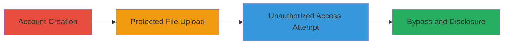

---
tags:
  - auth-bypass
  - privilege-escalation
  - info-disclosure
  - cloudup
  - automattic
  - web-vulnerability
type: attack_chain
tools: []
tactics:
  - '[[Initial Access]]'
  - '[[Defense Evasion]]'
commands: []
verified: false
platforms:
  - Web
submitted: true
complexity: low
created_at: '2023-10-01T00:00:00Z'
procedures:
  - '[[procedures/Create-Multiple-Cloudup-Accounts]]'
  - '[[procedures/Upload-Password-Protected-File]]'
  - '[[procedures/Attempt-Unauthorized-File-Download]]'
  - '[[procedures/Bypass-Protection-via-URL-Modification]]'
step_count: 4
techniques:
  - '[[Exploit Public-Facing Application]]'
  - '[[File and Directory Discovery]]'
updated_at: '2025-12-14T17:28:59.333Z'
description: >-
  Multi-stage attack exploiting improper enforcement of password protection in
  Automattic's Cloudup service, enabling authentication bypass, cross-account
  privilege escalation, and sensitive file information disclosure.
skill_level: beginner
impact_level: high
id: 0ff4bd9b-efa1-4bbf-af28-7cedffb5b635
validated: true
mitre_tactics:
  - '[[Initial Access]]'
  - '[[Defense Evasion]]'
mitre_techniques:
  - '[[Exploit Public-Facing Application]]'
  - '[[File and Directory Discovery]]'
---
# Cloudup Password Protection Bypass via URL Manipulation for Unauthorized File Access

Multi-stage attack chain demonstrating authentication bypass in Cloudup's file sharing service, allowing any user to access password-protected files uploaded by others without authentication or the password, leading to privilege escalation across accounts and disclosure of sensitive file contents and metadata.

## Chain Metrics Dashboard

| Metric | Value |
|--------|-------|
| Chain Status | Unverified |
| Total Steps | 4 |
| Execution Time | ~5 minutes |
| Skill Level | Beginner |
| Complexity | Low |
| Impact Level | High |

## Attack Flow Visualization

## Prerequisites & Requirements

### Required Tools

- Web browser (e.g., Chrome, Firefox)

### Target Environment

- Cloudup service at https://cloudup.com
- Web-based file sharing platform
- No specific ports or services beyond standard HTTPS (443)

### Initial Access Requirements

- Ability to register free accounts on Cloudup
- Internet access to the web interface
- No prior credentials needed beyond new account creation

## Detailed Attack Procedures

### Step 1: Account Creation
procedure: [[procedures/Create-Multiple-Cloudup-Accounts]]

**Objective**: Establish two separate user accounts to simulate cross-account unauthorized access.

**Instructions**: Navigate to https://cloudup.com and register two distinct accounts (e.g., Account X and Account Y) using different email addresses. Verify both accounts via email confirmation if required.

**Expected Output**: Successful login to both accounts, confirming account creation.

**Success Indicators**:
- Two active accounts created and accessible
- No errors during registration

### Step 2: Protected File Upload
procedure: [[procedures/Upload-Password-Protected-File]]

**Objective**: Upload a file with password protection from Account X and obtain the direct download link for testing bypass.

**Instructions**: Log in as Account X, use the web interface to upload a test file (e.g., a .txt, .php, or image file), enable password protection during upload, and right-click the download button to copy the link URL in the format https://cloudup.com/files/{file_id}/download.

**Expected Output**: File uploaded successfully with password set; download link copied (e.g., https://cloudup.com/files/iDQ23wk5p1O/download).

**Success Indicators**:
- File appears in Account X's dashboard as password-protected
- Download link obtained without errors

### Step 3: Unauthorized Access Attempt
procedure: [[procedures/Attempt-Unauthorized-File-Download]]

**Objective**: Verify that direct download access is blocked for unauthorized accounts, confirming the protection is in place but bypassable.

**Instructions**: Log out of Account X, log in as Account Y, and paste the download link from Step 2 into the browser. Attempt to access the file.

**Expected Output**: Browser returns a 'Forbidden' error (HTTP 403) due to lack of authorization.

**Success Indicators**:
- Access denied with 'Forbidden' response
- No file download or view initiated

### Step 4: Protection Bypass and Disclosure
procedure: [[procedures/Bypass-Protection-via-URL-Modification]]

**Objective**: Exploit the URL manipulation vulnerability to bypass password protection and access file contents and metadata without authentication.

**Instructions**: While logged in as Account Y, modify the download URL from Step 2 by removing the '/download' segment (e.g., change https://cloudup.com/files/iDQ23wk5p1O/download to https://cloudup.com/files/iDQ23wk5p1O/). Load the modified URL in the browser.

**Expected Output**: File contents displayed directly in the browser, along with metadata such as EXIF data (file name, size, permissions like rw-rw-r--, timestamps, and paths like /tmp/thumbs).

**Success Indicators**:
- Unauthorized file contents and metadata visible
- No password prompt or authentication required

## Attack Chain Summary

### Key Achievements

1. Successful creation of multiple accounts for cross-account testing
2. Upload and protection of sensitive files that can be bypassed
3. Confirmation of access denial on direct links, highlighting the specific bypass vector
4. Unauthorized disclosure of protected file data, demonstrating high-impact information leakage

## Technique & Tactic Coverage

### MITRE ATT&CK Techniques

- [[Exploit Public-Facing Application]] Exploit Public-Facing Application
- [[File and Directory Discovery]] File and Directory Discovery

### MITRE ATT&CK Tactics

- [[Initial Access]] Initial Access
- [[Defense Evasion]] Defense Evasion

---
*Last updated: 2023-10-01T00:00:00Z*
