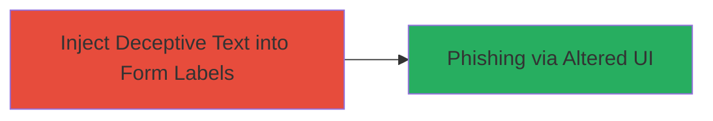

# Code Injection via Text Manipulation in RBKmoney Checkout Form Labels for Phishing

Single-stage attack chain demonstrating a code injection vulnerability in a payment checkout page, allowing attackers to alter form labels for deceptive purposes.

## Chain Metrics Dashboard

| Metric | Value |
|--------|-------|
| Chain Status | Unverified |
| Total Steps | 1 |
| Execution Time | ~5 minutes |
| Skill Level | Novice |
| Complexity | Low |
| Impact Level | Medium |

## Attack Flow Visualization

## Prerequisites & Requirements

### Required Tools

- Web browser with developer tools (e.g., Chrome DevTools)

### Target Environment

- Target Platform: Web
- Required Services/Ports: HTTPS on port 443
- Network Access Requirements: Public internet access to https://checkout.rbk.money

### Initial Access Requirements

- No credentials required
- Direct public access to the checkout page
- No prior access needed

## Detailed Attack Procedures

### Step 1: Inject Malicious Text
procedure: [[procedures/Exploit-Text-Manipulation-Code-Injection-in-Form-Labels]]

**Objective**: Exploit insufficient sanitization of text inputs to alter HTML form labels on the checkout page, misleading users into phishing actions.

**Instructions**: Navigate to the RBKmoney checkout page and use browser developer tools to identify and modify the parameter responsible for populating form labels. Append or replace the text with deceptive content, such as changing a legitimate label like "Enter Card Number" to "Enter Your Bank Details for Verification". Reload or submit the modified request to observe the injected text in the rendered HTML.

**Expected Output**: The form labels display the injected deceptive text, potentially tricking users into providing sensitive information.

**Success Indicators**:
- Form labels show altered text without errors
- Page renders successfully with manipulated UI elements

## Attack Chain Summary

### Key Achievements

1. Successful injection of arbitrary text into HTML form labels
2. Creation of a deceptive user interface for phishing
3. Demonstration of social engineering potential without code execution

## Technique & Tactic Coverage

### MITRE ATT&CK Techniques

- [[Exploit Public-Facing Application]]

### MITRE ATT&CK Tactics

- [[Initial Access]]

---
*Last updated: 2023-10-01T00:00:00Z*
