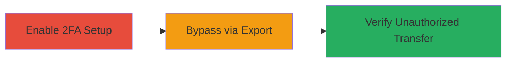

---
tags:
  - 2fa-bypass
  - auth-bypass
  - coinbase
  - cryptocurrency
  - bitcoin
type: attack_chain
tools: []
tactics:
  - '[[Defense Evasion]]'
  - '[[Initial Access]]'
verified: false
platforms:
  - Web
submitted: true
complexity: low
created_at: '2023-10-01T00:00:00Z'
procedures:
  - '[[procedures/Enable-2FA-for-BTC-Withdrawals-in-Coinbase]]'
  - '[[procedures/Bypass-2FA-via-Paper-Wallet-Export]]'
  - '[[procedures/Verify-2FA-Bypass-Success]]'
step_count: 3
techniques:
  - '[[Modify Authentication Process]]'
  - '[[Valid Accounts]]'
updated_at: '2025-12-14T17:30:58.888Z'
description: >-
  Demonstrates a design flaw in Coinbase's 2FA implementation allowing
  unauthorized BTC transfers to paper wallets without verification.
skill_level: intermediate
impact_level: high
id: 4a99eb9b-5fe4-4fd2-80b6-d4282a2f9114
validated: true
mitre_tactics:
  - '[[Defense Evasion]]'
  - '[[Initial Access]]'
mitre_techniques:
  - '[[Modify Authentication Process]]'
  - '[[Valid Accounts]]'
---
# Coinbase 2FA Bypass via Paper Wallet Export

Multi-stage attack chain demonstrating a complete attack workflow exploiting a design flaw in Coinbase's 2FA for BTC withdrawals.

## Chain Metrics Dashboard

| Metric | Value |
|--------|-------|
| Chain Status | Unverified |
| Total Steps | 3 |
| Execution Time | ~5 minutes |
| Skill Level | Intermediate |
| Complexity | Low |
| Impact Level | High |

## Attack Flow Visualization

## Prerequisites & Requirements

### Required Tools

- Web browser (e.g., Chrome)
- Valid Coinbase account with BTC balance

### Target Environment

- Coinbase web platform
- Bitcoin wallet services
- No specific ports or network access beyond standard HTTPS

### Initial Access Requirements

- Authenticated Coinbase user account
- Enabled 2FA capability in account settings
- Sufficient BTC balance for testing transfers

## Detailed Attack Procedures

### Step 1: Enable 2FA for BTC Withdrawals
procedure: [[procedures/Enable-2FA-for-BTC-Withdrawals-in-Coinbase]]

**Objective**: Configure account security settings to require 2FA for all BTC withdrawal actions, setting up the condition for bypass testing.

**Instructions**: Log in to the Coinbase web dashboard, navigate to account settings, and enable 2FA specifically for BTC sends. This ensures the system recognizes withdrawals as requiring verification.

**Expected Output**: Confirmation message in settings indicating 2FA is active for BTC withdrawals.

**Success Indicators**:
- 2FA enabled status visible in account settings
- Test withdrawal prompt requires 2FA code (if attempted normally)

### Step 2: Attempt BTC Transfer to Paper Wallet
procedure: [[procedures/Bypass-2FA-via-Paper-Wallet-Export]]

**Objective**: Exploit the design flaw by using the paper wallet export feature, which circumvents 2FA checks despite enabled settings.

**Instructions**: Generate or import a paper wallet address, then initiate a BTC transfer via the export feature in the Coinbase wallet interface. No 2FA prompt should appear, allowing the transfer to proceed.

**Expected Output**: Successful BTC transfer to the paper wallet without any 2FA verification step.

**Success Indicators**:
- Funds transferred without 2FA code entry
- Transaction history shows completed export

### Step 3: Verify and Confirm Bypass
procedure: [[procedures/Verify-2FA-Bypass-Success]]

**Objective**: Validate the vulnerability by checking transaction logs and ensuring no security controls were enforced, potentially reporting for remediation.

**Instructions**: Review the account's transaction history for the unauthorized export, capture screenshots of the lack of 2FA prompt, and confirm funds arrival in the paper wallet.

**Expected Output**: Evidence of bypassed transfer, including screenshots and transaction IDs.

**Success Indicators**:
- No 2FA logs or prompts in transaction details
- Funds securely moved without verification

## Attack Chain Summary

### Key Achievements

1. Successfully configured 2FA for BTC withdrawals to establish baseline security.
2. Bypassed 2FA entirely using paper wallet export, enabling unverified fund transfers.
3. Verified the flaw with evidence, highlighting risks of theft or loss in cryptocurrency accounts.

## Technique & Tactic Coverage

### MITRE ATT&CK Techniques

- [[Modify Authentication Process]] Modify Authentication Process
- [[Valid Accounts]] Valid Accounts

### MITRE ATT&CK Tactics

- [[Defense Evasion]] Defense Evasion
- [[Initial Access]] Initial Access

---
*Last updated: 2023-10-01T00:00:00Z*
