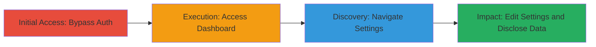

---
tags:
  - authorization-bypass
  - information-disclosure
  - account-takeover
  - coinbase
  - windows-phone
type: attack_chain
tools: []
tactics:
  - '[[Initial Access]]'
commands: []
platforms:
  - Web
complexity: low
procedures:
  - '[[procedures/Bypass-Coinbase-Authentication-with-Windows-Phone-Browser]]'
  - '[[procedures/Access-Coinbase-Account-Dashboard-Without-Verification]]'
  - '[[procedures/Navigate-to-Coinbase-Settings-Page]]'
  - '[[procedures/Edit-Coinbase-Account-Settings-Without-Additional-Auth]]'
step_count: 4
techniques:
  - '[[Valid Accounts]]'
  - '[[Exploit Public-Facing Application]]'
description: >-
  A multi-stage attack exploiting improper authentication in Coinbase's web
  application when accessed via Windows Phone browsers, allowing unauthorized
  access to account data and settings modification.
skill_level: low
impact_level: high
id: d4868876-a0c8-4899-8403-bd2130f34cfc
created_at: '2025-12-14T17:28:51.748Z'
updated_at: '2025-12-14T17:28:51.748Z'
verified: false
validated: true
submitted: true
mitre_tactics:
  - '[[Initial Access]]'
mitre_techniques:
  - '[[Valid Accounts]]'
  - '[[Exploit Public-Facing Application]]'
---
# Coinbase Authorization Bypass via Windows Phone Browser Leading to Information Disclosure and Account Takeover

Multi-stage attack chain demonstrating a complete attack workflow exploiting authentication flaws in Coinbase's web application specifically when accessed via Windows Phone browsers.

## Chain Metrics Dashboard

| Metric | Value |
|--------|-------|
| Chain Status | Unverified |
| Total Steps | 4 |
| Execution Time | ~5 minutes |
| Skill Level | Low |
| Complexity | Low |
| Impact Level | High |

## Attack Flow Visualization

## Prerequisites & Requirements

### Required Tools

- Windows Phone device with browser (e.g., Nokia Lumia)

### Target Environment

- Web platform
- Coinbase web application (https://www.coinbase.com)
- No specific ports or services beyond standard HTTPS (443)

### Initial Access Requirements

- Access to a Windows Phone browser
- Target user's Coinbase account (credentials may not be needed due to bypass)
- Network access to the internet

## Detailed Attack Procedures

### Step 1: Bypass Authentication
procedure: [[procedures/Bypass-Coinbase-Authentication-with-Windows-Phone-Browser]]

**Objective**: Gain access to the Coinbase login without triggering the email authorization prompt enforced on PC browsers.

**Instructions**: Use a Windows Phone browser to navigate to the Coinbase login page and attempt login. The mobile user-agent allows bypassing the standard verification flow.

**Expected Output**: Successful login without email link verification, redirecting to the account area.

**Success Indicators**:
- No authorization email prompt appears
- Direct access to account features granted

### Step 2: Access Account Dashboard
procedure: [[procedures/Access-Coinbase-Account-Dashboard-Without-Verification]]

**Objective**: View sensitive account information such as wallet transactions and balance without additional checks.

**Instructions**: After login, the dashboard loads automatically. Observe the displayed transactions and total balance.

**Expected Output**: Full visibility of wallet transactions and balance.

**Success Indicators**:
- Transactions list appears
- Wallet balance is shown without errors

### Step 3: Navigate to Settings Page
procedure: [[procedures/Navigate-to-Coinbase-Settings-Page]]

**Objective**: Reach the account settings area to prepare for modifications.

**Instructions**: From the dashboard, click or navigate to the settings section via the URL https://www.coinbase.com/settings.

**Expected Output**: Settings page loads without prompting for re-authentication.

**Success Indicators**:
- Settings page accessible
- No verification barriers encountered

### Step 4: Edit Account Settings
procedure: [[procedures/Edit-Coinbase-Account-Settings-Without-Additional-Auth]]

**Objective**: Modify sensitive account details, enabling potential takeover or destruction.

**Instructions**: On the settings page, attempt changes such as updating password, email, or deleting the account.

**Expected Output**: Changes saved successfully without further verification.

**Success Indicators**:
- Password or settings updated
- Account deletion option available and executable

## Attack Chain Summary

### Key Achievements

1. Bypassed email authorization unique to Windows Phone access
2. Disclosed private wallet data including transactions and balance
3. Enabled unauthorized modifications to account settings
4. Demonstrated potential for full account takeover

## Technique & Tactic Coverage

### MITRE ATT&CK Techniques

- [[Valid Accounts]]
- [[Exploit Public-Facing Application]]

### MITRE ATT&CK Tactics

- [[Initial Access]]

---
*Last updated: 2023-10-01*
