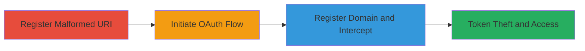

# Coinbase OAuth Redirect URI Misconfiguration Leading to Authorization Code Theft

Multi-stage attack chain demonstrating exploitation of Coinbase's OAuth system vulnerability, where protocol-less redirect URIs are accepted without validation, resulting in concatenated malformed URLs that attackers can register to steal OAuth authorization codes and access user data.

## Chain Metrics Dashboard

| Metric | Value |
|--------|-------|
| Chain Status | Unverified |
| Total Steps | 3 |
| Execution Time | ~10 minutes |
| Skill Level | Intermediate |
| Complexity | Medium |
| Impact Level | High |

## Attack Flow Visualization

## Prerequisites & Requirements

### Required Tools

- Domain registrar access (e.g., GoDaddy or Namecheap)
- Web browser for OAuth flow testing

### Target Environment

- Coinbase OAuth API (Web platform)
- Access to developer console for app registration

### Initial Access Requirements

- Ability to register a new OAuth application on Coinbase
- No prior credentials needed, but developer account may be required
- Network access to Coinbase endpoints

## Detailed Attack Procedures

### Step 1: Register Malformed Redirect URI
procedure: [[procedures/Register-Malformed-Redirect-URI-in-OAuth-App]]

**Objective**: Set up an OAuth application with a protocol-less redirect URI to trigger malformed URL construction.

**Instructions**: Log into the Coinbase developer console and create a new OAuth app. In the redirect URI field, enter a domain without http/https, such as `prashanthvarma.in/code.php`. The system accepts this without validating for absolute URIs.

**Expected Output**: Application registered successfully with client_id generated (e.g., `3616ab93541ef90540a0c991e113b22c1ccefa96996f70fcdc49a68d900cb761`).

**Success Indicators**:
- App creation confirmation
- Client ID visible in dashboard

### Step 2: Initiate OAuth Flow with Malformed URI
procedure: [[procedures/Initiate-OAuth-Flow-with-Malformed-URI]]

**Objective**: Trigger the authorization endpoint to construct and redirect to a malformed URL by using the protocol-less URI.

**Instructions**: Construct the authorization URL with parameters: `response_type=code`, `client_id=<your_client_id>`, `redirect_uri=prashanthvarma.in/code.php`, `scope=user`. Access the `/oauth/authorize` endpoint. This causes a redirect to `www.coinbase.comprashanthvarma.in/code.php`.

**Expected Output**: Browser redirects to the concatenated malformed domain.

**Success Indicators**:
- Redirect observed in browser network tab
- Malformed URL logged (e.g., `www.coinbase.comprashanthvarma.in/code.php`)

### Step 3: Register Concatenated Domain and Intercept
procedure: [[procedures/Register-Concatenated-Domain-to-Intercept-Codes]]

**Objective**: Control the malformed domain to capture the OAuth authorization code upon user approval.

**Instructions**: Monitor for the expected concatenated domain (e.g., `www.coinbase.comprashanthvarma.in`). Register it via a domain registrar and set up a server to handle redirects. When a user authorizes the app, the code is sent to your controlled domain, allowing token exchange.

**Expected Output**: Authorization code received in query parameters on your server.

**Success Indicators**:
- Domain registration successful
- Code intercepted and exchanged for access token
- Unauthorized access to user data confirmed

## Attack Chain Summary

### Key Achievements

1. Successful registration of malformed URI bypassing validation
2. Triggered predictable redirect to attacker-controllable domain
3. Intercepted OAuth code leading to full token theft and account compromise

## Technique & Tactic Coverage

### MITRE ATT&CK Techniques

- [[Exploit Public-Facing Application]] Exploit Public-Facing Application
- [[Application Access Token]] Application Access Token

### MITRE ATT&CK Tactics

- [[Initial Access]] Initial Access
- [[Credential Access]] Credential Access

---
*Last updated: 2023-10-01T00:00:00Z*
