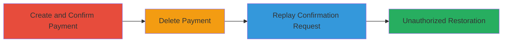

# Coinbase Recurring Payment Replay Attack to Bypass 2FA and Restore Deleted Payments

Multi-stage attack chain demonstrating a replay attack on Coinbase's beta platform to restore deleted recurring payments without re-entering 2FA, exploiting missing replay prevention and state validation on the confirmation endpoint.

## Chain Metrics Dashboard

| Metric | Value |
|--------|-------|
| Chain Status | Unverified |
| Total Steps | 3 |
| Execution Time | ~5 minutes |
| Skill Level | Intermediate |
| Complexity | Medium |
| Impact Level | Medium |

## Attack Flow Visualization

## Prerequisites & Requirements

### Required Tools

- Browser developer tools or proxy like Burp Suite for request capture
- Valid Coinbase account with 2FA enabled

### Target Environment

- Web platform: beta.coinbase.com
- Services: Recurring payments feature
- Network access: Valid session cookies and CSRF token

### Initial Access Requirements

- Authenticated user session on Coinbase beta
- Ability to create recurring payments
- Prior authorization for financial transactions

## Detailed Attack Procedures

### Step 1: Create and Confirm Recurring Payment
procedure: [[procedures/Create-and-Confirm-Coinbase-Recurring-Payment]]

**Objective**: Establish a confirmed recurring payment and capture the confirmation request for later replay.

**Instructions**: Log in to beta.coinbase.com, navigate to recurring payments, create a new payment schedule requiring 2FA, enter the verification code, and capture the resulting POST request using browser tools.

**Expected Output**: Payment confirmed with ID (e.g., 58087a3d6861ee015644fc48), request details saved including headers, cookies, and body.

**Success Indicators**:
- Payment status shows as active
- HTTP 200 response on confirmation

### Step 2: Delete Recurring Payment
procedure: [[procedures/Delete-Coinbase-Recurring-Payment]]

**Objective**: Remove the payment to simulate a deletion scenario, setting up conditions for unauthorized restoration.

**Instructions**: From the recurring payments interface, select and delete the confirmed payment. No restoration option is available natively, and recreation would normally require new 2FA.

**Expected Output**: Payment status updated to deleted, no active schedule.

**Success Indicators**:
- Payment no longer listed as active
- Deletion confirmation in UI

### Step 3: Replay Confirmation Request
procedure: [[procedures/Replay-Coinbase-Payment-Confirmation-Request]]

**Objective**: Replay the captured confirmation request to restore the deleted payment without re-authentication.

**Instructions**: Use the captured POST request to /recurring_payments/{id}/confirm, including original headers, CSRF token, cookies, and body parameters (utf8=✓, _method=patch). Send via curl or proxy tool while maintaining session validity.

**Expected Output**: Payment restored to active state without prompting for 2FA, HTTP 200 response.

**Success Indicators**:
- Payment reactivated in UI
- No additional 2FA required

## Attack Chain Summary

### Key Achievements

1. Bypassed 2FA re-verification for payment restoration
2. Exploited lack of idempotency and state checks on endpoint
3. Demonstrated potential for unauthorized financial transaction reactivation if requests are intercepted

## Technique & Tactic Coverage

### MITRE ATT&CK Techniques

- [[Valid Accounts]] Valid Accounts
- [[Modify Authentication Process]] Modify Authentication Process

### MITRE ATT&CK Tactics

- [[Initial Access]] Initial Access
- [[Defense Evasion]] Defense Evasion

---
*Last updated: 2023-10-01T00:00:00Z*
