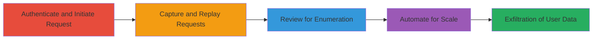

---
tags:
  - user-enumeration
  - information-disclosure
  - rate-limit-bypass
  - coinbase
  - web-vulnerability
type: attack_chain
tools:
  - '[[tools/Burp-Suite]]'
tactics:
  - '[[Discovery]]'
verified: false
platforms:
  - Web
submitted: true
complexity: medium
created_at: '2023-10-01T00:00:00Z'
procedures:
  - '[[procedures/Authenticate-and-Initiate-Money-Request-on-Coinbase]]'
  - '[[procedures/Capture-and-Replay-Request-with-Burp-Suite]]'
  - '[[procedures/Review-Transactions-for-User-Enumeration]]'
  - '[[procedures/Automate-Enumeration-with-Burp-Intruder]]'
step_count: 4
techniques:
  - '[[Account Discovery]]'
  - '[[Exploit Public-Facing Application]]'
updated_at: '2025-12-14T17:32:01.705Z'
description: >-
  Multi-stage attack exploiting lack of rate limiting on Coinbase's money
  request endpoint to enumerate users and disclose personal information through
  inconsistent display of transaction details.
skill_level: intermediate
impact_level: high
id: 2199f022-366c-4d74-9b2c-6db9b4130436
validated: true
mitre_tactics:
  - '[[Discovery]]'
mitre_techniques:
  - '[[Account Discovery]]'
  - '[[Exploit Public-Facing Application]]'
---
# Coinbase User Enumeration and Information Disclosure via Rate Limit Bypass on Money Request

Multi-stage attack chain demonstrating exploitation of Coinbase's web application vulnerabilities, including no rate limiting on the money request endpoint, enabling user enumeration via email testing and disclosure of full names for verified users.

## Chain Metrics Dashboard

| Metric | Value |
|--------|-------|
| Chain Status | Unverified |
| Total Steps | 4 |
| Execution Time | ~10 minutes |
| Skill Level | Intermediate |
| Complexity | Medium |
| Impact Level | High |

## Attack Flow Visualization

## Prerequisites & Requirements

### Required Tools

- [[tools/Burp-Suite]]

### Target Environment

- Web platform (Coinbase application at https://coinbase.com)
- Required services: Coinbase web app, email service for notifications
- Network access: Direct internet access to Coinbase

### Initial Access Requirements

- Valid Coinbase account credentials for authentication
- Proxy setup (e.g., Burp Suite) to intercept traffic
- No prior elevated access needed; standard user login suffices

## Detailed Attack Procedures

### Step 1: Authenticate and Initiate Money Request
procedure: [[procedures/Authenticate-and-Initiate-Money-Request-on-Coinbase]]

**Objective**: Gain access to the Coinbase transactions page and prepare a legitimate money request to capture the baseline HTTP request.

**Instructions**: Log in to your Coinbase account, navigate to the transactions page, and initiate a money request form with a test email. This sets up the endpoint for later replay.

**Expected Output**: Form submission triggers a POST to /transactions/request_money, ready for interception.

**Success Indicators**:
- Successful login and access to /transactions
- Money request form visible and submittable

### Step 2: Capture and Replay Requests with Arbitrary Emails
procedure: [[procedures/Capture-and-Replay-Request-with-Burp-Suite]]

**Objective**: Intercept the money request POST and replay it with modified email parameters to test multiple addresses without rate limits.

**Instructions**: Use Burp Suite as a proxy to capture the request during submission. Modify the transaction[from] parameter with arbitrary emails and replay the POST multiple times.

**Expected Output**: Multiple requests sent successfully, each attempting to request money from different emails.

**Success Indicators**:
- Requests replayed without errors or throttling
- No CAPTCHA or block after dozens of attempts

### Step 3: Review Transactions for User Enumeration and Disclosure
procedure: [[procedures/Review-Transactions-for-User-Enumeration]]

**Objective**: Analyze the transactions page to distinguish Coinbase members (full names displayed) from non-members (emails only), enabling enumeration and name disclosure.

**Instructions**: Return to the transactions page after replays. Observe how requests to member emails show full names (e.g., "John Doe") while non-members show only emails.

**Expected Output**: List of transactions revealing user status and names for members.

**Success Indicators**:
- Display differences confirm enumeration
- Full names of at least some users disclosed

### Step 4: Automate Enumeration with Burp Intruder
procedure: [[procedures/Automate-Enumeration-with-Burp-Intruder]]

**Objective**: Scale the attack by automating request replays against a list of emails to enumerate a large set of users efficiently.

**Instructions**: Load the captured request into Burp Intruder, set the email parameter as a payload position, provide a wordlist of 80 emails, and run in 5 threads.

**Expected Output**: Automated responses allowing bulk review of transaction displays for enumeration.

**Success Indicators**:
- Successful execution of 80+ requests in parallel
- Bulk identification of member accounts and names

## Attack Chain Summary

### Key Achievements

1. Bypassed rate limits to send unlimited money requests, enabling spam potential.
2. Enumerated Coinbase users by differentiating display formats on the transactions page.
3. Disclosed full names of verified users without authorization.

## Technique & Tactic Coverage

### MITRE ATT&CK Techniques

- [[Account Discovery]]
- [[Exploit Public-Facing Application]]

### MITRE ATT&CK Tactics

- [[Discovery]]

---

*Last updated: 2023-10-01T00:00:00Z*
