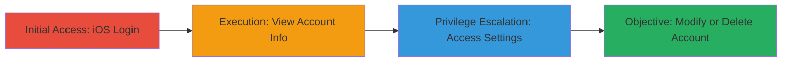

# Coinbase iOS Browser Authentication Bypass Leading to Account Takeover

Multi-stage attack chain demonstrating a complete attack workflow exploiting a flaw in Coinbase's authentication mechanism on iOS browsers.

## Chain Metrics Dashboard

| Metric | Value |
|--------|-------|
| Chain Status | Unverified |
| Total Steps | 4 |
| Execution Time | ~2 minutes |
| Skill Level | Beginner |
| Complexity | Low |
| Impact Level | High |

## Attack Flow Visualization

## Prerequisites & Requirements

### Required Tools

- None (uses standard iOS browser like Safari)

### Target Environment

- Target OS/Platform: iOS device with web browser
- Required services/ports: HTTPS access to Coinbase web application (port 443)
- Network access requirements: Internet connectivity to www.coinbase.com

### Initial Access Requirements

- Credential requirements: Valid Coinbase username and password
- Network position: Direct internet access from iOS device
- Prior access needed: None

## Detailed Attack Procedures

### Step 1: Initial Access
procedure: [[procedures/Login-to-Coinbase-via-iOS-Browser-Without-Verification]]

**Objective**: Gain access to the Coinbase account without the standard email authorization link required on desktop.

**Instructions**: Open the iOS browser (e.g., Safari) and navigate to the Coinbase login page at https://www.coinbase.com/signin. Enter the valid username and password. No additional email verification prompt will appear.

**Expected Output**: Successful login redirecting to the account dashboard.

**Success Indicators**:
- Login completes without email link request
- Dashboard loads immediately

### Step 2: Execution
procedure: [[procedures/Access-Account-Information-in-Coinbase]]

**Objective**: View sensitive account details such as transaction history and wallet balance without further checks.

**Instructions**: Upon login, the dashboard automatically displays account information. No manual commands needed; observe the loaded content.

**Expected Output**: Visible transaction list and total wallet balance.

**Success Indicators**:
- Transaction history and balance are disclosed
- No authorization prompt interrupts access

### Step 3: Privilege Escalation
procedure: [[procedures/Navigate-to-Coinbase-Settings]]

**Objective**: Reach the account settings page to prepare for modifications.

**Instructions**: From the dashboard, directly navigate to https://www.coinbase.com/settings or use the menu to access settings.

**Expected Output**: Settings page loads without additional verification.

**Success Indicators**:
- Settings page accessible post-login
- No secondary auth required

### Step 4: Objective
procedure: [[procedures/Modify-Coinbase-Account-Settings]]

**Objective**: Perform unauthorized changes to the account, such as password update or deletion.

**Instructions**: On the settings page, select options to change password, update details, or delete the account. Submit the changes without any further prompts.

**Expected Output**: Confirmation of changes applied successfully.

**Success Indicators**:
- Password changed or account deleted
- Modifications persist without alerts

## Attack Chain Summary

### Key Achievements

1. Bypassed email authorization in iOS browser login flow
2. Disclosed sensitive account information including balances and transactions
3. Enabled full account takeover via unauthorized modifications

## Technique & Tactic Coverage

### MITRE ATT&CK Techniques

- [[Valid Accounts]] Valid Accounts
- [[Account Manipulation]] Account Manipulation
- [[Exploit Public-Facing Application]] Exploit Public-Facing Application

### MITRE ATT&CK Tactics

- [[Initial Access]] Initial Access
- [[Collection]] Collection

---
*Last updated: 2023-10-01T00:00:00Z*
