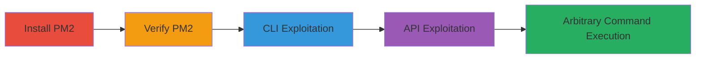

---
tags:
  - command-injection
  - rce
  - node-js
  - pm2
  - npm
type: attack_chain
tools:
  - '[[tools/npm]]'
  - '[[tools/pm2]]'
  - '[[tools/node]]'
tactics:
  - '[[Execution]]'
verified: false
platforms:
  - Node.js
  - macOS
  - Linux
submitted: true
complexity: medium
created_at: '2023-10-01T00:00:00Z'
procedures:
  - '[[procedures/Install-and-Verify-PM2]]'
  - '[[procedures/Exploit-PM2-CLI-Command-Injection]]'
  - '[[procedures/Exploit-PM2-API-Command-Injection]]'
step_count: 4
techniques:
  - '[[Unix Shell]]'
  - '[[Command-Line Interface]]'
updated_at: '2025-12-14T17:28:20.461Z'
description: >-
  Multi-stage attack exploiting command injection in PM2's pm2.install()
  function to achieve arbitrary OS command execution on the host system via
  unsanitized npm module names.
skill_level: intermediate
impact_level: high
id: d70fe468-2573-47ec-9ed1-3251da447b59
validated: true
mitre_tactics:
  - '[[Execution]]'
mitre_techniques:
  - '[[Unix Shell]]'
  - '[[Command-Line Interface]]'
---
# Command Injection in PM2 Module Installation Leading to Arbitrary Code Execution

Multi-stage attack chain demonstrating exploitation of a command injection vulnerability in the PM2 Node.js process manager, specifically in the pm2.install() function. The attack leverages unsanitized user input for npm module names passed to shell-executed commands, enabling arbitrary OS command execution on the host system. Discovered via source code analysis in Modularizer.install(), NPM.install(), and continueInstall() functions, where module_name is directly inserted into spawn() with shell: true. Demonstrated through CLI and API exploitation, this can lead to full remote code execution in production environments using PM2.

## Chain Metrics Dashboard

| Metric | Value |
|--------|-------|
| Chain Status | Unverified |
| Total Steps | 4 |
| Execution Time | ~5 minutes |
| Skill Level | Intermediate |
| Complexity | Medium |
| Impact Level | High |

## Attack Flow Visualization



## Prerequisites & Requirements

### Required Tools

- [[tools/npm]]
- [[tools/pm2]]
- [[tools/node]]

### Target Environment

- Node.js runtime (version 10+ inferred)
- macOS or Linux host (Unix shell for injection)
- Local project directory with npm access
- No specific ports or services required; local execution

### Initial Access Requirements

- Local or remote access to a system running or installable PM2
- No credentials needed for local reproduction; in production, access to PM2 CLI/API
- Prior installation of Node.js and npm

## Detailed Attack Procedures

### Step 1: Install PM2
procedure: [[procedures/Install-and-Verify-PM2]]

**Objective**: Set up the vulnerable PM2 environment by installing it locally via npm and verifying functionality.

**Instructions**: Install PM2 using [[commands/npm-i-pm2]] in the project directory:

```bash
npm i pm2
```

Create a symlink to the pm2 executable if needed, then verify by starting PM2 with [[commands/pm2-start]]:

```bash
./pm2 start
```

**Expected Output**: NPM installation logs confirming PM2 version 3.5.1, followed by PM2 status table or daemon start confirmation.

**Success Indicators**:
- PM2 installed without errors
- PM2 daemon starts successfully

### Step 2: Exploit via CLI
procedure: [[procedures/Exploit-PM2-CLI-Command-Injection]]

**Objective**: Trigger command injection by installing a malicious module name via PM2 CLI, appending shell commands that execute during the npm install process.

**Instructions**: Use [[commands/pm2-install-malicious-module]] with a payload like 'test;pwd;whoami;uname;' to inject commands:

```bash
./pm2 install "test;pwd;whoami;uname;"
```

**Expected Output**: NPM warnings, installation of 'test@0.6.0', outputs from injected commands (e.g., pwd: /Users/bl4de, whoami: bl4de, uname: Darwin), and PM2 status tables.

**Success Indicators**:
- Injected commands execute and output results
- No fatal errors in PM2 installation attempt

### Step 3: Exploit via API
procedure: [[procedures/Exploit-PM2-API-Command-Injection]]

**Objective**: Programmatically exploit the vulnerability using the PM2 API in a Node.js script to demonstrate remote or scripted attack scenarios.

**Instructions**: Create a script pm2_exploit.js with PM2 API calls, then execute it using [[commands/node-pm2-exploit]]:

```bash
node pm2_exploit.js
```

The script includes [[commands/pm2-connect]], [[commands/pm2-start-fake-app]], [[commands/pm2-install-payload]], and [[commands/pm2-disconnect]]. Payload example: 'test;pwd;whoami;uname -a;ls -l ~/playground/Node;'

**Expected Output**: Connection to PM2, fake app start, installation logs, outputs from injected commands (pwd, whoami, uname -a, ls -l), and disconnection.

**Success Indicators**:
- Script runs without connection errors
- Injected commands produce expected shell outputs

## Attack Chain Summary

### Key Achievements

1. Successful installation and verification of vulnerable PM2
2. Arbitrary command execution via CLI injection
3. Programmatic RCE via API exploitation
4. Demonstration of impact in local and potential production environments

## Technique & Tactic Coverage

### MITRE ATT&CK Techniques

- [[Unix Shell]] Unix Shell
- [[Command-Line Interface]] Command and Scripting Interpreter

### MITRE ATT&CK Tactics

- [[Execution]] Execution

---

*Last updated: 2023-10-01T00:00:00Z*
