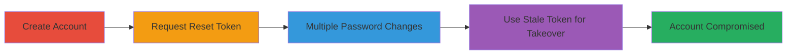

# Concrete CMS Account Takeover via Stale Password Reset Token

Multi-stage attack chain demonstrating a complete attack workflow exploiting improper token invalidation in Concrete CMS password reset mechanism.

## Chain Metrics Dashboard

| Metric | Value |
|--------|-------|
| Chain Status | Unverified |
| Total Steps | 5 |
| Execution Time | ~10 minutes |
| Skill Level | Intermediate |
| Complexity | Medium |
| Impact Level | High |

## Attack Flow Visualization

## Prerequisites & Requirements

### Required Tools

- Web browser (e.g., Chrome or Firefox)

### Target Environment

- Concrete CMS instance accessible via web
- User registration enabled
- Password reset functionality active

### Initial Access Requirements

- No prior credentials needed; attacker creates a test account
- Email access to receive reset links
- Network access to the target web application

## Detailed Attack Procedures

### Step 1: Create Account
procedure: [[procedures/Create-Account-in-Concrete-CMS]]

**Objective**: Establish a test account to demonstrate the vulnerability.

**Instructions**: Navigate to the Concrete CMS registration page and complete the signup process with valid details, including an email address you control.

**Expected Output**: Confirmation of account creation and ability to log in.

**Success Indicators**:
- Account registered successfully
- Login possible with new credentials

### Step 2: Request Password Reset
procedure: [[procedures/Request-Password-Reset-Without-Using]]

**Objective**: Generate a password reset token without immediately using it.

**Instructions**: From the login page, initiate the password reset process by entering the registered email and submitting. Receive the reset link via email but do not click it yet.

**Expected Output**: Email containing the password reset link/token.

**Success Indicators**:
- Reset email received
- Link saved for later use

### Step 3: Log In and Change Password Multiple Times
procedure: [[procedures/Log-In-and-Change-Password-Multiple-Times]]

**Objective**: Invalidate sessions through repeated password changes while keeping the reset token active.

**Instructions**: Log in using the original credentials, then navigate to account settings and change the password 5-10 times in succession. Note that each change logs you out and destroys active sessions.

**Expected Output**: Successful password updates, with logout after each change.

**Success Indicators**:
- Multiple password changes completed
- Sessions invalidated (forced logout)

### Step 4: Use Stale Reset Link
procedure: [[procedures/Use-Stale-Reset-Link-for-Takeover]]

**Objective**: Exploit the persistent token to reset the password again, achieving takeover.

**Instructions**: After the multiple changes, open the original reset link from the email and use it to set a new password. Log in with this new password to confirm control.

**Expected Output**: Password successfully reset via the stale token; login with new credentials works.

**Success Indicators**:
- Stale link allows password change
- Account now controlled by attacker

## Attack Chain Summary

### Key Achievements

1. Bypassed authentication by exploiting token persistence
2. Demonstrated account takeover without direct credential access
3. Highlighted failure in token invalidation post-password changes

## Technique & Tactic Coverage

### MITRE ATT&CK Techniques

- [[Valid Accounts]] Valid Accounts
- [[Exploit Public-Facing Application]] Exploit Public-Facing Application

### MITRE ATT&CK Tactics

- [[Initial Access]] Initial Access

---

*Last updated: 2023-10-01T00:00:00Z*
