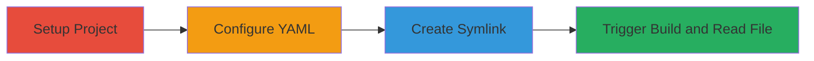

# Container Escape via Symlink Attack in LGTM Build Process

Multi-stage attack chain demonstrating exploitation of Semmle's LGTM platform to escape container boundaries and read sensitive host files like /etc/passwd through a symlink attack during the build process.

## Chain Metrics Dashboard

| Metric | Value |
|--------|-------|
| Chain Status | Unverified |
| Total Steps | 4 |
| Execution Time | ~10 minutes |
| Skill Level | Intermediate |
| Complexity | Medium |
| Impact Level | High |

## Attack Flow Visualization

## Prerequisites & Requirements

### Required Tools

- Git (for repository management)
- Web browser (for LGTM interface)

### Target Environment

- LGTM platform (Semmle-hosted code analysis service)
- Docker-based build workers on Linux host
- Access to create and push GitHub repositories

### Initial Access Requirements

- GitHub account with public repository creation permissions
- No special credentials for LGTM; uses public repo integration
- Network access to GitHub and LGTM services

## Detailed Attack Procedures

### Step 1: Setup Project
procedure: [[procedures/Setup-LGTM-Compatible-Project]]

**Objective**: Create a basic project structure that LGTM can successfully build to initiate the analysis process.

**Instructions**: Initialize a new GitHub repository with a simple buildable project, such as a basic Java or other supported language setup. Use the example structure from https://github.com/testanull/test11 as a reference, ensuring it includes files that allow a clean build.

**Expected Output**: A GitHub repository ready for LGTM integration.

**Success Indicators**:
- Repository created and pushed to GitHub
- Basic files present for build

### Step 2: Configure YAML
procedure: [[procedures/Configure-LGTM-YAML-File]]

**Objective**: Add a valid lgtm.yml configuration file to define the build process, ensuring the project is processable by LGTM.

**Instructions**: Create and commit an lgtm.yml file in the repository root with valid YAML content, such as specifying extraction for Java with a build command like `./custom-build`. Push the changes to trigger LGTM recognition.

**Expected Output**: lgtm.yml file committed and visible in the repository.

**Success Indicators**:
- YAML file validates without syntax errors
- LGTM dashboard shows configuration recognition

### Step 3: Create Symlink
procedure: [[procedures/Create-Malicious-LGTM-Symlink]]

**Objective**: Introduce a symlink named .lgtm.yml that points to a sensitive host file, exploiting the lack of symlink sanitization.

**Instructions**: In the repository root, create a symbolic link named .lgtm.yml targeting a host-sensitive file like /etc/passwd. Commit and push this symlink to the repository.

**Expected Output**: Symlink present in the repository file list, pointing to the target path.

**Success Indicators**:
- Symlink created without errors
- Git commit includes the symlink entry

### Step 4: Trigger Build and Extract
procedure: [[procedures/Trigger-LGTM-Build-and-Extract-Host-File]]

**Objective**: Initiate a build on LGTM to resolve the symlink and expose host file contents in the retained build artifacts.

**Instructions**: Enable LGTM analysis on the repository via the GitHub integration or LGTM dashboard. Wait for a successful build, then navigate to the build output file list to view the resolved .lgtm.yml content, which now contains the host file data like /etc/passwd.

**Expected Output**: Build succeeds, and .lgtm.yml in the file list displays sensitive host file contents.

**Success Indicators**:
- Build status shows success
- Host file contents visible in LGTM's file viewer

## Attack Chain Summary

### Key Achievements

1. Bypassed container isolation to access host filesystem
2. Exposed sensitive files like /etc/passwd without direct access
3. Demonstrated potential for further host exploration and privilege escalation

## Technique & Tactic Coverage

### MITRE ATT&CK Techniques

- [[Exploit Public-Facing Application]] Exploit Public-Facing Application
- [[File and Directory Discovery]] File and Directory Discovery

### MITRE ATT&CK Tactics

- [[Discovery]] Discovery
- [[Collection]] Collection

---
*Last updated: 2023-10-01T00:00:00Z*
