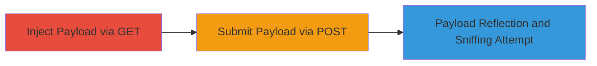

---
tags:
  - xss
  - content-sniffing
  - reflected-xss
  - liberapay
type: attack_chain
tools: []
tactics:
  - '[[Execution]]'
verified: false
platforms:
  - Web
submitted: true
complexity: medium
created_at: '2023-10-01T00:00:00Z'
procedures:
  - '[[procedures/Inject-Payload-via-GET-Parameter]]'
  - '[[procedures/Submit-Payload-via-POST-Request]]'
step_count: 2
techniques:
  - '[[JavaScript]]'
updated_at: '2025-12-14T03:15:30.932Z'
description: >-
  A multi-step attempt to exploit reflected XSS via content-sniffing in the
  Liberapay application's sign-in.currency parameter, targeting the /sign-up or
  /about/me/edit endpoints. The technique involves injecting URL-encoded
  payloads to trick browsers into executing scripts, though mitigations like
  CSRF tokens, proper Content-Type, and X-Content-Type-Options: nosniff prevent
  exploitation.
skill_level: intermediate
impact_level: low
id: 56e8edf4-2ffa-4f5b-b3a2-3972709d3269
validated: true
mitre_tactics:
  - '[[Execution]]'
mitre_techniques:
  - '[[JavaScript]]'
---
# Content-Sniffing XSS Attempt on Liberapay Sign-Up Endpoint

Multi-stage attack chain demonstrating an attempt to inject and reflect a malicious payload for XSS via content-sniffing in Liberapay's user interface.

## Chain Metrics Dashboard

| Metric | Value |
|--------|-------|
| Chain Status | Unverified |
| Total Steps | 2 |
| Execution Time | ~5 minutes |
| Skill Level | Intermediate |
| Complexity | Medium |
| Impact Level | Low |

## Attack Flow Visualization



## Prerequisites & Requirements

### Required Tools

- Browser developer tools for inspection
- [[tools/curl]]

### Target Environment

- Web application: Liberapay (https://liberapay.com)
- Endpoints: /about/me/edit or /sign-up
- No specific ports or services required beyond standard HTTPS (443)

### Initial Access Requirements

- Public access to the Liberapay website
- No credentials needed for initial testing, but authenticated session may enhance reflection visibility
- Network access to the internet

## Detailed Attack Procedures

### Step 1: Inject Payload via GET Parameter
procedure: [[procedures/Inject-Payload-via-GET-Parameter]]

**Objective**: Deliver a URL-encoded malicious payload in the sign-in.currency query parameter to test for reflection in a text element, potentially enabling content-sniffing by browsers.

**Instructions**: Navigate to the edit page with the encoded payload using a browser or curl to simulate the request and observe reflection.

Use [[commands/curl-get-payload]] to send the GET request:

```bash
curl -G "https://liberapay.com/about/me/edit" --data-urlencode "sign-in.currency=USD<WDILR9>G8OAI[ !+! ]</WDILR9>"
```

Inspect the response for payload reflection in HTML text elements.

**Expected Output**: HTTP response with the decoded payload USD<WDILR9>G8OAI[ !+! ]</WDILR9> reflected in a text element, such as a currency display field.

**Success Indicators**:
- Payload appears unescaped in the page source
- No immediate script execution due to mitigations

### Step 2: Submit Payload via POST Request
procedure: [[procedures/Submit-Payload-via-POST-Request]]

**Objective**: Send a POST request with the malicious payload in the sign-in.currency field, including a CSRF token, to trigger reflection and attempt to exploit via email sending or browser sniffing.

**Instructions**: Craft a POST request to the /sign-up or /about/me/edit endpoint with form data including the payload. Use [[commands/curl-post-payload]]:

```bash
curl -X POST "https://liberapay.com/sign-up" \
  -d "csrf_token=oiCrDqa91GRS4YBFb4jzZQzpgxSZN38I" \
  -d "form.repost=false" \
  -d "sign-in.back-to=/about/me/edit" \
  -d "sign-in.currency=USD<WDILR9>G8OAI[ !+! ]</WDILR9>" \
  -d "sign-in.email=sample%40email.tst"
```

Check the response for a 400 Bad Request and reflected payload.

**Expected Output**: 400 Bad Request response body containing the reflected payload, potentially in an error message or email template.

**Success Indicators**:
- Payload reflected in response without sanitization
- No actual script execution or email dispatch with executable content

## Attack Chain Summary

### Key Achievements

1. Successful reflection of encoded payload in both GET and POST responses
2. Demonstration of potential content-sniffing vector in text elements
3. Identification of mitigations preventing real exploitation (CSRF, Content-Type: application/json, X-Content-Type-Options: nosniff)

## Technique & Tactic Coverage

### MITRE ATT&CK Techniques

- [[JavaScript]]

### MITRE ATT&CK Tactics

- [[Execution]]

---
*Last updated: 2023-10-01T00:00:00Z*
