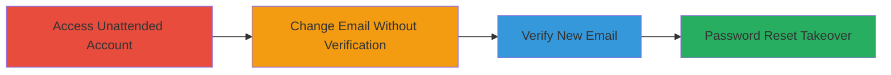

# Coursera Account Takeover via Unverified Email Change

Multi-stage attack chain demonstrating a complete attack workflow exploiting weak email change controls on Coursera.org.

## Chain Metrics Dashboard

| Metric | Value |
|--------|-------|
| Chain Status | Unverified |
| Total Steps | 4 |
| Execution Time | ~5 minutes |
| Skill Level | Beginner |
| Complexity | Low |
| Impact Level | High |

## Attack Flow Visualization

## Prerequisites & Requirements

### Required Tools

- None (browser access only)

### Target Environment

- Coursera.org web platform
- Active user account session
- Access to a shared/public computer

### Initial Access Requirements

- Physical or opportunistic access to a device with the victim's logged-in session
- No prior credentials needed if session is active
- Network access to coursera.org

## Detailed Attack Procedures

### Step 1: Access Unattended Account
procedure: [[procedures/Access-Victims-Unattended-Account-Session]]

**Objective**: Gain initial access to the victim's Coursera account via an open browser session on a shared device.

**Instructions**: Locate a public or shared computer (e.g., in a cafe, office, or library) where the victim has left their Coursera session active. Open the browser and navigate to coursera.org to confirm the logged-in state.

**Expected Output**: Active dashboard or account page indicating the victim's session.

**Success Indicators**:
- User's name or profile visible on the site
- No login prompt appears

### Step 2: Change Email Address
procedure: [[procedures/Change-Email-Address-Without-Verification]]

**Objective**: Modify the account's email address to a attacker-controlled one without triggering security checks.

**Instructions**: From the account settings page on coursera.org, locate the email update field. Enter a new email address controlled by the attacker and submit the change. No password or old email verification is required.

**Expected Output**: Confirmation that the email change is pending verification, with a verification email sent to the new address.

**Success Indicators**:
- Email field updated in settings
- No prompts for current password or old email confirmation

### Step 3: Verify New Email Address
procedure: [[procedures/Verify-New-Email-Address]]

**Objective**: Complete the email verification process using the attacker's email inbox.

**Instructions**: Check the attacker's email inbox for the verification message from Coursera. Click the verification link or enter the provided code on the Coursera site to activate the new email.

**Expected Output**: Success message confirming the email address has been updated.

**Success Indicators**:
- New email reflected in account settings
- Access to old email notifications absent

### Step 4: Perform Password Reset
procedure: [[procedures/Perform-Password-Reset-for-Account-Takeover]]

**Objective**: Use the forgot password feature on the new email to reset credentials and gain full control.

**Instructions**: On coursera.org, initiate a password reset using the newly set email address. Receive the reset link in the attacker's inbox, follow it, and set a new password.

**Expected Output**: Ability to log in with the new credentials and access all account features.

**Success Indicators**:
- Password reset successful
- Full account control achieved, including course access and personal data

## Attack Chain Summary

### Key Achievements

1. Bypassed email change security controls without authentication
2. Redirected account notifications to attacker-controlled email
3. Executed password reset for persistent access
4. Achieved complete account compromise with minimal effort

## Technique & Tactic Coverage

### MITRE ATT&CK Techniques

- [[Valid Accounts]]
- [[Account Manipulation]]

### MITRE ATT&CK Tactics

- [[Initial Access]]
- [[Persistence]]

---
*Last updated: 2023-10-01T00:00:00Z*
