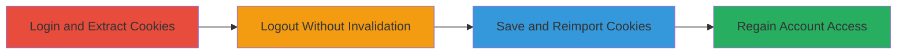

---
tags:
  - session-hijacking
  - cookie-reuse
  - broken-auth
  - coursera
type: attack_chain
tools:
  - '[[tools/Burp-Suite]]'
  - '[[tools/EditThisCookie]]'
tactics:
  - '[[Credential Access]]'
  - '[[Initial Access]]'
verified: false
platforms:
  - Web
submitted: true
complexity: medium
created_at: '2023-10-01T00:00:00Z'
procedures:
  - '[[procedures/Login-and-Extract-Session-Cookies-from-Coursera]]'
  - '[[procedures/Logout-Without-Invalidating-Session-Cookies]]'
  - '[[procedures/Save-and-Reimport-Session-Cookies]]'
  - '[[procedures/Access-Account-via-Reused-Cookies]]'
step_count: 4
techniques:
  - '[[Steal Web Session Cookie]]'
  - '[[Valid Accounts]]'
updated_at: '2025-12-14T17:31:19.376Z'
description: >-
  Demonstrates exploitation of broken session management in Coursera where
  logout fails to invalidate session cookies, allowing unauthorized account
  access via cookie reuse.
skill_level: intermediate
impact_level: high
id: 7d771b2c-a14c-4cef-8b33-ca1729f9c57d
validated: true
mitre_tactics:
  - '[[Credential Access]]'
  - '[[Initial Access]]'
mitre_techniques:
  - '[[Steal Web Session Cookie]]'
  - '[[Valid Accounts]]'
---
# Coursera Session Hijacking via Persistent Cookies After Logout

Multi-stage attack chain demonstrating exploitation of broken authentication and session management in Coursera's web application, where logout does not invalidate session cookies, enabling persistent unauthorized access.

## Chain Metrics Dashboard

| Metric | Value |
|--------|-------|
| Chain Status | Unverified |
| Total Steps | 4 |
| Execution Time | ~10 minutes |
| Skill Level | Intermediate |
| Complexity | Medium |
| Impact Level | High |

## Attack Flow Visualization

## Prerequisites & Requirements

### Required Tools

- [[tools/Burp-Suite]]
- [[tools/EditThisCookie]]

### Target Environment

- Web platform (coursera.org)
- Valid user credentials for initial login
- Browser with extension support (e.g., Chrome for EditThisCookie)

### Initial Access Requirements

- Network access to coursera.org
- Legitimate account credentials (for testing own account or authorized testing)
- No prior session persistence issues

## Detailed Attack Procedures

### Step 1: Login and Extract Session Cookies
procedure: [[procedures/Login-and-Extract-Session-Cookies-from-Coursera]]

**Objective**: Authenticate to Coursera and capture session cookies for later reuse.

**Instructions**: Open a web browser and navigate to coursera.org. Enter valid credentials to log in, establishing an authenticated session. Use interception tools to extract the session cookies associated with the domain.

**Expected Output**: List of session cookies (e.g., session_id, auth_token) captured and ready for export.

**Success Indicators**:
- Successful login confirmed by access to user dashboard.
- Cookies extracted without errors.

### Step 2: Logout Without Invalidating Session Cookies
procedure: [[procedures/Logout-Without-Invalidating-Session-Cookies]]

**Objective**: Perform logout action to test if session cookies are properly invalidated.

**Instructions**: From the authenticated session, initiate the logout process via the application's logout button or endpoint. Observe that the main page reflects logout status, but do not clear cookies yet.

**Expected Output**: User interface shows logged out state, but cookies remain in browser storage.

**Success Indicators**:
- Logout UI confirmation.
- Cookies persist in browser developer tools or extension view.

### Step 3: Save and Reimport Session Cookies
procedure: [[procedures/Save-and-Reimport-Session-Cookies]]

**Objective**: Clear current cookies, save extracted ones externally, and reimport them to simulate session hijacking.

**Instructions**: Clear all Coursera-related cookies from the browser. Save the previously extracted cookies to a text file (e.g., JSON or Netscape format). Then, import the saved cookies back into the browser for coursera.org.

**Expected Output**: Cookies successfully imported and visible in browser storage.

**Success Indicators**:
- Cookies cleared and reimported without syntax errors.
- No active session before reimport.

### Step 4: Access Account via Reused Cookies
procedure: [[procedures/Access-Account-via-Reused-Cookies]]

**Objective**: Demonstrate unauthorized access using reused cookies, bypassing logout.

**Instructions**: Navigate to protected endpoints like /account/profile. The reimported cookies should restore the session, allowing viewing and editing of profile information despite the prior logout.

**Expected Output**: Full access to account features, including profile edits, for up to hours or a day.

**Success Indicators**:
- Access to /account/profile without re-authentication.
- Ability to modify sensitive data.

## Attack Chain Summary

### Key Achievements

1. Successful extraction and persistence of session cookies post-logout.
2. Regained unauthorized access to user account.
3. Exposed impact on sensitive profile data modification.

## Technique & Tactic Coverage

### MITRE ATT&CK Techniques

- [[Steal Web Session Cookie]] Steal Web Session Cookie
- [[Valid Accounts]] Valid Accounts

### MITRE ATT&CK Tactics

- [[Credential Access]] Credential Access
- [[Initial Access]] Initial Access

---

*Last updated: 2023-10-01T00:00:00Z*
