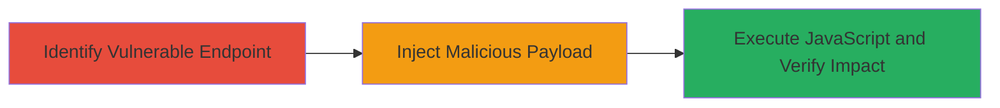

# Cross-Site Scripting (XSS) Vulnerability Exploitation on Deriv.com

Multi-stage attack chain demonstrating a complete attack workflow.

## Chain Metrics Dashboard

| Metric | Value |
|--------|-------|
| Chain Status | Unverified |
| Total Steps | 1 |
| Execution Time | ~5 minutes |
| Skill Level | Intermediate |
| Complexity | Low |
| Impact Level | Medium |

## Attack Flow Visualization

## Prerequisites & Requirements

### Required Tools

- Web browser with developer tools (e.g., Chrome DevTools)
- Optional: Proxy tool like Burp Suite for payload crafting

### Target Environment

- Web application on main domain (e.g., https://deriv.com)
- Vulnerable input fields, URL parameters, or forms that reflect user input without sanitization
- No specific ports required beyond standard HTTPS (443)

### Initial Access Requirements

- Public access to the website
- No credentials needed for reflected XSS; stored XSS may require user registration
- Ability to submit inputs via forms or URLs

## Detailed Attack Procedures

### Step 1: Identify and Exploit XSS
procedure: [[procedures/Exploit-XSS-Vulnerability-on-Web-Application]]

**Objective**: Locate an unsanitized input point on Deriv.com and inject a JavaScript payload to execute arbitrary code in the victim's browser, potentially leading to session hijacking or data theft.

**Instructions**: Navigate to the main domain of Deriv.com and inspect forms, search fields, or URL parameters for reflection of user input. Craft a simple payload like `` and submit it via a vulnerable endpoint. Observe if the script executes in the browser.

**Expected Output**: An alert box or console log confirming JavaScript execution, indicating successful payload delivery.

**Success Indicators**:
- JavaScript alert or DOM manipulation visible in the browser
- Payload reflected without encoding in the page source

## Attack Chain Summary

### Key Achievements

1. Identification of XSS vulnerability on the main domain
2. Successful injection and execution of arbitrary JavaScript
3. Potential for further impacts like cookie theft or phishing

## Technique & Tactic Coverage

### MITRE ATT&CK Techniques

- [[JavaScript]]

### MITRE ATT&CK Tactics

- [[Execution]]

---
*Last updated: 2023-10-01T12:00:00Z*
