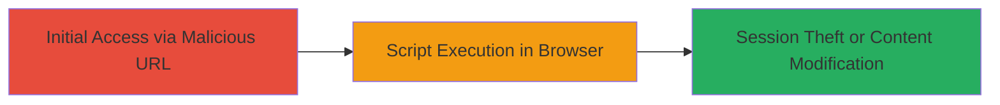

---
tags:
  - xss
  - reflected-xss
  - dod
  - web-vulnerability
  - script-injection
type: attack_chain
tools: []
tactics:
  - '[[Execution]]'
  - '[[Collection]]'
verified: false
platforms:
  - Web
submitted: true
complexity: low
created_at: '2023-10-01T00:00:00Z'
procedures:
  - '[[procedures/Demonstrate-Reflected-XSS-via-URL]]'
step_count: 1
techniques:
  - '[[JavaScript]]'
updated_at: '2025-12-14T03:15:47.154Z'
description: >-
  A single-stage attack demonstrating a reflected XSS vulnerability on a U.S.
  Department of Defense website by crafting a malicious URL to inject and
  execute JavaScript in a victim's browser.
skill_level: beginner
impact_level: high
id: 94723118-af9e-4758-a114-b218347440a8
validated: true
mitre_tactics:
  - '[[Execution]]'
  - '[[Collection]]'
mitre_techniques:
  - '[[JavaScript]]'
---
# Cross-Site Scripting (XSS) via Malicious URL Parameter on DoD Website

Multi-stage attack chain demonstrating a complete attack workflow.

## Chain Metrics Dashboard

| Metric | Value |
|--------|-------|
| Chain Status | Unverified |
| Total Steps | 1 |
| Execution Time | ~1 minutes |
| Skill Level | Beginner |
| Complexity | Low |
| Impact Level | High |

## Attack Flow Visualization

## Prerequisites & Requirements

### Required Tools

- None (uses standard web browser)

### Target Environment

- Target Platform: Web application on DoD website
- Required Services/Ports: HTTP/HTTPS (port 80/443)
- Network Access Requirements: Public internet access to the DoD website

### Initial Access Requirements

- No credentials required
- Victim must click or visit the malicious URL
- Attacker needs ability to distribute the URL (e.g., via phishing)

## Detailed Attack Procedures

### Step 1: Craft and Demonstrate XSS Payload
procedure: [[procedures/Demonstrate-Reflected-XSS-via-URL]]

**Objective**: Inject a malicious JavaScript payload via a URL parameter to execute arbitrary code in the victim's browser, potentially stealing session cookies or modifying page content.

**Instructions**: Identify a vulnerable URL parameter on the DoD website that reflects user input without proper sanitization. Craft a URL appending a script tag to the parameter, such as `https://vulnerable.dod.gov/page?param=`. Test by pasting the URL into a browser. If vulnerable, the script executes, showing an alert box. To escalate, replace the alert with code to exfiltrate cookies, e.g., `https://vulnerable.dod.gov/page?param=`.

**Expected Output**: Browser executes the injected script, displaying an alert or sending data to attacker's server.

**Success Indicators**:
- Alert box or unexpected script behavior appears on the page
- Network request to attacker's domain with stolen data (e.g., session cookies)
- Page content modified as per payload

## Attack Chain Summary

### Key Achievements

1. Successful injection and execution of JavaScript via URL parameter
2. Potential theft of user session information
3. Demonstration of content modification risks on a high-value target

## Technique & Tactic Coverage

### MITRE ATT&CK Techniques

- [[JavaScript]]

### MITRE ATT&CK Tactics

- [[Execution]]
- [[Collection]]

---
*Last updated: 2023-10-01T00:00:00Z*
