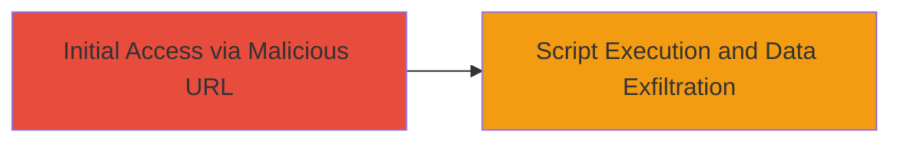

# Cross-Site Scripting (XSS) via URL Parameter on DoD Website

Multi-stage attack chain demonstrating a complete attack workflow.

## Chain Metrics Dashboard

| Metric | Value |
|--------|-------|
| Chain Status | Unverified |
| Total Steps | 1 |
| Execution Time | ~1 minutes |
| Skill Level | Intermediate |
| Complexity | Low |
| Impact Level | High |

## Attack Flow Visualization



## Prerequisites & Requirements

### Required Tools

- Browser (e.g., Chrome or Firefox) for testing
- Optional: Proxy tool like Burp Suite for crafting and intercepting requests

### Target Environment

- Web application on a DoD website
- Vulnerable URL parameter that accepts user input without sanitization
- Network access to the public-facing DoD site

### Initial Access Requirements

- No credentials required (reflected XSS assuming public access)
- Ability to send a specially crafted URL to a victim (e.g., via phishing)
- Victim must visit the malicious URL while authenticated to the site

## Detailed Attack Procedures

### Step 1: Craft and Deliver Malicious URL
procedure: [[procedures/Exploit-XSS-via-Malicious-URL]]

**Objective**: Inject malicious JavaScript into the DoD website via a URL parameter to execute in the victim's browser, enabling session theft or content manipulation.

**Instructions**: Identify a vulnerable URL parameter on the DoD site (e.g., a search or redirect parameter). Craft a payload such as `<script>alert(document.cookie)</script>` and append it to the URL, URL-encoding if necessary (e.g., %3Cscript%3Ealert(document.cookie)%3C/script%3E). Deliver the URL to the victim via email or link. Upon visit, the script executes in the browser context.

For testing, open the crafted URL in a browser while logged into the site:

```bash
# No specific command; use browser URL bar or curl for verification
curl "https://dod-site.example.com/search?q=<script>alert(1)</script>"
```

**Expected Output**: Alert box pops up in the browser, or network requests to attacker-controlled server if exfiltrating data.

**Success Indicators**:
- Malicious script executes (e.g., alert fires)
- Session cookies or page content are accessible via the injected script
- No server-side errors; payload reflects in the response

## Attack Chain Summary

### Key Achievements

1. Successful injection of JavaScript via URL parameter
2. Execution of arbitrary code in victim's browser
3. Potential theft of sensitive session information from DoD site

## Technique & Tactic Coverage

### MITRE ATT&CK Techniques

- [[JavaScript]]

### MITRE ATT&CK Tactics

- [[Execution]]
- [[Collection]]

---
*Last updated: 2023-10-01T00:00:00Z*
