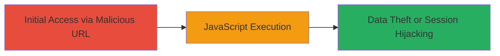

# Cross-Site Scripting (XSS) via Unsanitized 'q' Parameter in Uzbey Staging Application

Multi-stage attack chain demonstrating a complete attack workflow.

## Chain Metrics Dashboard

| Metric | Value |
|--------|-------|
| Chain Status | Unverified |
| Total Steps | 1 |
| Execution Time | ~1 minutes |
| Skill Level | Beginner |
| Complexity | Low |
| Impact Level | Medium |

## Attack Flow Visualization

## Prerequisites & Requirements

### Required Tools

- Web browser with developer tools (e.g., Chrome DevTools)

### Target Environment

- Web application at https://staging.uzbey.com/
- No specific services or ports required beyond standard HTTP/HTTPS (port 80/443)
- Direct network access to the staging domain

### Initial Access Requirements

- No credentials required
- Victim must visit the crafted malicious URL in their browser
- No prior access needed; exploitable via phishing or direct link

## Detailed Attack Procedures

### Step 1: Inject and Execute XSS Payload
procedure: [[procedures/Demonstrate-Reflected-XSS-in-Query-Parameter]]

**Objective**: Identify and exploit the lack of input sanitization in the 'q' parameter to inject and execute arbitrary JavaScript, confirming the vulnerability and demonstrating potential impacts like alert popups or data exfiltration.

**Instructions**: Navigate to the target URL and append the vulnerable 'q' parameter with a test payload. Use a browser to visit https://staging.uzbey.com/?q=. Observe if the script executes, displaying an alert box. For more advanced exploitation, replace the alert with code to steal cookies (e.g., ?q=) to simulate session hijacking.

**Expected Output**: An alert box pops up with 'XSS' or the page redirects to the attacker's server with stolen data.

**Success Indicators**:
- JavaScript alert executes without sanitization
- Injected script reflects back in the page source unescaped
- Potential for further payloads to access browser context (e.g., localStorage or cookies)

## Attack Chain Summary

### Key Achievements

1. Confirmed reflected XSS in the 'q' parameter set to 'user'
2. Demonstrated arbitrary JavaScript execution in the browser context
3. Highlighted risks of session hijacking and data theft due to unsanitized input

## Technique & Tactic Coverage

### MITRE ATT&CK Techniques

- [[JavaScript]]

### MITRE ATT&CK Tactics

- [[Execution]]

---
*Last updated: 2023-10-01T00:00:00Z*
